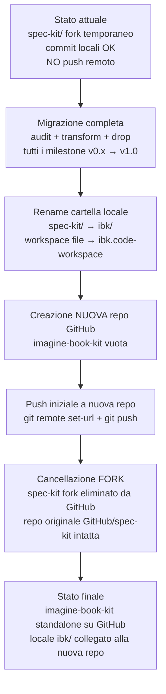
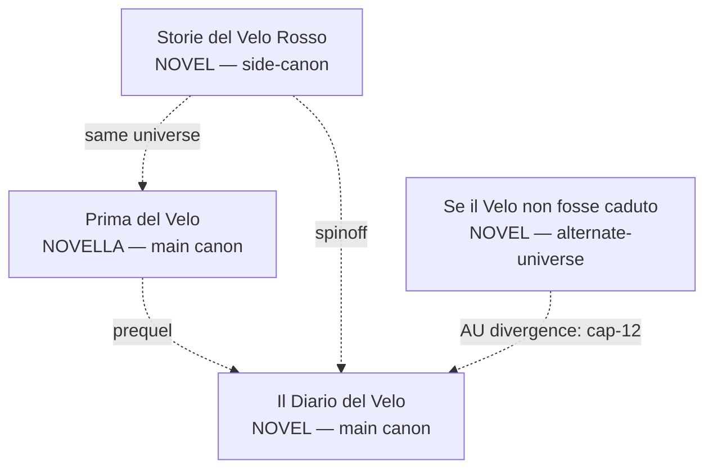
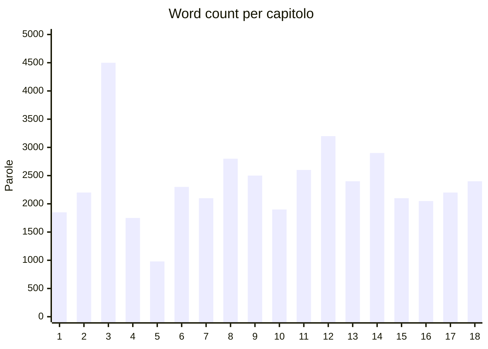
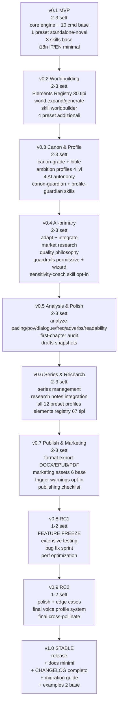
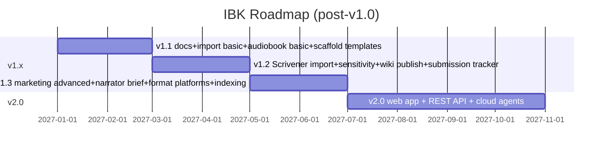

# Imagine Book Kit (IBK) — Piano Hard-Fork Definitivo

## 1. Identità prodotto (confermata)

- **Nome pubblico**: `imagine-book-kit` (IBK) — "image" interpretato come "immaginare"
- **CLI command**: `imagine` (es. `imagine init il-mio-romanzo`)
- **Pacchetto Python**: `imagine-book-kit`
- **Modulo Python**: `imagine_cli` (rename da `specify_cli`)
- **Namespace comandi agent**: `/imagine.*`
- **Framework dir interna**: `.imagine/` (rimpiazza `.specify/`)
- **Asset release**: `imagine-kit-template-{agent}-{sh|ps}.zip`
- **Default repo**: il tuo fork (env `IBK_REPO_OWNER` / `IBK_REPO_NAME`)
- **Lingue**: architettura i18n **estensibile a N lingue** (resolver locale + plug-in language packs); **v1 attiva IT/EN** (CLI strings, prompt template, docs, methodology pack) con traduzione bidirezionale IT↔EN dell'opera (glossario consistente). Altre lingue (ES, FR, DE, PT, ZH, ecc.) supportabili come **community language packs** in `.imagine/locales/<lang>.yml` senza modifiche al core
- **Filosofia coach-first**: il kit **non è un command runner passivo** ma un **writing coach proattivo** — conosce lo stato del tuo progetto, ti dice cosa fare dopo, identifica cosa manca, suggerisce tecniche/maestri/metodologie adatte al genere/fase/livello, ti onboarda con wizard, rileva blocchi creativi. Lo scrittore non deve sapere a priori quale comando lanciare: il kit lo guida
- **Filosofia transmedia-grade**: il prodotto del kit sono i **libri**, ma il **worldbuilding deve avere profondità da IP transmedia-ready**. Riferimenti: Middle-earth (Tolkien → Silmarillion → Jackson trilogy → Amazon Rings of Power), ASOIAF (Martin → HBO → House of the Dragon), Cosmere (Sanderson → 30+ romanzi pianificati con coerenza canonica → pronto per game/film), The Witcher (Sapkowski → CD Projekt RED games → Netflix), Discworld (Pratchett → film/TV/games), Foundation (Asimov → Apple TV+), Dune (Herbert → Villeneuve film). Il kit produce **story bible canonica**, **canon management con versioning/retcon**, **continuity enforcement rigoroso** affinché chi un giorno volesse adattare l'opera (anche l'autore stesso) trovi un mondo coerente e completo, non un patchwork di idee. Adattamento attivo (game/TV/film output) non è obiettivo v1 ma il *foundation è pronto per esso*
- **Filosofia transform-first, drop-last**: per ogni componente dello Spec Kit attuale, prima di eliminarlo valutiamo se può essere **riadattato (REUSE)** o **trasformato in qualcosa di utile agli scrittori (TRANSFORM)** sfruttandone l'idea/architettura. **DROP solo per ciò che davvero non ha analogo narrativo**. Lo Spec Kit ha già architetture eccellenti (agent skills installation, templates con placeholders, multi-agent support, slash commands, checklist gates, constitution.md come memoria persistente) che reimpieghiamo direttamente o ispirano feature del coach narrativo
- **Architettura "CLI-first, Agent-optional, Web/Integration-ready"**: la CLI `imagine` è sempre l'**unica fonte della verità**. Tutti i comandi major espongono `--json`. Lo state vive in file leggibili (YAML/Markdown) sul filesystem. La logica deterministic vive nella CLI, **mai nei prompt agent**. L'agent è una UX conversazionale (eccellente, raccomandata), ma non l'unica via di accesso. Web app v2 + cloud agents + integrazioni third-party (Obsidian plugin, automazioni, ecc.) troveranno un'API stabile. Costo zero per v1 (disciplina tecnica), future-proof totale. Vincoli concreti: tutti i comandi major con `--json` documentato, state in YAML, niente prompt interattivi bloccanti senza `--non-interactive`, hooks documentati, output paths predittibili
- **Filosofia AI-primary, autore-direttore**: nel default workflow l'**AI è l'autore primario del testo** (scrive prosa, dialoghi, descrizioni, capitoli) applicando voice profile + influences + originality recipe + genre conventions. L'**utente è autore-direttore**: fornisce visione, decisioni di plot, modifiche puntuali. L'autore può **sempre** scegliere comando-per-comando di scrivere manualmente (`ai_autonomy: manual` per dominio specifico) o di delegare ulteriormente (`auto`/`surprise-me`). Comandi dedicati `imagine.adapt` (adatta pezzo dell'autore a voice/influences, formatta con convenzioni tipografiche corrette per lingua, integra nel manoscritto) e `imagine.integrate` (incolla materiale grezzo: note/frammenti/vecchi scritti, AI trasforma in prosa narrativa). Provenance dettagliato (campo `authored_by`: ai/user/adapted) per onestà autoriale e safety
- **Filosofia "encourage quality, don't enforce it"**: il kit propone SEMPRE la strada di qualità come default. Lo shortcut è opzionale (`--quick`/`--draft-only`/`--minimal`) tracciato in provenance. Il coach SUGGERISCE qualità quando rileva pattern di fretta MAI blocca. `shitty first draft` di Lamott esplicitamente supportato (drafting libero → revisione profonda). Foundation cita maestri come ispirazione, non come regole rigide. L'autore decide il proprio stile di lavoro; il kit lo aiuta a essere consapevole dei trade-off (Tolkien 12 anni LotR, Hemingway 39 revisioni finale, Pixar regola #4)
- **Filosofia "permissive-by-default guardrails"**: il kit NON impone restrizioni di contenuto preconfigurate (no rating forzato, no topic vietati per default). L'**onboarding wizard chiede all'autore** preferenze su maturity rating, topic restrictions, trigger warning placement, disclosure preference. L'autore decide cosa scrivere per il suo pubblico: horror brutale? Romance esplicito? Violenza graphic? Dark themes? Tutto permesso se l'autore lo configura. **No-go zones hardcoded SOLO per illegal reale**: CSAM in ogni forma, hate speech contro gruppi reali specifici, istruzioni operative per atti illegali reali (bombe, drugs synthesis, ecc.). Il kit è uno strumento di scrittura, non un censore
- **Delivery strategy: milestone progressive (no big-bang)**: v1.0 raggiunta tramite 9 milestone progressive (v0.1 MVP → v1.0 stable in 6-9 mesi). Ogni milestone è una versione **usabile** del kit. Vantaggi: deliverable rapidi, feedback early, momentum costante, scope creep contenuto per milestone. Anti-pattern evitato: big-bang 12-18 mesi senza utenti reali. Vedi sezione 26 per milestone roadmap dettagliata

## 2. Terminologia autoriale corretta (IT/EN)

Glossario canonico — base per CLI, prompt, docs:

- **Romanzo / Novel** — opera singola (40k+ parole)
- **Novella / Novella** — opera breve (17.5k-40k)
- **Racconto / Short Story** — narrazione breve
- **Ciclo / Cycle** o **Serie / Series** — sequenza di opere con continuità condivisa
- **Trilogia / Trilogy**, **Tetralogia / Tetralogy**, etc. — serie con numero specifico di volumi
- **Universo narrativo / Fictional Universe** — lore condivisa attraverso più cicli (es. Marvel, Cosmere)
- **Capitolo / Chapter** — divisione di un romanzo
- **Scena / Scene** — beat narrativo dentro un capitolo
- **Spin-off**, **Prequel**, **Sequel**, **Antologia / Anthology**

I tipi progetto IBK usano i termini autore-corretti:

- `--type novel` / `--tipo romanzo`
- `--type series` / `--tipo ciclo` (o `serie`)
- `--type universe` / `--tipo universo`

## 3. Struttura flessibile (novel / series / universe)

```
PROJECT_ROOT/
├── .imagine/                       # Framework
│   ├── memory/
│   │   ├── foundation.md           # Writing principles + primary_lang + target_langs
│   │   ├── voice-profile.md        # Tono/stile autore (lingua primaria)
│   │   ├── voice-profile-en.md     # Voice opzionale per traduzione (se primary=it)
│   │   └── translation-glossary.md # Glossario: nomi propri, neologismi, key terms (IT↔EN)
│   ├── templates/                  # Phase templates (bilingue)
│   ├── scripts/{bash,powershell}/
│   ├── methodologies/              # Reference pack (bilingue)
│   ├── locales/                    # i18n strings (it.yml, en.yml)
│   └── project.yml                 # type, primary_lang, target_langs, methodology, voice_refs
├── voice/                          # Campioni testi dell'autore (uploadabili)
├── influences/                     # Autori di riferimento scelti (King, Sanderson, ...)
├── research/                       # Note di ricerca
├── characters/                     # Profili personaggi
├── world/                          # Worldbuilding modulare
│   ├── geography/
│   ├── history/                    # Timeline cosmica, dinastie, ere
│   ├── cultures/
│   ├── peoples/                    # Razze, etnie, lignaggi
│   ├── religions/
│   ├── languages/                  # Tolkien-style (fonologia, lessico, nomi)
│   ├── politics/                   # Sistemi, dinastie, leggi (GRRM)
│   ├── economy/                    # Risorse, commercio, valuta
│   ├── ecology/                    # Biomi, fauna, flora (Herbert)
│   └── magic-systems/              # Sanderson laws
├── maps/                           # Mappe Mermaid (character/world/timeline/plot/dynasty/political/language-tree)
├── <project-shape>/                # Contenuto in lingua primaria. Variabile:
│   # type=novel    → novel/
│   # type=series   → series/<id>/novels/<id>/
│   # type=universe → universe/series/<id>/novels/<id>/
└── translations/                   # Versioni tradotte (mirror struttura primaria)
    ├── en/                         # Es. se primary=it: traduzione inglese
    │   ├── novel/ | series/ | universe/
    │   ├── world/                  # World bible tradotta
    │   ├── characters/
    │   └── _sync-state.yml         # Tracks staleness vs primary
    └── it/                         # Es. se primary=en: traduzione italiana
```

Comandi di crescita strutturale:

- `imagine init <name> --type novel|series|universe --lang it|en [--target-langs en,it]`
- `imagine add novel|chapter|character|series ...`
- `imagine promote novel-to-series` → avvolge il romanzo in un ciclo
- `imagine promote series-to-universe` → avvolge il ciclo in un universo
- `imagine translate --target en|it [--scope all|chapter|world|character|outline]` → genera/aggiorna traduzione
- `imagine glossary [list|add|edit|export]` → gestisci glossario di traduzione
- `imagine swap-primary --to en|it` → promuovi una traduzione a lingua primaria (rare ma supportato)

## 4. Comandi narrativi (roadmap completa scrittura + promozione)

Il catalogo copre **l'intero ciclo di vita di un libro**: dall'ideazione, ricerca, scrittura, revisione, traduzione, fino a marketing, pubblicazione, distribuzione e post-launch. **Sviluppo graduale**: la v1 include il **core writing flow** (27 comandi), le release successive aggiungono i comandi avanzati (research-deep, beta workflow, marketing pack, distribution, analytics, anti-block). Tutti i comandi sono presenti nella roadmap del kit dall'inizio per garantire coerenza architetturale.

### 4.1 Core v1 (36 comandi — implementati nella prima release)

I comandi sono raggruppati in **fasi narrative** (1-10) + **comandi trasversali di coaching** (sempre disponibili, vedi sezione 12) + **comandi canon-grade worldbuilding** (vedi sezione 13) + **cross-pollinate signature command** (originalità tramite mix cross-medium) + **AI-primary workflow** (adapt + integrate, sezione 23) + **market research** (sezione 24).

**Coaching trasversale (sempre disponibile, fase qualsiasi):**
- `/imagine.next` — il kit valuta lo stato del progetto e propone i prossimi 1-3 passi più sensati, motivati ("hai foundation+influences ma manca premise; ti consiglio /imagine.premise citando McKee #1 inciting incident")
- `/imagine.status` — dashboard di completamento per fase (foundation ✓, voice ✓, influences ✓, premise ✗, worldbuilding 4/10, structure ✗, draft 0/N capitoli, ...). Cita anche metodologie attive e voice-profile caricato
- `/imagine.coach` — chiedi guida proattiva su un dilemma specifico ("come sviluppo l'antagonista?", "il mio sistema magico è troppo soft?"); il kit risponde citando maestri pertinenti al tuo genere
- `/imagine.gap` — analisi delle lacune: quali file mancano per la qualità minima (es. "world bible incompleta: manca religion e economy"), quali quality gate non passati, quali metodologie applicabili che non hai ancora usato
- `/imagine.roadmap` — genera/visualizza la **writing roadmap personalizzata** per il progetto: una sequenza di comandi suggerita basata su genre/type/methodology/skill-level, con stima word count per fase e milestone

**Canon-grade worldbuilding (sempre disponibile, vedi sezione 13):**
- `/imagine.bible` — genera/aggiorna la **Story Bible canonica** (formato industry-grade TV/film/game): show overview, world overview, character bibles complete, location bibles, magic/tech rules, factions/houses, timeline cosmica, themes, tone. Output Markdown strutturato, esportabile e estendibile per adattamenti
- `/imagine.canon` — gestione del canone: marca elementi come `canon` / `apocryphal` / `non-canon`, registra retcon con motivazione e impatto (cita Asimov merger, Star Wars canon/Legends split), versiona il canone (v1, v2 dopo retcon), genera report continuity per cicli e universi

**Signature originality (sempre disponibile, sezioni 6.3 + 12):**
- `/imagine.cross-pollinate` — **il comando-firma del kit per originalità**. Combina maestri da letteratura + manga + comics + cinema/TV filtrabili per categoria/genere/medium, propone 3-5 combinazioni inattese motivate (es. "fantasy literary alla Lev Grossman + magic system manga alla Togashi/Hunter x Hunter + minimalismo prosa alla Hemingway + dialogue dinamico alla Aaron Sorkin"), l'autore sceglie e produce `.imagine/memory/originality-recipe.md`. Tutti i prompt creativi successivi citano la ricetta per coerenza voce originale. **Cross-medium incluso da v1**: ispira libri freschi mescolando tecniche da romanzi, manga, fumetti e schermo

**AI-primary workflow (sempre disponibile, vedi sezione 23):**
- `/imagine.adapt` — l'autore ha scritto un pezzo (paragrafo, dialogo, scena, descrizione) e vuole che l'AI lo integri nel manoscritto preservando il suo intento ma allineandolo a voice profile + influences + originality-recipe + convenzioni tipografiche corrette per lingua (caporali « » IT, em-dash — EN, virgolette dritte EN, ecc.). Parametri: `--input <file|text>`, `--target <chapter|scene>`, `--mode {preserve|polish|integrate}`. Provenance traccia il pezzo come `authored_by: adapted` con diff e timestamp
- `/imagine.integrate` — l'autore ha materiale grezzo (note, vecchi scritti, frammenti, citazioni, descrizioni, riferimenti) che vuole trasformare in prosa narrativa coerente nel manoscritto. Parametri: `--input <file|text>`, `--target <chapter|scene|character|location>`, `--style {narrative|descriptive|dialogue|exposition}`. AI riscrive in prosa narrativa applicando voice + influences. Provenance traccia come `authored_by: integrated` con riferimento al source

**Market research (sempre disponibile, vedi sezione 24):**
- `/imagine.market-research` — ricerca web per evitare conflitti pre-pubblicazione: titoli già usati (Amazon Books, Google Books, ISBNdb, WorldCat), premise/concept simili (Goodreads, Wikipedia + AI summarization), nomi propri di personaggi/luoghi/sistemi magici (cross-search), domain availability (`<title>.com/.it`), trademark basic (US PTO, EUIPO). Parametri: `--scope {title|characters|premise|domain|trademark|all}`, `--allow-network` (richiesto, default off per privacy). Output documento `research/market-research.md` versionato (data, query, risultati con similarity score, decisione autore con motivazione). Cache risultati in `.imagine/research/web-cache/`. Skill `ibk-market-researcher` (10°, opt-in) propone proattivamente verifica a conferma titolo/nome/premise

### Fase 1 — Foundation
- `/imagine.foundation` — writing principles, genere, voce-base, target reader, metodologia preferita, lingua

### Fase 2 — Voice & Influences
- `/imagine.voice` — definisci/importa tono autore: incolla/upload campioni, sistema estrae stile e lo cita nei prompt
- `/imagine.influences` — seleziona autori di ispirazione (King, McKee, Sanderson, Tolkien, custom)

### Fase 3 — Concept & Research
- `/imagine.premise` — premessa: protagonista + obiettivo + ostacolo (fiction); problema + audience + soluzione (nonfiction)
- `/imagine.research` — fonti, fatti, periodo storico, ambientazione (McKee: "Know your world thoroughly")

### Fase 4 — Worldbuilding (modulare, 8 grandi maestri integrati)
Approccio configurabile in `foundation.md`:
- **architect** (Sanderson/Tolkien) — pre-pianificazione profonda, sistemi pronti prima della scrittura
- **gardener** (GRRM/Rowling) — organico, situazionale, mondo cresce con la storia
- **layered** (Herbert/Erikson) — strati interconnessi (ecologia + religione + politica + economia)
- **anthropological** (Le Guin/Erikson) — social evolution come base
- **interconnected-universe** (Sanderson Cosmere/Asimov Foundation) — multi-serie con continuity nascosta
- **satirical-parallel** (Pratchett) — parallel reality che riflette il nostro mondo
- **hybrid** — combinazione personalizzata

- `/imagine.geography` — continenti, regioni, città, biomi, clima. GRRM real-world model (Scotland=North, Mongoli=Dothraki) + Herbert estrapolazione (Oregon dunes → Arrakis)
- `/imagine.history` — timeline cosmica, eventi fondanti, ere, dinastie, guerre. Modelli: Tolkien Silmarillion / GRRM Fire&Blood (Plantageneti) / Erikson 300k anni archaeological / Asimov 25k anni unified
- `/imagine.cultures` — società, costumi, taboo, status, riti, gerarchie sociali. Le Guin (anthropology-based) + Erikson (social evolution as archaeologist)
- `/imagine.peoples` — razze, etnie, classi, lignaggi, lingue parlate
- `/imagine.religion` — framework completo: 5 funzioni essenziali (cosmologia / codice morale / aldilà / rituali / comunità) + tipo pantheon (mono/poli/filosofico). No "renamed Greek gods"
- `/imagine.languages` — conlang Rosenfelder LCK: phonology → lexicon → grammar → alphabet (ordine corretto). Tolkien-style con evoluzione storica delle lingue
- `/imagine.politics` — sistemi politici, dinastie, alleanze, leggi, intrighi. GRRM realismo politico-economico (tasse, eserciti, carestie) — critica esplicita a Tolkien
- `/imagine.economy` — risorse, commercio, tasse, scarsità, valuta. GRRM + Herbert (spice-as-oil analogia)
- `/imagine.ecology` — ecosistemi, biomi, fauna, flora, ciclo risorse. Herbert/Dune (6 anni di ricerca su desert planet) + Le Guin
- `/imagine.magic` — sistema magico framework completo: spettro hard ↔ soft + 3 leggi Sanderson (Understanding=Magic, Limits>Powers, Expand-don't-Add) + 5 elementi essenziali (Source / Cost / Limits / Dangers / Cultural-Integration)

### Fase 5 — Characters
- `/imagine.character` — engine: **Want** (esterno, misurabile) + **Need** (interno, verità) + **Lie/Misbelief** (falsa credenza). Arc type: positive / negative / flat. McKee (desire/conflict/obsession) + naming methodico (Rowling: 5 pagine di varianti per "Quidditch") + voice differentiation per personaggio

### Fase 6 — Structure & Plot
- `/imagine.outline` — Snowflake progressivo (1-frase → 1-paragrafo → 1-pagina → scene list) di Randy Ingermanson
- `/imagine.structure` — opzioni configurabili: **3-act** (25/50/25) / **Hero's Journey** 12-stage Campbell / **Save the Cat** 15 beats Snyder / **7-point** Dan Wells / **Story Circle** 8 steps Harmon / **Story Grid 5 commandments** Coyne / **Fichtean Curve** / **Kishōtenketsu** (giapponese, no conflitto)
- `/imagine.plot` — plot threads, subplots, Story Grid 5 commandments (Inciting Incident → Progressive Complications → Crisis → Climax → Resolution). Stack odds against character (Pixar #19)

### Fase 7 — Maps & Visualization
- `/imagine.map` — genera mappe Mermaid:
  - `character` (relazioni personaggi, flowchart)
  - `world` (geografia, mindmap/flowchart)
  - `timeline` (eventi storici, Mermaid timeline)
  - `plot` (fili narrativi, gantt/flowchart)
  - `dynasty` (alberi genealogici, classDiagram) — GRRM-style
  - `political` (alleanze e fazioni, flowchart)
  - `language-tree` (evoluzione lingue, classDiagram) — Tolkien-style

### Fase 8 — Drafting (King + Lamott + Pixar + Swain)
- `/imagine.draft` — scrivi capitolo/scena usando voice-profile + influences. Filosofia combinata:
  - **King**: "door closed", 3 mesi per romanzo, no judgment
  - **Lamott**: "shitty first draft" — perfectionism is the enemy
  - **Pixar #11**: get ideas on paper (don't keep them perfect in your head)
  - **Struttura interna**: Scene/Sequel di Swain (Goal/Conflict/Disaster → Reaction/Dilemma/Decision) per pacing
- `/imagine.dialogue` — write/revise dialoghi con regole **Elmore Leonard** (no verbi diversi da "said", no avverbi sui dialogue tags, max 2-3 punti esclamativi per 100k parole), differenziazione voce per personaggio, subtext (McKee #9 "avoid on-the-nose writing")

### Fase 9 — Revision (King "door open" + Story Grid spreadsheet)
- `/imagine.revise` — second draft (King: regola "−10%", kill darlings) + **Story Grid spreadsheet** (Coyne) scene-by-scene: change / continuity / avatars / value shifts
- `/imagine.continuity` — check continuità (capitoli, libri, timeline, dinastie, lingue) — critico per cicli/universi (modello Rowling "ghost plots")
- `/imagine.analyze` — cross-artifact consistency (foundation ↔ characters ↔ outline ↔ structure ↔ chapters)

### Fase 10 — Edit, QA, Translation, Publish
- `/imagine.edit` — line/copy editing, prose tightening, subtext check (McKee #9), Leonard ("if it sounds like writing, I rewrite it"), Le Guin (lyrical prose attraverso ripetizione e internalizzazione)
- `/imagine.checklist` — gates configurabili: **McKee 10 commandments** + **Sanderson 3 Laws** + **Leonard 10 rules** + **Pixar 22 rules** (estratto) + custom
- `/imagine.translate` — traduzione bidirezionale IT↔EN dell'opera (o parte). Parametri: `--target {it|en}`, `--scope {all|chapter <id>|world|character <id>|outline|structure}`. Caratteristiche:
  - **Glossario obbligatorio**: nomi propri, neologismi, magic terms, place names tradotti consistentemente (es. "Mistborn" → decisione registrata in `translation-glossary.md`)
  - **Voice preservation**: applica `voice-profile.md` adattato alla lingua target (o `voice-profile-<lang>.md` se l'autore ha campioni nella target language)
  - **Influences-aware**: cita autori di ispirazione anche per la versione tradotta (es. per IT: Calvino, Eco; per EN: King, McCarthy)
  - **Cultural localization**: idiomi, riferimenti culturali, convenzioni linguistiche (es. virgolette caporali per IT, dialoghi con em-dash per EN)
  - **Sync detection**: traccia hash dei file primari; mark stale quando primario cambia
  - **Quality gate**: rilegge la traduzione contro l'originale per fedeltà semantica + scorrevolezza nella lingua target
- `/imagine.glossary` — gestisci glossario di traduzione: aggiungi/modifica termini con varianti, contesto, regole di declinazione/coniugazione. Critico per consistency in cicli e universi
- `/imagine.publish` — Markdown export per romanzo/serie/universo con metadata, frontespizio, indice, blurb. Pubblica versioni in **tutte le lingue configurate** (`target_langs`). Genera anche `pottermore-style` companion bible per universi

### 4.2 Roadmap v1.x+ (sviluppo graduale post-v1)

I seguenti comandi sono **architetturalmente previsti** (template e schema documentati) ma implementati progressivamente in release successive. L'utente può vederli in `imagine commands list --roadmap`.

**Pre-scrittura & sblocco creativo (v1.1):**

> Nota: `/imagine.cross-pollinate` è stato **promosso a v1** (vedi 4.1) come signature command per la filosofia "unique & original" cross-medium.

- `/imagine.brainstorm` — sblocco creativo: 10-20 idee da un prompt, classificate per originalità (usa originality-recipe se presente)
- `/imagine.what-if` — esplora premesse alternative ("what if X invece di Y"), genera divergenze plot
- `/imagine.scene-prompt` — genera scene prompts per la giornata, basati su outline + voice + originality-recipe
- `/imagine.title-generator` — proposte di titolo (per opera, capitolo, serie) con analisi di marketability

**Research avanzata (v1.1):**
- `/imagine.research-deep` — fact-check storico, citazioni accademiche, periodi specifici
- `/imagine.location-scout` — luoghi reali come setting (clima, cultura, geografia)
- `/imagine.expert-consult` — simula consultazione expert (storico, scienziato, antropologo) per accuracy
- `/imagine.timeline-historical` — allinea timeline narrativa con eventi storici reali

**Analytics opera (v1.2):**
- `/imagine.stats` — word count, reading time stimato, complessità lessicale per capitolo
- `/imagine.pace` — analisi pacing con Story Grid spreadsheet automatico, heat-map intensità
- `/imagine.readability` — Flesch-Kincaid IT/EN + altre metriche di leggibilità
- `/imagine.heat-map` — emotional intensity / azione / dialogo per capitolo (visual mermaid)
- `/imagine.word-frequency` — termini ricorrenti, possibili crutch words

**Beta reader workflow (v1.2):**
- `/imagine.beta-reader` — genera questionari personalizzati per beta (struttura, personaggi, mondo, pacing)
- `/imagine.feedback` — raccoglie e integra feedback in formato standard, tracciabile
- `/imagine.sensitivity-read` — check sensitivity reader (cultural, content warnings, rappresentazione)

**Marketing & pubblicazione (v1.2-v1.3):**
- `/imagine.blurb` — back-cover blurb in stile generico o specifico per genere
- `/imagine.pitch` — pitch/logline (high-concept, character-driven, mystery-driven varianti)
- `/imagine.query-letter` — query letter per agenti/editori (formato standard US/UK/IT)
- `/imagine.synopsis` — synopsis professionale (1, 3, 5 pagine) per submission
- `/imagine.comp-titles` — comparable titles analysis ("se ti è piaciuto X, ti piacerà...")
- `/imagine.bio` — bio autore (short, medium, long) bilingue
- `/imagine.metadata` — keyword Amazon, BISAC categories, hashtag social
- `/imagine.cover-brief` — brief per cover designer (mood, simboli, target reader, riferimenti visivi)
- `/imagine.social-launch` — pacchetto social media launch (post, teaser, reveal sequence)
- `/imagine.newsletter` — sequenza email per il lancio (pre-launch, launch day, follow-up)
- `/imagine.press-kit` — press kit completo (bio, opera, Q&A, foto requirements, sample chapters)

**Distribution & platform-specific (v1.3):**
- `/imagine.amazon-kdp` — checklist KDP (metadata, formattazione, A+ content)
- `/imagine.kobo` — checklist Kobo, IngramSpark
- `/imagine.italian-platforms` — checklist Streetlib, Bookrepublic, Mondadori store
- `/imagine.audiobook-prep` — prep per audiobook: pronunce nomi propri, capitoli, narratore brief

**Post-pubblicazione & author platform (v1.3):**
- `/imagine.author-platform` — costruisci author platform (sito, social, newsletter strategy)
- `/imagine.events` — supporto eventi (presentazioni, fiere, podcast pitches)
- `/imagine.reviews-tracker` — schema raccolta recensioni, risposta professionale

**Writing discipline & workflow (v1.1):**
- `/imagine.session` — start writing session con goal word count, timer, voice loaded
- `/imagine.daily-log` — log giornaliero word count + thoughts + blockers
- `/imagine.streak` — tracking serie giorni consecutivi (NaNoWriMo-style), milestones
- `/imagine.calendar` — writing calendar con target (50k in 30 giorni, ecc.)

**Originality & AI safety (v1.2 — vedi sezione AI safety):**
- `/imagine.originality` — controllo similarity vs voice samples e classici noti (avoid unconscious plagiarism)
- `/imagine.provenance` — visualizza provenance tracking (quale comando/voce/metodologia ha generato quale parte)
- `/imagine.ai-disclosure` — gestisci dichiarazione uso AI (opt-in pubblico/privato)

**Transmedia & adaptation-ready (v1.3 — l'opera resta libro, ma output preparati per adattamenti futuri):**
- `/imagine.character-sheet` — character sheet completo formato professionale: fisico, voce, motivazioni, arco, relazioni, **visual descriptors** (per concept art/casting), **auditory descriptors** (per audiobook/voice acting), abbigliamento, ferite/marchi, gestualità. Cita Sanderson character bible + screen industry standard
- `/imagine.location-bible` — location bible con mood, atmosfera, **visual prompts** (per concept artist), suoni dell'ambiente, abitanti tipici, eventi storici legati al luogo, mappa locale (Mermaid)
- `/imagine.codex` — formato enciclopedia/wiki esportabile (stile Pottermore, Cosmere Coppermind, The Witcher wiki, Mass Effect Codex). Output: file Markdown auto-cross-referenced, esportabile a MkDocs/Hugo/Docusaurus
- `/imagine.adaptation-brief` — brief professionale per adattamento in altro mezzo: `--medium {film|tv|game|comic|audiobook|tabletop-rpg}`. Genera treatment specifico per medium con considerazioni industry standard (es. per TV: pilot + season arcs; per game: gameplay loops + faction design; per film: 3-act 90-120min)
- `/imagine.visual-prompts` — prompts dettagliati per concept artist / AI image generation per personaggi/luoghi/oggetti chiave (no immagini generate dal kit, solo prompt testuali professionali con mood, palette, riferimenti artistici)
- `/imagine.sound-prompts` — sound design suggestions: temi musicali per personaggi/luoghi/fazioni (leitmotiv-style, riferimenti compositori), ambient sounds per scene-chiave, suggerimenti per casting voce narratore (audiobook)
- `/imagine.pitch-bible` — pitch bible professional 20-40 pagine per submission a editori, agenti, studios, game publishers. Include: logline, synopsis, world overview, main characters, themes, comparable IP, market analysis
- `/imagine.ip-strategy` — strategia IP a lungo termine: cosa è canon, quali storie sono prequel/sequel/spin-off potenziali, dove ci sono "ganci" per espansione, modello di lore release (Sanderson incremental vs Tolkien Silmarillion)

## 5. Methodology pack (built-in, bilingue, 38 file: 5 processo + 8 struttura + 10 worldbuilding + 7 tecniche + 1 coaching + 1 transmedia + 1 cross-medium + 1 worldbuilding-elements-taxonomy + 1 ambition-scaling + 1 quality-philosophy + 1 market-research-craft + 1 agent-ux-principles)

`.imagine/methodologies/{it,en}/`:

**Processo & disciplina (5 file):**
- `king-on-writing.md` — draft veloce (3 mesi), pausa 6 settimane, "door closed/open", formula 10%, kill darlings
- `lamott-bird-by-bird.md` — "shitty first draft", perfectionism is the enemy, break work into small pieces, polaroid metaphor
- `leonard-10-rules.md` — 10 regole: no weather opener, no prologues, "said" only, no adverbs, no "suddenly", sparing dialect, light description, "leave out parts readers skip"
- `pixar-22-rules.md` — 22 regole Emma Coats (template "Once upon a time...", endings first, simplify chars, stack odds, write for audience)
- `voice-development.md` — Le Guin Steering the Craft (read a lot, deliberate practice, internalization fino al "do it without rules")

**Struttura narrativa (8 file):**
- `mckee-story.md` — 10 commandments, inciting incident, climax, 3 livelli conflitto (intra/inter/extra-personal)
- `snowflake-method.md` — Ingermanson 10-step expansion (1-frase → scene list)
- `save-the-cat.md` — Blake Snyder 15 beats
- `three-act-structure.md` — setup 25% / confrontation 50% / resolution 25%
- `hero-journey.md` — Campbell 12-17 stage monomyth
- `seven-point-structure.md` — Dan Wells (hook, plot turn 1, pinch 1, midpoint, pinch 2, plot turn 2, resolution)
- `story-circle-harmon.md` — Dan Harmon 8 step semplificato (You/Need/Go/Search/Find/Take/Return/Change)
- `story-grid-coyne.md` — Shawn Coyne 5 commandments (Inciting Incident, Progressive Complications, Crisis, Climax, Resolution) + spreadsheet metodologia

**Worldbuilding & universi (10 file):**
- `tolkien-language-first.md` — lingua come fondamento ("invention of languages is the foundation"), 40 anni sviluppo Elvish, mitologia che emerge dalla filologia
- `martin-gardener-historical.md` — "gardener" organico + realismo storico (Plantageneti per Targaryen, Mongoli per Dothraki), critica a Tolkien su politics/economy
- `herbert-layered-universe.md` — 6 anni di ricerca, layered approach (ecologia + religione + politica + economia + scarsità + messianismo), estrapolazione da fenomeni reali (Oregon dunes)
- `sanderson-laws.md` — 3 leggi magia + Lecture 5 worldbuilding (geo/cultura/magia)
- `sanderson-cosmere.md` — interconnected mega-universe planning (Mistborn 18-month foresight, ispirazione da Asimov merger, "unified theory of magic")
- `le-guin-anthropology.md` — Hainish Cycle anthropology-based, social science come backbone worldbuilding
- `asimov-interconnected.md` — merger postumo Foundation+Robot+Empire (25k anni, 18 romanzi, 1.5M parole), psychohistory, cliffhanger strategy
- `rowling-character-driven.md` — character-first worldbuilding, "ghost plots" per personaggi minori, naming methodico (5 pagine per "Quidditch"), Pottermore companion bible
- `erikson-archaeology.md` — archaeologist/anthropologist approach, 300k anni di storia, convergence, "no history is complete"
- `pratchett-parallel-reality.md` — parallel reality che riflette il nostro mondo, hyperdetermined humor, footnotes come voce narrativa, comic resonance

**Tecniche & framework specifici (7 file):**
- `worldbuilding-bible.md` — schema completo (geografia, culture, politica, magia, storia, daily life, groups, religioni, economia) + principio "link every entry to plot/character/scene"
- `language-construction-kit.md` — Rosenfelder LCK: phonology → lexicon → grammar → alphabet (ordine critico), morfologia (agglutinative/fusional/isolating/polysynthetic)
- `magic-system-framework.md` — spettro hard ↔ soft + Sanderson 3 laws + 5 elementi (Source/Cost/Limits/Dangers/Cultural-Integration)
- `religion-construction.md` — 5 funzioni (cosmologia/morale/aldilà/rituali/comunità) + pantheon types + orthodoxy vs orthopraxy
- `character-arcs.md` — engine Want/Need/Lie/Misbelief + 3 tipi arc (positive/negative/flat) + observable change + cost of change
- `scene-sequel-swain.md` — pacing scene-level (Goal/Conflict/Disaster → Reaction/Dilemma/Decision)
- `translation-craft.md` — traduzione letteraria IT↔EN: dicotomia domestication/foreignization (Venuti), preservazione voce autoriale, gestione idiomi e riferimenti culturali, convenzioni tipografiche per lingua (virgolette caporali « » per IT, em-dash — per dialoghi EN), trattamento di nomi propri/neologismi (mantenere vs tradurre), best practice glossario, AI come collaboratore non sostituto. Cita traduttori celebri (es. Vittoria Alliata e Ottavio Fatica per Tolkien in IT)

**Coaching (1 file):**
- `coaching-principles.md` — principi del writing coach proattivo: state awareness, gap analysis, raccomandazioni adattive per genere/fase/livello, stuck detection, motivazione (King: discipline > talent; Lamott: small pieces; Bradbury: feed the muse), genre-specific recipes (ricette di comandi consigliati per fantasy/sci-fi/giallo/romance/storico/letterario), skill-calibration (novice/intermediate/expert), quality gates per fase prima del passaggio successivo

**Transmedia (1 file):**
- `transmedia-worldbuilding.md` — worldbuilding canon-grade transmedia-ready: principi di IP design da Tolkien (sub-creation, secondary world consistency da *On Fairy-Stories*), Sanderson (Cosmere multi-volume planning + Magic: The Gathering come modello flessibile-rigoroso), Sapkowski/CD Projekt (libri → games), Lucasfilm (canon vs Legends decision tree), Marvel (multi-medium continuity), HBO/Amazon adattamento da romanzi. Standard industry: Story Bible format (TV/film), Series Bible (TV), Game Design Document (videogiochi), TTRPG Sourcebook (D&D/Pathfinder lore), Codex format (Mass Effect, Witcher, Pottermore). Principio "every element production-ready": personaggi con visual/auditory descriptors, location con mood/atmosphere prompts, magic systems con rules esplicite per game mechanics, factions con political structure adattabile a TV. Canon management con versioning/retcon (Asimov merger, Wheel of Time, Star Wars Disney decision)

**Cross-medium techniques (1 file):**
- `cross-medium-techniques.md` — tecniche complementari da **manga giapponesi**, **fumetti americani** e **cinema/TV** applicabili a romanzi per produrre voci originali. **Da manga**: short-chapter cliffhanger formula (Death Note, Dan Brown manga-style), decompressed storytelling per momenti emotivi (Urasawa), power scaling rigoroso (Togashi/Nen, modello Sanderson cita esplicitamente), foreshadowing long-arc (Oda/One Piece 20+ anni di setup), ensemble cast esteso (One Piece), Kishōtenketsu 4-act senza conflitto, multi-arc structure per cicli, slice-of-life integrato con plot (Asano/Solanin), historical fiction maturo (Yukimura/Vinland Saga). **Da comics**: literary deconstruction (Moore/Watchmen, Grossman per literary fantasy), mythopoetic narrative (Gaiman/Sandman), formal innovation (Watchmen 9-panel come metafora di struttura narrativa), multiverse storytelling (Crisis, Spider-Verse), event storytelling che cambia status quo, long-form continuity decennale (Marvel/DC, modello per universi), iconic character archetypes (Batman/Superman), idea-density alta (Morrison/Invisibles, Ellis/Transmetropolitan), meta-narrative sul racconto stesso (Carey/Unwritten, Morrison/Animal Man), intimate literary superhero (King/Mister Miracle, Vision). **Da cinema/TV**: dialogue overlapping (Sorkin), institutional storytelling mosaico (Simon/The Wire), character moral descent (Gilligan/Breaking Bad), subtext + period authenticity (Weiner/Mad Men). **Esempi cross-pollination potenti** documentati con casi-studio: Grossman (literary + fantasy classico), Sanderson (epic fantasy + manga power systems), Brian K. Vaughan (Saga = sci-fi romance manga-paced), Naoki Urasawa (thriller psicologico + manga long-form). **Workflow `/imagine.cross-pollinate`**: filtra maestri per medium target → propone combinazioni inattese motivate → produce `originality-recipe.md` citata dai prompt creativi successivi

**Worldbuilding elements taxonomy (1 file):**
- `worldbuilding-elements-taxonomy.md` — tassonomia completa dei 67 tipi di elementi worldbuilding nell'Elements Registry (sezione 16), organizzati nelle 11 categorie (living/laws/geography/culture/society/history/tech-magic/nature/economy/meta/soprannatural). Per ogni tipo: definizione, esempi reali da maestri (es. `language` cita Tolkien Quenya + Rosenfelder LCK + Sanderson conlang sketch), campi obbligatori vs opzionali, suggerimenti di interconnessione (`expand_suggestions`), livello minimo di ambition richiesto, riferimenti al methodology pack pertinenti. Permette all'autore di scoprire COSA può costruire e con quale livello di profondità. Documenta anche il workflow `imagine world expand` (ramificazione naturale) e `imagine world generate <complex-type>` (sistema completo prefab) con esempi concreti per ecosystem, civilization, religion-deep, planet, magic-tradition, dynasty, solar-system, language-family

**Ambition scaling (1 file):**
- `ambition-scaling.md` — filosofia di scalabilità per ambizione (sezione 17): perché stesse fondazioni architetturali devono adattarsi a flash fiction VS saga transmedia. Mappa quando il worldbuilding di profondità Tolkien serve davvero (universe sci-fi/fantasy multi-libro) vs quando è overkill (cozy mystery autoconclusivo). Documenta i 4 ambition levels (`micro`/`lite`/`standard`/`pro`) e gli scenari tipici per ognuno, i 4 AI autonomy levels (`manual`/`guided`/`auto`/`surprise-me`) e quando usare ognuno per quale dominio (es. delegare descrizioni ambientali a `auto`, ma scrivere dialoghi `manual`), i 12+ preset profiles e quando convertirsi (upgrade/downgrade). Cita maestri pertinenti per ogni livello: Hemingway/Calvino per `micro`/`lite` minimalismo, King/Sanderson per `standard`, Tolkien/Cosmere per `pro`. Inoltre principi anti-over-engineering ("Sanderson's Cosmere works because it's planned, not because it's exhaustive: every element has narrative purpose")

**Quality philosophy (1 file):**
- `quality-philosophy.md` — filosofia "encourage quality, don't enforce it" (cardine del kit). Principi: (1) Default sempre = strada completa; shortcut (`--quick`/`--draft-only`/`--minimal`) sono opzioni esplicite tracciate in provenance ma mai default. (2) Coach SUGGERISCE qualità quando rileva pattern di fretta MAI blocca. (3) `shitty first draft` di Lamott esplicitamente supportato: drafting libero seguito da revisione profonda. (4) L'autore decide il proprio stile; il kit lo aiuta a essere consapevole. Cita: Tolkien 12 anni LotR refusing to rush, Hemingway 39 revisioni finale di A Farewell to Arms, GRRM rifiuta di pubblicare ASOIAF 6 prima che sia pronto, Calvino 6 valori (esattezza vs frettolosità), Pixar regola #4 "you may know your X, the fun is in finding out your Y", King "amateurs sit and wait, professionals show up and work". Distingue **shortcut consapevole** (legittimo, tracciato) da **shortcut compulsivo** (segno di blocco, coach interviene). Default `imagine.revise` ha modalità deep, perché la qualità nasce in revisione

**Market research craft (1 file):**
- `market-research-craft.md` — principi di market research letteraria pre-pubblicazione (sezione 25). Spiega perché evitare conflitti di titolo/nome/premise è critico per autori indie (cause legali, confusione marketing, fail Amazon search) e tradizionali (agent rifiuta pitch se "another X" troppo simile a opera recente). Workflow consigliato: (1) market research dopo `imagine.foundation` (titolo definito), (2) re-run dopo `imagine.character` (nomi propri), (3) re-run dopo `imagine.premise` (concept), (4) re-run prima di `imagine.publish` (controllo finale). Best practice di differenziazione (es. "stessa formula 'cronache di X' è ok se il sottotitolo è distintivo"; "stesso nome protagonist OK se IP non è iconica"). API gratuite (Google Books, WorldCat, US PTO) vs paid (ISBNdb), rate limit strategies, cache utility. Cita casi famosi (Harry Potter vs Larry Potter, 50 Shades vs Master of the Universe fanfic, "Twilight" pre-existing titoli) per illustrare necessità del check. Output sempre documento versionato `research/market-research.md` (mai effimero)

**Agent UX principles (1 file):**
- `agent-ux-principles.md` — riferimento esteso dei 10 principi UX hardcoded per orchestrator-driven experience (vedi sezione 15.5). Per ogni principio: razionale (perché serve), esempi corretti vs sbagliati, applicazione contestuale, eccezioni. Cita ricerca UX scrittura assistita (es. "Cognitive Load Theory in Authoring Tools" by Sweller adapted, "Progressive Disclosure" by Nielsen Norman Group, "Conversational UX" by Cathy Pearl). Spiega perché trasparenza comandi `always_visible` (decisione utente) supera sia "hidden" (utente non impara) sia "command-first" (utente sopraffatto): mostra comando come "behind the scenes" + spiegazione narrativa di cosa fa. Documenta pattern di interazione (Natural Language → Command translation, Conversational wizards, Progressive disclosure 3-5 options, State narration, Hint cards STATUS.md, Recipe matching, Disambiguation, Error recovery). Linee guida per agent che non supportano skills nativi (fallback markdown system prompt). Cita best practice tool concorrenti: Sudowrite (high autonomy but opaque), Novelcrafter (transparency-focused), Plottr (visual planning), Scrivener (power user friendly), ChatGPT custom GPTs (NL-first ma no state). IBK distillation: trasparenza + conversational + progressive + always opt-out

Configurabile in `foundation.md` quali metodologie attive; tutti i prompt creativi citano metodologie + voice-profile + influences scelti.

## 6. Maestri di riferimento — libreria completa per categoria e genere (`influences/library/`)

Libreria curata e organizzata in due assi: **categoria** (cosa insegnano) e **genere** (in cosa eccellono). L'utente seleziona maestri via `/imagine.influences` filtrando per categoria, genere, lingua, periodo. Ogni scheda è bilingue IT/EN con opere chiave, tecniche, citazioni utili e cross-reference ad altri maestri.

### 6.1 Per categoria

**Processo & disciplina:**
- **Stephen King** (USA, horror/thriller) — *On Writing*: door closed/open, 10% rule, 6 weeks pause
- **Anne Lamott** (USA, literary) — *Bird by Bird*: shitty first drafts, polaroid metaphor
- **Ursula K. Le Guin** (USA, sci-fi/fantasy) — *Steering the Craft*: deliberate practice, internalizzazione
- **Ray Bradbury** (USA, sci-fi) — *Zen in the Art of Writing*: 1 story per week, "feed the muse"
- **Italo Calvino** (IT, literary) — *Lezioni americane*: 6 valori (leggerezza, rapidità, esattezza, visibilità, molteplicità, consistenza)
- **Umberto Eco** (IT, literary) — *Come si fa una tesi di laurea* + *Postille al Nome della Rosa*: ricerca, costruzione del mondo storico
- **Roberto Cotroneo** (IT, literary) — disciplina e mestiere
- **Dean Koontz** (USA, thriller/horror) — *How to Write Best Selling Fiction*: classical structure
- **Lawrence Block** (USA, mystery) — *Telling Lies for Fun and Profit*: pragmatismo professionale

**Struttura & teoria:**
- **Robert McKee** (USA, screenwriting) — *Story*: 10 commandments
- **Joseph Campbell** (USA, mythology) — Hero's Journey monomyth
- **Blake Snyder** (USA, screenwriting) — Save the Cat 15 beats
- **Randy Ingermanson** (USA, fiction) — Snowflake Method
- **Dan Harmon** (USA, TV) — Story Circle 8 step
- **Shawn Coyne** (USA, editing) — Story Grid 5 commandments + spreadsheet
- **Dwight Swain** (USA, fiction) — Scene/Sequel pacing
- **Linda Aronson** (AUS, screen) — *21st Century Screenplay*: parallel narratives, ensemble
- **John Truby** (USA, screen) — *The Anatomy of Story*: 22 step
- **Lisa Cron** (USA, fiction) — *Wired for Story*: brain science of storytelling
- **K.M. Weiland** (USA, fiction) — Story Structure + Character Arcs

**Dialogo & prosa:**
- **Elmore Leonard** (USA, crime/western) — 10 rules
- **Cormac McCarthy** (USA, literary) — minimalismo punteggiatura, prosa biblica
- **Ernest Hemingway** (USA, literary) — iceberg theory
- **Andrea Camilleri** (IT, giallo) — italiano dialettale come voce
- **Gianrico Carofiglio** (IT, legal) — *La manomissione delle parole*: precisione linguistica
- **Aaron Sorkin** (USA, screen) — dialogo "walk and talk", overlapping
- **David Mamet** (USA, screen/theater) — *On Directing Film* + *Three Uses of the Knife*: dialogue azione
- **Anton Chekhov** (RU, drama/short) — show don't tell, Chekhov's gun

**Tecniche specifiche:**
- **Mark Rosenfelder** — *Language Construction Kit*
- **Renni Browne & Dave King** — *Self-Editing for Fiction Writers*
- **Donald Maass** — *Writing the Breakout Novel*
- **Sol Stein** — *Stein on Writing*
- **Janet Burroway** — *Writing Fiction*
- **John Gardner** — *The Art of Fiction*: vivid continuous dream
- **James Scott Bell** — *Plot & Structure* + *Conflict & Suspense*
- **Christopher Vogler** — *The Writer's Journey*: Hero's Journey applied

**Pixar & moderni:**
- **Emma Coats** (Pixar) — 22 storytelling rules
- **Andrew Stanton** (Pixar) — "story spine"
- **Vince Gilligan** (USA, TV) — *Breaking Bad*: character transformation, moral descent
- **David Simon** (USA, TV) — *The Wire*: institutional storytelling, mosaic
- **Matthew Weiner** (USA, TV) — *Mad Men*: subtext, period authenticity

### 6.2 Per genere (specialisti)

**Fantasy:**
- **J.R.R. Tolkien** (UK) — Middle-earth: language-first
- **George R.R. Martin** (USA) — ASOIAF: gardener + realismo storico
- **Brandon Sanderson** (USA) — Cosmere: 3 leggi magia
- **Ursula K. Le Guin** (USA) — Earthsea: anthropology
- **J.K. Rowling** (UK) — Wizarding World: character-driven
- **Steven Erikson** (CAN) — Malazan: archaeologist
- **Terry Pratchett** (UK) — Discworld: satirical parallel
- **Robert Jordan** (USA) — Wheel of Time: cyclical
- **Patrick Rothfuss** (USA) — Kingkiller: framed narrative
- **Robin Hobb** (USA) — Realm of the Elderlings: psychological depth
- **N.K. Jemisin** (USA) — Broken Earth: second-person, oppression
- **Joe Abercrombie** (UK) — First Law: grimdark, subverted tropes
- **Mark Lawrence** (UK) — Broken Empire: anti-hero, dark
- **Lev Grossman** (USA) — *The Magicians* trilogy: **literary deconstruction del fantasy classico** (Narnia + Harry Potter visti da adulto disilluso), prosa colta + tropes adult-aware, depressione/scelta morale, "anti-Hogwarts" come tesi narrativa. Caso-firma di cross-pollination genre+literary
- **Italo Calvino** (IT, fantastico) — *Cosmicomiche*, *Le città invisibili*: fantastico literario
- **Dino Buzzati** (IT, fantastico) — *Il deserto dei Tartari*: realismo magico

**Sci-Fi (general/soft):**
- **Frank Herbert** (USA) — Dune: layered universe
- **Isaac Asimov** (USA) — Foundation/Robot: interconnected
- **Ursula K. Le Guin** (USA) — Hainish: anthropological SF
- **Philip K. Dick** (USA) — reality questioning
- **Ray Bradbury** (USA) — lyrical SF

**Hard SF:**
- **Liu Cixin** (CN) — Three-Body Problem: physics-driven
- **Ted Chiang** (USA) — *Stories of Your Life*: thought experiments
- **Greg Egan** (AUS) — mathematical/physical rigor
- **Vernor Vinge** (USA) — singularity, deep math
- **Catherine Asaro** (USA) — physics PhD applied
- **Andy Weir** (USA) — *The Martian*: engineering realism
- **Kim Stanley Robinson** (USA) — Mars trilogy: terraforming science

**Cyberpunk:**
- **William Gibson** (USA/CAN) — Neuromancer: cyberspace
- **Neal Stephenson** (USA) — Snow Crash: linguistic deep-dive
- **Bruce Sterling** (USA) — Mirrorshades, ideology cyberpunk
- **Pat Cadigan** (USA) — feminist cyberpunk
- **Richard K. Morgan** (UK) — Altered Carbon: noir cyberpunk

**Horror:**
- **Stephen King** (USA) — domestic horror, character
- **H.P. Lovecraft** (USA) — cosmic horror, mythos
- **Shirley Jackson** (USA) — psychological horror
- **Clive Barker** (UK) — body horror, dark fantasy
- **Junji Ito** (JP, manga) — body horror, visual dread
- **Thomas Ligotti** (USA) — philosophical pessimism
- **Joe Hill** (USA) — modern horror, character-driven

**Giallo / Mystery / Thriller:**
- **Agatha Christie** (UK) — fair play mystery, puzzle plotting
- **Patricia Highsmith** (USA) — psychological thriller
- **Michael Connelly** (USA) — procedurale, Bosch series
- **Henning Mankell** (SE) — Nordic noir
- **Andrea Camilleri** (IT) — Montalbano: regional giallo
- **Gianrico Carofiglio** (IT) — legal thriller
- **Giorgio Faletti** (IT) — thriller psicologico
- **Massimo Carlotto** (IT) — noir italiano
- **Donato Carrisi** (IT) — psychological thriller
- **Stieg Larsson** (SE) — Millennium: investigative
- **John le Carré** (UK) — spy fiction, moral ambiguity
- **Dan Brown** (USA) — *Da Vinci Code*, *Inferno*: short-chapter page-turner, cliffhanger denso, intellectual thriller (storia/arte/religione/scienza), velocità + densità informativa, cap chapter ~3-5 pagine

**Romance:**
- **Nora Roberts** (USA) — prolific commercial romance
- **Diana Gabaldon** (USA) — Outlander: time-travel romance
- **Jojo Moyes** (UK) — contemporary emotional
- **Sally Rooney** (IRL) — literary romance, millennial

**Storico:**
- **Hilary Mantel** (UK) — Wolf Hall: deep research + voice
- **Bernard Cornwell** (UK) — Saxon Stories: military historical
- **Ken Follett** (UK) — Pillars of the Earth: epic generational
- **Umberto Eco** (IT) — *Il nome della rosa*: medieval erudition
- **Andrea Frediani** (IT) — romanzo storico romano
- **Valerio Massimo Manfredi** (IT) — archeologo + romanziere
- **Mary Renault** (UK) — classical Greece authenticity

**YA / Children:**
- **J.K. Rowling** (UK) — series-long character growth
- **Suzanne Collins** (USA) — Hunger Games: dystopia YA
- **John Green** (USA) — contemporary YA, emotional
- **Rick Riordan** (USA) — mythology adaptation
- **Roald Dahl** (UK) — dark children's
- **Philip Pullman** (UK) — His Dark Materials: epic YA

**Letterario / Premi Nobel:**
- **Toni Morrison** (USA) — *Beloved*: lyrical, historical, racial
- **Kazuo Ishiguro** (UK) — restrained narrators, memory
- **Annie Ernaux** (FR) — autofiction, sociological
- **Olga Tokarczuk** (PL) — fragmentary, philosophical
- **José Saramago** (PT) — long sentences, parable
- **Gabriel García Márquez** (CO) — magical realism
- **Jorge Luis Borges** (AR) — labyrinthine short fiction
- **Julio Cortázar** (AR) — *Rayuela*: non-linear
- **Haruki Murakami** (JP) — surreal contemporary
- **Italo Calvino** (IT) — meta-narrative, fantastico
- **Umberto Eco** (IT) — semiotic novels
- **Antonio Tabucchi** (IT) — postmodern, Pessoa-influenced
- **Niccolò Ammaniti** (IT) — contemporary IT
- **Roberto Saviano** (IT) — non-fiction novel (Gomorra)
- **Elena Ferrante** (IT) — Neapolitan Novels: female friendship saga

**Western:**
- **Cormac McCarthy** (USA) — *Blood Meridian*: literary western
- **Elmore Leonard** (USA) — pulp western + crime
- **Larry McMurtry** (USA) — *Lonesome Dove*: epic western

**Russian classics (struttura morale + profondità psicologica):**
- **Lev Tolstoy** — *War and Peace*: panoramic
- **Fyodor Dostoevsky** — *The Brothers Karamazov*: psychological/moral
- **Anton Chekhov** — short fiction master

**Magical realism / Fantastico literario:**
- **Gabriel García Márquez** (CO)
- **Isabel Allende** (CL)
- **Haruki Murakami** (JP)
- **Italo Calvino** (IT)
- **Dino Buzzati** (IT)
- **Salman Rushdie** (UK/IN)

**Manga (Giappone) — sequential storytelling maestri (tecniche applicabili a romanzi):**
- **Osamu Tezuka** (Astro Boy, Phoenix) — padre del manga moderno, panel composition + cinematic technique
- **Hayao Miyazaki** (Nausicaä, Studio Ghibli) — environmental themes, mature children stories, sub-creation visuale
- **Naoki Urasawa** (*Monster*, *20th Century Boys*, *Pluto*) — psychological thriller maestro, complex multi-thread plotting, decompressed storytelling per momenti emotivi (modello per romanzieri thriller)
- **Hiromu Arakawa** (*Fullmetal Alchemist*) — tight plot con setup/payoff perfetti, magic system con cost rigoroso (equivalent exchange), themes filosofici accessibili
- **Yoshihiro Togashi** (*Hunter x Hunter*, *YuYu Hakusho*) — **power system Nen** tra i più rigorosi del medium (citato da Sanderson come ispirazione), tactical storytelling
- **Eiichiro Oda** (*One Piece*) — **foreshadowing maestoso** (setup ripagati dopo 20+ anni), epic worldbuilding multi-arc, ensemble cast esteso, modello per autori di cicli/universi
- **Tsugumi Ohba / Takeshi Obata** (*Death Note*, *Bakuman*) — intellectual thriller cat-and-mouse, cliffhanger denso (formula Dan Brown manga-style)
- **Kentaro Miura** (*Berserk*) — dark fantasy con worldbuilding profondo, themes maturi, tonalità grimdark
- **Makoto Yukimura** (*Vinland Saga*, *Planetes*) — historical fiction maturo (Vikinghi), character arc decennale
- **Inio Asano** (*Solanin*, *Goodnight Punpun*) — literary manga, contemporary realism, depressione/young adult emotivo
- **Akira Toriyama** (*Dragon Ball*) — power scaling progressive, action pacing chiaro
- **Katsuhiro Otomo** (*Akira*) — sci-fi cyberpunk distopico, prosa visiva densa
- **Masamune Shirow** (*Ghost in the Shell*) — hard SF cyberpunk filosofico
- **CLAMP** (*Sakura*, *xxxHolic*) — shōjo intricate, multi-arc interconnected universe
- **Rumiko Takahashi** (*InuYasha*, *Ranma 1/2*) — long-running comedy + serious, character ensemble
- **Yukito Kishiro** (*Battle Angel Alita*) — cyberpunk character-driven epic

**American Comics & Graphic Novels — narrative maestri (long-form serial, multiverse, deconstruction):**
- **Alan Moore** (*Watchmen*, *V for Vendetta*, *From Hell*, *Promethea*) — **literary deconstruction** dei supereroi, formal innovation (Watchmen 9-panel grid, parallel narratives), uso di archivi/extras come worldbuilding
- **Neil Gaiman** (*Sandman*) — **mythopoetic literary fantasy**, mix di mitologie mondiali, framed narrative onirico, modello per fantasy literario
- **Frank Miller** (*Sin City*, *Dark Knight Returns*, *Daredevil*) — noir minimalismo, prosa essenziale, character iconography
- **Grant Morrison** (*Invisibles*, *All-Star Superman*, *Doom Patrol*, *Animal Man*) — meta-narrative mind-bending, deconstruction + reconstruction di tropes, idea-density estrema
- **Brian K. Vaughan** (*Saga*, *Y the Last Man*, *Ex Machina*, *Paper Girls*) — sci-fi episodic con emotional core, long-form series mantenendo intimacy, dialogue maestoso
- **Garth Ennis** (*Preacher*, *The Boys*, *Hellblazer*) — dark satire, transgressive, deconstruction supereroi
- **Warren Ellis** (*Transmetropolitan*, *Planetary*, *Authority*) — cyberpunk + meta + idea-driven
- **Robert Kirkman** (*The Walking Dead*, *Invincible*) — long-form serial drama, character development decennale
- **Mark Waid** (*Kingdom Come*, *Daredevil*) — mythic superhero storytelling, character-as-mythology
- **Brian Michael Bendis** (*Ultimate Spider-Man*, *Daredevil*, *Powers*) — dialogue maestro, decompressed storytelling
- **Geoff Johns** (*Green Lantern*, *Flash*, *Justice Society*) — mythology builder per franchise legacy
- **Jonathan Hickman** (*Manhattan Projects*, *East of West*, Krakoa X-Men) — high-concept worldbuilding industriale, infographic-style storytelling
- **Tom King** (*Mister Miracle*, *The Vision*) — literary intimate superhero, prose-poetic
- **Mike Mignola** (*Hellboy*) — folk horror + occult worldbuilding, atmosfera tonale
- **Jeff Smith** (*Bone*) — independent epic fantasy graphic novel (modello per fantasy character-driven)
- **Bryan Lee O'Malley** (*Scott Pilgrim*) — pop culture pastiche, narrative gaming aesthetics
- **Marjane Satrapi** (*Persepolis*) — autobiographical literary graphic novel
- **Art Spiegelman** (*Maus*) — Pulitzer-winning literary graphic novel, historical trauma
- **Craig Thompson** (*Blankets*, *Habibi*) — autobiographical/literary lyrical graphic novel
- **Mike Carey / Peter Gross** (*Unwritten*) — meta-narrative su narrazione stessa, literary

L'utente può aggiungere autori custom in `influences/custom/` con schema bilingue. La libreria si arricchisce nel tempo via community contributions (`.imagine/community-influences/`).

### 6.3 Cross-pollination per originalità (cross-medium incluso)

Filosofia del kit: **mixare maestri di categorie, generi e mezzi diversi produce voci originali**. Cross-pollination tra letteratura, manga, fumetti, cinema/TV è **il modo più potente** per trovare una voce unica e ricavare libri freschi.

**Esempi di cross-pollination potenti documentati in `cross-medium-techniques.md`:**

- *"Fantasy con worldbuilding di Tolkien, prosa minimalista di Hemingway, struttura Story Circle di Harmon, realismo politico di Martin"* (multi-master letterario)
- *"Thriller intellettuale alla Dan Brown con prosa colta alla Eco e setting storico-religioso italiano alla Camilleri"* (formula short-chapter + erudizione + voce IT)
- *"Fantasy literary deconstruction alla Lev Grossman con magic system rigoroso alla Sanderson + power scaling tactical alla Togashi (Hunter x Hunter Nen)"* (cross-medium: literary fantasy + epic fantasy + manga power system)
- *"Sci-fi epico alla Asimov con cyberpunk visivo alla Otomo (Akira) e idea-density alla Warren Ellis (Transmetropolitan)"* (cross-medium: SF + manga + comics)
- *"Romanzo storico alla Eco con foreshadowing manga-style di Oda (One Piece) e multi-thread plotting di Urasawa (Monster)"* (literary + manga long-form)
- *"Horror cosmico alla Lovecraft + folk horror visuale alla Mignola (Hellboy) + dread psicologico alla Junji Ito"* (literary + comics + manga horror)
- *"Romanzo YA fantasy con world deconstruction alla Grossman + magic system pop alla Toriyama (Dragon Ball) + intimacy episodica alla Brian K. Vaughan (Saga)"*
- *"Cyberpunk noir alla Gibson + minimalismo visivo alla Frank Miller (Sin City) + filosofia alla Shirow (Ghost in the Shell)"*

**Il comando `/imagine.cross-pollinate` è core v1** (vedi sezione 4) — non più roadmap. Filtra per categoria/genere/medium, propone 3-5 combinazioni inattese motivate, e l'autore sceglie quella che risuona di più. Produce un "ricetta originalità" documentata in `.imagine/memory/originality-recipe.md` citata dai prompt creativi.

## 7. Voice profile system

Permette all'autore di:

- Caricare propri testi esistenti (anche romanzi precedenti) → `voice/samples/`
- Selezionare autori di riferimento → `influences/refs.yml`
- Il sistema genera `voice-profile.md` (tono, ritmo, lessico ricorrente, costrutti tipici)
- Tutti i prompt `imagine.draft`, `imagine.revise`, `imagine.edit` citano automaticamente voice-profile + influences scelti

## 8. Maps system (Markdown + Mermaid)

Output sempre Markdown — nessun tool esterno:

- `imagine.map character` → `maps/characters.md` con `flowchart` Mermaid (relazioni)
- `imagine.map world` → `maps/world.md` con `mindmap` o `flowchart` (regioni, luoghi)
- `imagine.map timeline` → `maps/timeline.md` con `timeline` Mermaid
- `imagine.map plot` → `maps/plot-threads.md` con `gantt` o `flowchart` (fili narrativi)
- `imagine.map dynasty` → `maps/dynasty-<id>.md` con `classDiagram` (alberi genealogici, GRRM-style)
- `imagine.map political` → `maps/political.md` con `flowchart` (alleanze, fazioni, conflitti)
- `imagine.map language-tree` → `maps/language-tree.md` con `classDiagram` (evoluzione linguistica, Tolkien-style)

## 9. Project metadata (progressivi)

I metadata in `.imagine/project.yml` sono **progressivi**: solo lo strato richiesto da ciò che si sta facendo è obbligatorio. Niente fricion all'init, ma tutto pronto per pubblicare quando serve.

**Strato 1 — Minimi (richiesti all'`imagine init`):**

```yaml
title: "Il mio romanzo"
title_localized:
  en: "My Novel"
author: "Mario Rossi"
type: novel          # novel | series | universe
primary_lang: it
target_langs: [en]
genre: fantasy
subgenre: epic-fantasy
target_audience: adult   # children | middle-grade | YA | new-adult | adult
methodology: [snowflake, sanderson-laws, scene-sequel]   # da methodology pack
worldbuilding_approach: layered   # architect | gardener | layered | anthropological | ...
```

**Strato 2 — Publishing-ready (richiesti al `/imagine.publish`):**

```yaml
publishing:
  isbn: ""                       # placeholder, da assegnare alla pubblicazione
  copyright_year: 2026
  copyright_holder: "Mario Rossi"
  license: "All rights reserved"  # CC-BY-SA, Public Domain, ...
  content_warnings: [violence, mild-language]
  age_rating: "16+"
  themes: [coming-of-age, sacrifice, identity]
  word_count_target: 90000
  blurb_short: ""    # 50 parole, popolato da /imagine.blurb
  blurb_long: ""     # 150 parole, popolato da /imagine.blurb
```

**Strato 3 — Marketing-full (richiesto al `/imagine.metadata`, `/imagine.comp-titles`, lancio):**

```yaml
marketing:
  comparable_titles:
    - "Mistborn (Brandon Sanderson)"
    - "Il nome del vento (Patrick Rothfuss)"
  elevator_pitch: ""        # 1-frase, popolato da /imagine.pitch
  market_positioning: ""
  series_position:           # solo se type=series|universe
    series_name: "Cronache di X"
    book_number: 1
    total_planned: 3
  amazon_keywords: []
  bisac_categories: []
  social_hashtags: []
```

**Strato 4 — AI provenance (sempre attivo, vedi sezione 10):**

```yaml
ai:
  provenance_tracking: true   # sempre on internamente, per autorialità
  disclosure:
    public: false             # default OFF — l'autore decide se rendere visibile
    statement: ""             # opzionale, mostrato in publish se public=true
```

Comandi che modificano metadata:
- `imagine config set <path> <value>` — modifica diretta
- `imagine config wizard` — wizard interattivo per strato corrente
- `/imagine.metadata-fill` — l'agent completa metadata mancanti da contesto opera (con conferma autore)

## 10. AI safety, content guardrails permissive e provenance

Il kit applica safeguards completi **sempre attivi internamente** (per integrità autoriale), ma **rispetta totalmente la volontà dell'autore sui contenuti**. Filosofia: il kit è uno strumento di scrittura, non un censore. L'autore decide cosa scrivere per il suo pubblico.

### 10.1 Content guardrails permissive-by-default

**Nessuna restrizione preconfigurata.** Il kit NON forza maturity rating, NON vieta topic per default, NON limita horror/sex/violence/dark-themes salvo le no-go zones hardcoded (sotto).

**Onboarding wizard interattivo** all'`imagine init --interactive` chiede:

```yaml
# Esempio output wizard, salvato in project.yml -> content
content:
  maturity_rating: ""             # opzionale: g | pg | pg13 | r | nc17 | unrated (default)
                                  # l'autore può lasciarlo vuoto se non gli interessa
  sex:
    enabled: true                 # default true se autore non specifica
    explicitness: ""              # opzionale: implied | fade-to-black | tasteful | explicit
  violence:
    enabled: true                 # default true
    level: ""                     # opzionale: none | mild | moderate | graphic
  language:
    profanity: ""                 # opzionale: none | mild | strong
  themes:
    enabled_topics: all           # default tutto abilitato
    sensitive_topics_warnings:    # avvisi (non blocco) per topic specifici
      enabled: false              # default off: nessun avviso
      topics: []                  # opzionale: [war, mental-health, addiction, abuse, ...]
  trigger_warnings:
    auto_generate: false          # default off: l'autore decide se vuole TW pubblicate
    placement: ""                 # opzionale: book-start | chapter-start | none
  disclosure:
    public: false                 # default false (provenance interno comunque tracciato)
```

**Domande del wizard (formulate come scelte non giudicanti):**
1. "Vuoi configurare preferenze di rating per il tuo libro? (utile se pubblichi su piattaforme che richiedono rating)" — Yes / No / Skip
2. "Hai topic specifici che NON vuoi che l'AI tratti? (es. autolesionismo se ti tocca personalmente)" — Yes / No / Skip
3. "Vuoi che il kit generi trigger warnings automatici alla pubblicazione?" — Yes / No / Skip
4. "Vuoi rendere pubblico l'uso AI (richiesto da KDP per opere AI-primary)?" — Yes / No / Skip
5. "Vuoi attivare il sensitivity coach per warning su cultural appropriation/stereotypes?" — Yes (sempre) / Yes (solo on demand) / No

Tutte le risposte modificabili in qualsiasi momento via `imagine guardrails wizard`.

### 10.2 No-go zones hardcoded (NON bypassabili, anche con --force)

Sono restrizioni assolute, scritte nel codice, non configurabili:

1. **CSAM (Child Sexual Abuse Material)** in qualsiasi forma, anche fittizia o "artistica" — illegale in tutte le giurisdizioni
2. **Hate speech contro gruppi reali specifici** — incitamento alla violenza/genocidio contro etnie/religioni/orientamenti reali (la critica sociale e i villain razzisti rappresentati nella finzione sono OK; il kit distingue tra rappresentazione e propaganda)
3. **Istruzioni operative per atti illegali reali** — sintesi droghe step-by-step, costruzione bombe operative, hacking di infrastrutture reali, ecc. (la menzione narrativa è OK; la guida operativa no)
4. **Minorenni in scene sessuali esplicite** — anche fittizi, anche maggiorenni "che sembrano minori" (Lolita-style è zona grigia ma NO esplicito)

**Qualsiasi altra cosa è permessa se l'autore vuole.** Horror estremo, body horror, splatter, dark erotica, violenza graphic, temi disturbanti, antieroi moralmente discutibili, villain credibili, contenuti adult, religione satirica/critica, politica controversa, ecc. → tutto OK.

**Quando l'autore richiede contenuto in zona "no-go hardcoded"**, il kit risponde:
> "Questo specifico contenuto non posso generarlo perché ricade in `<categoria>`, una restrizione hardcoded del kit. Posso aiutarti con [alternativa narrativa equivalente]: <proposta>. Se vuoi più dettagli sul perché, vedi `.imagine/docs/no-go-zones.md`."

### 10.3 Layer 1 — Attribution (`ATTRIBUTION.md` nel progetto)
- Voice samples usati (con conferma di proprietà/licenza dell'autore)
- Influenze citate (maestri da libreria + custom)
- Metodologie applicate
- Disclaimer su uso AI (opzionale, solo se `content.disclosure.public: true`)

### 10.4 Layer 2 — Originality checks (`/imagine.originality` — v1.x)
- Similarity check vs voice samples (rileva auto-plagio non intenzionale)
- Similarity check vs classici noti (database locale di passaggi famosi, evita plagio inconsapevole)
- Cross-check tra capitoli (passaggi ripetuti)
- Report con scoring + suggerimenti di revisione (no automatic rewrite)

### 10.5 Layer 3 — Provenance tracking (sempre attivo internamente)
- Ogni capitolo/scena/sezione registra in `_provenance.yml` (file interno, non in publish):
  - Quale comando ha generato la prima draft (`/imagine.draft`, `/imagine.dialogue`, ecc.)
  - Quali metodologie + influences + voice-profile attivi
  - Data e versione kit
  - Revisioni successive dell'autore (manual edits tracked)
  - `authored_by`: ai/user/adapted/integrated (vedi sezione 23.3)
- Permette all'autore di **ricostruire la genesi creativa** in qualunque momento
- **Non esposto in publish** salvo opt-in esplicito

### 10.6 Layer 4 — Publishing safety (`/imagine.publish` quality gate)
- Checklist pre-publish:
  - Attribution completa?
  - Content warnings dichiarati (solo se autore ha attivato `trigger_warnings.auto_generate: true` o manualmente)?
  - Originality check eseguito senza alert critici?
  - AI disclosure: rispetta la scelta `content.disclosure.public`
- Genera AI disclosure statement standard **solo se `public: true`** (richiesto da alcuni editori/piattaforme come Amazon KDP per opere generate da AI; il kit assiste se l'autore vuole)
- **Context-aware reminder al publish**: "Sei consapevole che KDP richiede disclosure AI per opere AI-primary? Vuoi attivare disclosure ora?" (mai forzato)

### 10.7 Skill `ibk-sensitivity-coach` (12°, opt-in via wizard)

Attivo SOLO se autore l'ha richiesto nel wizard (default OFF). Quando attivo:
- Rileva potenziali cultural appropriation issues e propone "vuoi consultare risorse o sensitivity reader umano?"
- Warning su harmful stereotypes (es. magical-negro trope, fridging female chars, queer-coded villain di vecchia scuola)
- Suggerimento sensitivity reader per topic specifici dell'opera

**MAI blocca, sempre propone.** L'autore decide se ascoltare o ignorare. Le restrizioni sono opt-in.

### 10.8 Comandi

- `imagine guardrails wizard` — riconfigura content preferences in qualsiasi momento (riesegue il wizard onboarding)
- `imagine guardrails show` — mostra configurazione corrente
- `imagine guardrails reset` — reset a permissive-default
- `imagine guardrails check` — verifica che il manoscritto rispetti le preferenze dell'autore (utile pre-publish per chi ha settato rating)
- `imagine guardrails trigger-warnings generate` — genera TW dal manoscritto (opt-in)

### 10.9 Filosofia riassunta

- Il **provenance interno è sempre acceso** per autorialità e tutela legale dell'autore (può dimostrare il proprio processo creativo)
- Le **content restrictions sono opt-in dell'autore via wizard**, mai imposte
- Le **no-go zones hardcoded** sono limitate al minimo etico/legale (CSAM, hate speech reale, istruzioni atti illegali, minori in sessuale)
- Tutto il resto (horror, gore, sex esplicito, dark themes, controversie) → **l'autore decide**
- Il kit è un **alleato dell'autore**, non un censore. Se autore vuole scrivere horror estremo, dark erotica, splatter, controversie → il kit lo aiuta professionalmente

## 11. Translation system (IT ↔ EN bidirezionale)

Il kit supporta una **lingua primaria** in cui si scrive e una o più **lingue target** in cui pubblicare. La traduzione non è un'esportazione monouso ma un artefatto vivo, sincronizzato con il primario.

**Configurazione** (in `.imagine/project.yml`):

```yaml
primary_lang: it          # lingua di stesura
target_langs: [en]        # lingue di traduzione attive
translation:
  strategy: domestication  # domestication | foreignization (Venuti)
  preserve_proper_nouns: true    # i nomi propri restano invariati di default
  preserve_neologisms: true       # neologismi (es. "Mistborn") gestiti via glossario
  dialogue_convention:
    it: caporali           # « »
    en: em-dash            # —
```

**Glossario di traduzione** (`.imagine/memory/translation-glossary.md`):

```yaml
- term: "Nato della nebbia"
  lang: it
  translations:
    en: "Mistborn"
  context: "Classe di utilizzatori della magia, capitolo 3"
  source: "characters/nato-della-nebbia.md"  # popolato dal seed
  notes: "Mantenere maiuscola; coniugazione: nati/nate della nebbia"
- term: "Hogwarts"
  lang: en
  translations:
    it: "Hogwarts"          # mantenuto (decisione esplicita)
  preserve: true
```

**Seeding del glossario** (strategia ibrida):

1. **All'init di un nuovo `target_lang`** o al primo `/imagine.translate`: `glossary seed` legge automaticamente `world/`, `characters/`, magic-systems, place names, religioni, peoples → estrae proper nouns + neologismi → presenta all'autore per conferma e proposta di traduzione (con opzione `preserve: true`)
2. **Durante ogni traduzione**: nuovi nomi propri / neologismi rilevati nel testo vengono aggiunti al glossario in stato `pending` → l'autore conferma o modifica via `imagine glossary edit`
3. **Manuale**: `imagine glossary add` per inserimenti puntuali

**Comandi**:

- `imagine translate --target en` (senza `--scope`) — **modalità interattiva**: il sistema mostra cosa è disponibile (capitoli, world bible, outline, character profiles), cosa è stale, cosa è già tradotto e aggiornato; l'autore sceglie cosa tradurre
- `imagine translate --target en --scope all [--yes]` — traduce tutto il progetto (richiede `--yes` per skip conferma)
- `imagine translate --target en --scope chapter 3` — solo capitolo 3
- `imagine translate --target en --scope world` — solo world bible
- `imagine translate --target en --scope outline` — solo outline/struttura
- `imagine translate --target en --stale-only` — solo file stale (incrementale, veloce)
- `imagine translate --sync-check` — solo report drift, no traduzione
- `imagine glossary list|add|edit|export|seed` — gestione glossario (`seed` re-popola da world bible)

**Engine**: solo AI agent locale guidato dal prompt `/imagine.translate`. Zero dipendenze da servizi cloud esterni (no DeepL/Google API) per v1 — preserva privacy, full control sulle convenzioni e voice/influences. Integrazione API esterne valutabile come estensione futura (v1.1+).

**Workflow tipico**:

1. Autore scrive capitolo 5 in IT → `novel/chapters/05-...md`
2. Esegue `imagine translate --target en --scope chapter 5`
3. Sistema: (a) consulta glossario, (b) applica voice-profile EN, (c) localizza idiomi/convenzioni, (d) genera `translations/en/novel/chapters/05-...md`, (e) aggiorna `_sync-state.yml` con hash del primario
4. Se in seguito modifica il capitolo 5 primario, `--sync-check` rileva drift e propone re-traduzione
5. Nuovi nomi propri / neologismi vengono aggiunti automaticamente al glossario per conferma

**Quality gate integrato**: dopo la traduzione, il comando rilegge il file tradotto e lo confronta con l'originale per verificare:
- Fedeltà semantica (nessuna omissione/aggiunta significativa)
- Consistenza glossario (nessun termine tradotto in modo divergente)
- Scorrevolezza nella lingua target (no calchi sintattici)
- Rispetto convenzioni tipografiche (virgolette, em-dash, spazi)

**Voice-profile per traduzione**:
- Default: applica `voice-profile.md` (in lingua primaria) adattandolo alla target language
- Avanzato: l'autore fornisce campioni nella target language → `voice-profile-en.md` / `voice-profile-it.md` per voce più autentica

**Comando avanzato**: `imagine swap-primary --to en` — promuove una traduzione esistente a lingua primaria, retrocedendo la precedente a target. Utile se l'autore decide di cambiare lingua principale dopo aver lavorato un po'.

## 12. Proactive Writing Coach & Adaptive Guidance

Il kit è progettato per **guidare attivamente** l'autore. Non si limita a eseguire comandi: conosce lo stato del progetto, suggerisce mosse, identifica lacune, propone tecniche e maestri pertinenti, rileva blocchi creativi e onboarda chi non sa da dove iniziare.

### 12.1 State awareness (knowledge del progetto)

Il kit mantiene `.imagine/state/project-state.yml` aggiornato dopo ogni comando:

```yaml
phases:
  foundation: { complete: true, last_update: "2026-05-17" }
  voice: { complete: true, samples_count: 3, profile_quality: high }
  influences: { complete: true, selected: [tolkien, sanderson, calvino] }
  premise: { complete: false }
  worldbuilding:
    geography: { complete: true }
    history: { complete: false }
    cultures: { complete: false }
    religion: { complete: false }
    languages: { complete: false }
    magic: { complete: true, sanderson_laws_checked: 3/3 }
  characters: { count: 5, protagonist_arc_defined: true, antagonist_defined: false }
  structure: { framework: snowflake, current_step: 4/10 }
  outline: { complete: false }
  draft:
    chapters_planned: 24
    chapters_drafted: 3
    word_count: 12500
    target_word_count: 90000
  revision: { passes_done: 0 }
  translation: { en: { complete: false, stale_files: 0 } }
  publish: { ready: false, blockers: [premise, outline, ...] }
last_activity:
  command: /imagine.draft
  chapter: 3
  date: "2026-05-17"
  session_word_count: 1200
stuck_indicators:
  no_activity_days: 0
  same_chapter_iterations: 0
  brainstorm_invocations: 0
```

### 12.2 Comportamenti proattivi automatici

**Dopo ogni comando**, il kit appende al output:

```
✓ Comando completato: /imagine.character (Aragorn definito)

📍 Stato progetto: 5/24 capitoli, world 4/10 elementi, structure 4/10 snowflake
💡 Suggerimenti next-step:
  1. /imagine.character — manca antagonista (critico prima di outline)
     → Sanderson: "make your antagonist as well-developed as your protagonist"
  2. /imagine.cultures — la cultura dei Rohirrim non è ancora definita; rischia inconsistency con geography
  3. /imagine.outline — pronto per espandere a livello 5/10 Snowflake
⚠️  Gap rilevati:
  - voice-profile-en.md non presente; se traduci in EN ora la voce sarà generica
🎯 Prossima milestone: completare worldbuilding minimo (history + cultures + religion) prima del draft
```

Disattivabile con `imagine config set coaching.auto_suggest false` (default ON).

### 12.3 Onboarding wizard (`imagine init --interactive` — default)

`imagine init` lancia per default un **wizard interattivo** che fa domande chiave e costruisce automaticamente la roadmap del progetto:

1. **Identità opera**: titolo, tipo (novel/series/universe), lingue
2. **Genere e sottogenere**: dropdown con tutti i generi supportati (fantasy/sci-fi/giallo/...)
3. **Livello esperienza autore**: novice / intermediate / expert (calibra dettaglio dei prompt e numero di guard-rail)
4. **Approccio worldbuilding**: architect / gardener / layered / anthropological / hybrid (con esempi di maestri per ogni approccio)
5. **Methodology preferite**: il kit suggerisce default sensati per il genere scelto (es. fantasy epico → snowflake + sanderson-laws + scene-sequel); l'autore conferma o sceglie altrimenti
6. **Influences iniziali**: il kit propone 3-5 maestri per il genere scelto da `influences-library`, con opzione di esplorare e aggiungerne altri
7. **Goal**: target word count, deadline, daily word count goal (per `/imagine.session` e tracking discipline)
8. **Output**: roadmap personalizzata in `.imagine/state/roadmap.md` + `project-state.yml` inizializzato + suggerimento primo comando da lanciare

Flag `--non-interactive` per skip wizard (utile per CI/script).

### 12.4 Genre-aware recipes (`coaching-principles.md` → `genre-recipes/`)

Per ogni genere, il kit ha una **"ricetta consigliata"** di comandi, maestri, metodologie e ordine ottimale. Esempi:

**Fantasy epico (Tolkien/Sanderson):**
```
Sequence: foundation → influences (Tolkien+Sanderson+Le Guin) → languages → geography → history → cultures → religion → magic → peoples → politics → economy → ecology → character → outline (snowflake) → structure (Hero's Journey) → map character + dynasty + language-tree → draft (scene/sequel pacing) → revise (story-grid spreadsheet)
Key methodologies: tolkien-language-first, sanderson-laws, snowflake-method, hero-journey, scene-sequel-swain
Critical gates: 3 leggi Sanderson verificate prima del draft; lingue iniziali prima della geografia (Tolkien)
```

**Giallo italiano (Camilleri/Carofiglio):**
```
Sequence: foundation → influences (Camilleri+Carofiglio+Carlotto+Christie) → research (procedurale + ambientazione regionale) → premise (vittima, sospetti, colpevole, movente) → character (investigatore con tratti distintivi linguistici) → outline (fair play mystery) → structure (3-act con red herring) → draft (dialogo in stile Leonard adattato a IT) → revise → continuity (no plot holes)
Key methodologies: leonard-10-rules, three-act-structure, mckee-story, voice-development
Critical gates: clue tracking, alibi consistency, fair-play check (lettore può risolvere)
```

**Hard SF (Asimov/Liu Cixin/Chiang):**
```
Sequence: foundation → influences (Asimov+Liu Cixin+Chiang+Egan) → research-deep (scientific accuracy) → premise (high concept con thought experiment) → world (physics/tech consistent) → character → outline (7-point) → structure → draft (idea-driven) → expert-consult (peer review scientifico) → revise
Key methodologies: asimov-interconnected, story-grid-coyne, scene-sequel-swain
Critical gates: scientific plausibility check, thought experiment payoff
```

**Romanzo letterario / Premio Strega-style (Calvino/Eco/Ferrante):**
```
Sequence: foundation → influences (Calvino+Eco+Ferrante+Ishiguro) → voice (campioni autore + tradizione italiana) → premise (tema, voce, contesto) → research (deep) → character (psicologia profonda) → structure (Fichtean Curve o non-lineare) → outline (libero) → draft (prosa elaborata, McKee subtext) → revise (line editing rigoroso) → edit
Key methodologies: calvino-leggerezza, voice-development, mckee-story, scene-sequel-swain
Critical gates: voce distintiva consolidata, livelli di significato (Eco semiotica)
```

Ricette per: fantasy epico, urban fantasy, sci-fi soft, hard SF, cyberpunk, horror, giallo, thriller, romance, storico, YA, letterario, magical realism, satira, western. Estensibili dalla community.

### 12.5 Skill-aware guidance

Il kit adatta dettaglio e tono in base a `author.skill_level` in `project.yml`:

- **Novice**: prompt verbose con esempi, citazioni estese di maestri, micro-tutorial inline, più guard-rail, suggerimenti automatici frequenti
- **Intermediate**: prompt bilanciati, citazioni mirate, suggerimenti su richiesta o per gate critici
- **Expert**: prompt concisi, citazioni-key minimal, autonomia massima, suggerimenti solo per problemi rilevati

Modificabile in qualunque momento con `imagine config set author.skill_level <novice|intermediate|expert>`.

### 12.6 Stuck detection

Il kit rileva pattern di blocco e propone strategie:

- **No activity > 7 giorni** → suggerisce `/imagine.session` con goal piccolo (King: "build the habit"), `/imagine.brainstorm`, o cambio di scena
- **Same chapter > 5 iterazioni senza progresso** → propone `/imagine.what-if` (cambio prospettiva), `/imagine.cross-pollinate` (mix di tecniche fresh), o pausa (Lamott: "the writing will be there tomorrow")
- **Brainstorm invocations > 3 senza output** → suggerisce di tornare a foundation/premise (manca chiarezza concettuale)
- **Word count stagnante** → propone scrittura disciplinata (King: 1000 parole/giorno, no judgment) o cambio focus (es. da draft a worldbuilding per ricaricare)

### 12.7 Quality gates per fase

Il kit applica gate prima di consigliare il passaggio alla fase successiva:

- **Foundation gate** (prima di premise): writing principles + genere + voce-base definiti
- **Premise gate** (prima di worldbuilding): protagonista + obiettivo + ostacolo chiari
- **Worldbuilding minimum gate** (prima di structure per fantasy/sci-fi): geography + magic + cultures di base
- **Characters gate** (prima di outline): protagonista (Want/Need/Lie completi) + antagonista
- **Outline gate** (prima di draft): Snowflake almeno step 6/10 o equivalente strutturale
- **Draft gate** (prima di revision): >80% capitoli scritti
- **Revision gate** (prima di publish): 2+ pass revisione + continuity check + originality check
- **Publish gate**: metadata Strato 2 completi + AI safety checklist

L'autore può forzare bypass con `--skip-gate`, ma il kit lo registra in `_provenance.yml` per trasparenza.

## 13. Canon-grade worldbuilding & transmedia-ready foundation

Il prodotto del kit sono i libri, ma la **profondità del worldbuilding** deve essere tale da reggere a futuri adattamenti senza riscritture. Quando l'autore (o uno studio interessato all'IP) deciderà di portare l'opera in altri mezzi, troverà già pronti tutti gli elementi canonici, coerenti e dettagliati.

### 13.1 Story Bible canonica (output principale di `/imagine.bible`)

File `.imagine/bible/story-bible.md` (rigenerato/aggiornato a comando), struttura industry-grade ispirata ai TV/film standard + Sanderson Cosmere bible + The Witcher Compendium:

```
# Story Bible — <Titolo>

## 1. Show/Series overview
- Logline, premise, tone, themes, target audience, comparable IP
- Genre & subgenre, ratings (US/EU/IT)
- Author intent + "what makes this unique"

## 2. World overview
- Cosmology, history major eras, geography overview
- Magic/Tech rules summary (1 page max, links to detailed magic-systems/)
- Political map at story start
- Languages overview + language tree (Mermaid)

## 3. Character bibles (per main character)
- Identity: name, alias, age, origin
- Physical: appearance, voice, gestures, distinguishing marks
- Visual descriptors (per concept art / casting)
- Auditory descriptors (per audiobook / voice acting)
- Psychological: Want, Need, Lie/Misbelief, arc type
- Relationships network
- Voice samples (signature dialogues)
- Wardrobe/equipment iconic

## 4. Location bibles (per key location)
- Name, region, era
- Atmosphere/mood (per concept art)
- Visual prompts
- Sounds of place
- Inhabitants, factions present
- Historical events tied to place
- Local map (Mermaid)

## 5. Factions/Houses/Organizations
- Hierarchy, goals, methods, alliances/enemies
- Visual identity (banners, colors, symbols)
- Key members
- Adaptation notes (es. faction balance per game design)

## 6. Magic / Tech / Power systems
- Source, cost, limits, dangers (Sanderson 5 elements)
- Hard ↔ Soft positioning
- Cultural integration
- Game mechanics suggestions (roadmap v1.3)

## 7. Timeline canonica
- Cosmic events
- Pre-story major events (years/eras)
- Story timeline
- Post-story possibilities (for sequels/spin-offs)

## 8. Themes & subtext
- Main themes, secondary themes
- Symbol systems
- Author intent

## 9. Tone & style guide
- Prose tone (link voice-profile)
- Dialogue conventions
- Pacing philosophy
- Influences cited

## 10. Adaptation notes
- IP positioning
- Sequel/prequel hooks
- Cross-media opportunities (where the world has gaps that adaptation can fill)
- Canon flexibility map (what's set in stone vs. open for interpretation)
```

Story Bible è **rigenerabile** ma anche **direttamente editabile**: l'autore può raffinare manualmente; il sistema rispetta edit umani salvo override esplicito.

### 13.2 Canon management (`/imagine.canon`)

Ogni elemento del worldbuilding ha uno **stato canonico** in `.imagine/canon/canon-state.yml`:

```yaml
- id: aragorn
  type: character
  status: canon              # canon | apocryphal | non-canon | retconned
  introduced_in: novel/chapters/03-...md
  canon_version: 2           # incrementata se retconned
  canon_history:
    - version: 1
      from: "2026-01-15"
      to: "2026-03-22"
      note: "Originariamente nato a Gondor"
    - version: 2
      from: "2026-03-22"
      note: "Retcon: nato in Arnor per coerenza con genealogia (cita /imagine.continuity check del 22/03)"
- id: magic-system-allomancy
  type: magic-system
  status: canon
  canon_version: 1
  locked: true               # bloccato: modifiche richiedono override esplicito
- id: alternative-ending-chapter-12
  type: scene
  status: apocryphal
  note: "Versione esplorata e accantonata, conservata per riferimento"
```

Comandi:
- `imagine canon mark <id> {canon|apocryphal|non-canon|retconned}`
- `imagine canon lock <id>` — protegge da modifiche accidentali (richiede `--force` per cambio)
- `imagine canon retcon <id> --reason "<motivazione>"` — registra retcon con tracking
- `imagine canon report` — report completo di canon, retcon storia, elementi non-canon vs canon
- `imagine canon diff <v1> <v2>` — confronta versioni del canone (utile dopo grandi revisioni)

### 13.3 Continuity enforcement rigoroso

Il kit applica **check di continuità automatici** sui canon-locked elements:

- Riferimenti a personaggi/luoghi/eventi/sistemi → verificati contro Story Bible canonica
- Timeline consistency (es. data di nascita vs evento storico)
- Magic/Tech rules consistency (Sanderson Legge 2: limiti rispettati)
- Dynastic consistency (lignaggi, eredità) — Tolkien/GRRM style
- Language consistency (parole conlang riusate con stessa traduzione)
- Glossary consistency (per traduzioni — vedi sezione 11)
- Cross-reference completeness (ogni elemento citato → linkato a sua scheda canonica)

Eseguito automaticamente durante `/imagine.draft`, `/imagine.revise`, `/imagine.publish`. Report dedicato via `/imagine.continuity`.

### 13.4 Cross-reference completa

Ogni file canonico (character, location, magic, faction) è **auto-linkato** ai file in cui appare. Esempio: `characters/aragorn.md` mostra in fondo "Appears in: chapters 03, 05, 09; mentioned in: history/numenor-fall.md, factions/dunedain.md". Genera in modo trasparente per autore + adattatori futuri.

### 13.5 Adattamento futuro (roadmap v1.3)

I comandi di adaptation (`/imagine.character-sheet`, `/imagine.location-bible`, `/imagine.codex`, `/imagine.adaptation-brief`, `/imagine.visual-prompts`, `/imagine.sound-prompts`, `/imagine.pitch-bible`, `/imagine.ip-strategy`) sono in roadmap v1.3, ma il **foundation è pronto da v1**: la Story Bible canonica + canon management contengono già tutti i dati necessari, basterà formattarli per il medium target.

**Casi studio di riferimento** documentati in `transmedia-worldbuilding.md`:

- **J.R.R. Tolkien**: Middle-earth — 50+ anni di sub-creation con coerenza interna (linguistica, mitologica, storica) → 6 film + serie Amazon + MMO + giochi LEGO senza riscritture sostanziali
- **George R.R. Martin**: ASOIAF — gardener ma con bible interna ferrea (genealogie Targaryen tracciate per generazioni) → HBO Game of Thrones + House of the Dragon + spin-off pianificati
- **Brandon Sanderson**: Cosmere — pianificato 18 mesi prima del primo libro per essere multi-volume e adattabile. 30+ romanzi con continuity perfetta. Modello esplicito da Magic: The Gathering (sistema flessibile-rigoroso)
- **Andrzej Sapkowski / CD Projekt RED**: The Witcher — libri originali → game trilogy (200M$ + revenue) → Netflix series. La profondità linguistica/culturale slava di Sapkowski ha sostenuto adattamenti totalmente nuovi
- **Lucasfilm / Star Wars**: canon vs Legends decision tree (2014). Modello di come gestire decanonizzazione massiva mantenendo IP coesa
- **Marvel / MCU**: comics 60 anni → MCU 30+ film coerenti. Bible interna gestita da Kevin Feige come "story group"
- **Frank Herbert / Dune**: Villeneuve films basati sul worldbuilding originale di Herbert (6 anni di ricerca) senza modifiche sostanziali al canon
- **Asimov / Foundation**: merger postumo Foundation+Robot+Empire come blueprint di IP retconning massivo + serie Apple TV+

### 13.6 Project metadata transmedia (Strato 2 esteso)

Quando l'opera è canon-grade, il `project.yml` può dichiarare ambizioni transmedia per pianificare il livello di dettaglio:

```yaml
transmedia:
  ambitions: [film, tv, game, audiobook]   # mezzi previsti/auspicati
  canon_strictness: high                    # low | medium | high (high = lock canon)
  ip_strategy: incremental                  # incremental (Sanderson) | foundational (Tolkien) | gardener (Martin)
  adaptation_readiness: 0.0                 # 0-1 score auto-calcolato (Story Bible completeness + canon consistency)
```

Il kit calcola `adaptation_readiness` analizzando:
- Story Bible completeness (tutte le sezioni popolate)
- Canon coverage (% elementi marcati canon vs in-progress)
- Continuity check pass rate
- Character bibles depth (visual+auditory descriptors presenti)
- Location bibles depth (visual prompts presenti)

Score visualizzato in `/imagine.status` e `/imagine.gap`.

## 14. Architettura agent-first & Cursor integration

Il kit è progettato per essere usato principalmente **dentro Cursor IDE** (o equivalenti Claude Code/Copilot), dove l'agent AI è la **UI conversazionale primaria** e la CLI il **deterministic engine**. Questa architettura emerge dal profilo target (autore tech-savvy che vive già nell'editor) e massimizza riuso dell'architettura Spec Kit esistente (agent skills, slash commands, multi-agent support).

### 14.1 Decomposizione architetturale

```
┌──────────────────────────────────────────────────────────┐
│                    CURSOR IDE                            │
│                                                          │
│   ┌─────────────────────┐    ┌────────────────────┐    │
│   │  AGENT CHAT (UI)    │    │  EDITOR + VIEWER   │    │
│   │  ─────────────────  │    │  ────────────────  │    │
│   │  - conversazione    │    │  manuscript/       │    │
│   │  - wizard           │    │  worldbuilding/    │    │
│   │  - suggerimenti     │    │  characters/       │    │
│   │  - brainstorming    │    │  STATUS.md         │    │
│   │  - invoca CLI       │    │  [Mermaid render]  │    │
│   └─────────────────────┘    └────────────────────┘    │
│              ↓                          ↑               │
│              └──────────┬───────────────┘               │
│                         ↓                               │
│   ┌─────────────────────────────────────────────────┐  │
│   │  CLI: imagine (deterministic engine)            │  │
│   │  ─────────────────────────────────────────────  │  │
│   │  - state management (project-state.yml)         │  │
│   │  - file generation (bibles, maps, status)       │  │
│   │  - validation (canon, continuity, voice)        │  │
│   │  - translation engine                           │  │
│   │  - provenance tracking                          │  │
│   │  - registry create/expand/generate              │  │
│   └─────────────────────────────────────────────────┘  │
└──────────────────────────────────────────────────────────┘
```

### 14.2 Principi guida

- **Agent-first UX**: l'autore parla in linguaggio naturale ("scrivi character bible di Aragorn", "qual è il prossimo passo?", "creami un sistema magico basato sul sangue"). L'agent interpreta, invoca i comandi CLI giusti, ti mostra output sintetizzato. Comandi CLI diretti restano disponibili come fallback per power user
- **CLI come engine deterministic**: cose che devono essere precise, ripetibili, validabili (state, glossario, traduzione, canon, provenance, registry, profile) vivono nella CLI. L'agent NON gestisce stato autonomamente
- **File system come storage**: tutto è Markdown/YAML, leggibile, git-friendly, future-proof. Niente database, niente lock-in proprietario
- **Output agent-friendly**: ogni comando supporta `--json` per output parsabile dall'agent + Markdown formattato per umani. L'agent legge JSON e ti mostra Markdown
- **State leggibile**: `project-state.yml`, `canon-state.yml`, `_provenance.yml`, `project.yml` sono YAML puliti che l'agent può parsare senza chiamare la CLI ogni volta
- **Cursor renderer-friendly**: tutti gli output (mappe, bibles, status) sfruttano feature native di Cursor (Mermaid rendering, Markdown highlighting, file navigation, search). Niente UI custom, niente viewer dedicati

### 14.3 Pattern di interazione tipica

**Esempio 1 — Domanda generale all'agent:**
```
USER (in Cursor chat): "Qual è il prossimo passo per il mio romanzo?"
AGENT:
  1. Legge `.imagine/state/project-state.yml`
  2. Invoca `imagine next --json` sotto le quinte
  3. Sintetizza la risposta:
     "Hai foundation+influences+geography pronti, ma manca premise.
      Ti suggerisco /imagine.premise (citando McKee inciting incident).
      Vuoi che procediamo insieme?"
```

**Esempio 2 — Creazione macro:**
```
USER: "Creami un sistema magico basato sul sangue"
AGENT:
  1. Riconosce intent → invoca `imagine world generate magic-tradition --base "blood magic"`
  2. Mostra il file generato `worldbuilding/magic-systems/blood-magic.md`
  3. Propone elementi correlati:
     "Ho creato il sistema. Suggerisco di espandere con:
      - una società che lo pratica (`imagine create faction`)
      - tabù sociali (`imagine create taboo`)
      - artefatti collegati (`imagine create artifact`)
      Vuoi che procediamo? Posso lavorare in autonomia se preferisci."
```

**Esempio 3 — Wizard onboarding:**
```
USER: "Voglio iniziare un nuovo progetto"
AGENT (lancia conversazione strutturata, NON prompt CLI):
  "Iniziamo. Che tipo di opera hai in mente?
   - Una short story autoconclusiva?
   - Un romanzo standalone?
   - Una saga multi-libro?
   - Un universo transmedia?
   Oppure descrivimi liberamente e ti suggerisco il preset migliore."
[continua per genere, voice, influences, preset...]
[al termine, invoca `imagine init --preset <chosen> --non-interactive` con tutti i valori]
```

### 14.4 Dashboard doppio canale

Lo stato del progetto è accessibile via due canali complementari:

**Canale 1 — Terminale Rich (`imagine status`):**
- Output colorato in terminale Cursor (tabelle, progress bar, emoji)
- Quick check istantaneo, no file generato
- Ideale per "scan veloce" durante writing session
- Stile simile a `gh`, `gitui`, `lazygit`

**Canale 2 — File `STATUS.md` (auto-generato):**
- File Markdown completo in radice progetto, rigenerato a ogni comando major
- Apri in Cursor per overview profonda: tabelle word count per capitolo, Mermaid pie chart completion per fase, Mermaid gantt per scadenze, lista gap critici, suggested next steps
- Versionabile in git (history dello stato del progetto nel tempo)
- L'agent può sintetizzarlo on-demand ("come va il progetto?") leggendolo direttamente

Configurabile in `coaching.dashboard`:
```yaml
dashboard:
  terminal_rich: true       # default ON
  status_md: true           # default ON
  status_md_auto_update: true  # rigenera dopo ogni comando major
```

### 14.5 Compatibilità multi-agent (eredita da Spec Kit)

L'architettura agent-first è ottimizzata per Cursor ma **funziona con tutti gli agent supportati da Spec Kit** (`claude`, `gemini`, `copilot`, `cursor-agent`, `qwen`, `opencode`, `codex`, `windsurf`, `kilocode`, `auggie`, ecc.). Per agent che non supportano Skills nativi (sezione 15), il kit degrada gracefully a comandi-only senza coaching proattivo automatico (l'utente invoca manualmente i comandi).

## 15. Skills System (Cursor-native) + Orchestration

**Problema fondamentale**: con ~64 comandi CLI in v1, l'utente medio non-developer si perderà. Soluzione: l'AI è il **front-end primario** che nasconde la complessità della CLI tramite **18 skills** (12 verticali specialistiche + **6 orchestration orizzontali**) + **sistema Recipes** (sezione 36) + **trasparenza comandi sempre visibili** (l'utente impara progressivamente).

### 15.1 Rules base (sempre attive — TRIPLE LAYER)

**File 1: `.cursor/rules/imagine-kit.mdc`** (vocabolario kit + struttura)
- Vocabolario del kit: terminologia autoriale IT/EN, namespace `/imagine.*`, struttura cartelle (`.imagine/`, `manuscript/`, `worldbuilding/`, `characters/`, ecc.)
- Convenzioni di output: preservare frontmatter YAML, mantenere struttura Markdown del template, non eliminare campi vuoti
- Quando invocare la CLI: pattern intent recognition base (poi raffinati dall'orchestrator)
- Quality bar baseline: King discipline > talent, Lamott shitty first draft, Leonard prose rules

**File 2: `.cursor/rules/imagine-kit-ux-principles.mdc`** (10 principi UX hardcoded, sempre applicati dai 18 skills) — vedi sezione 15.5

### 15.2 Skills specialistici verticali (12 skills context-aware)

12 skill files in `.cursor/skills/` con trigger pattern frontmatter automatici.

**Skill 1 — `ibk-writing-coach.md`:**
- **Trigger**: file in `manuscript/**/*.md` (drafting/revisione)
- **Comportamento**: applica King "door closed/open", Lamott "shitty first draft", Leonard prose rules, Pixar storytelling. Detection pattern shortcut ripetuti (3+ uso `--quick` consecutivi → propone revisione qualità). Cita maestri pertinenti

**Skill 2 — `ibk-canon-guardian.md`:**
- **Trigger**: file in `worldbuilding/**/*.md` o quando si modifica `.imagine/canon/canon-state.yml`
- **Comportamento**: verifica continuity con Story Bible, segnala retcon impliciti, controlla elementi `locked`. Attivo solo se `ambition >= standard`

**Skill 3 — `ibk-voice-keeper.md`:**
- **Trigger**: comandi di revisione/edit, file in `manuscript/` dopo draft
- **Comportamento**: verifica coerenza con `voice-profile.md` + influences. Segnala deviazioni. Per traduzioni applica `voice-profile-<lang>.md`

**Skill 4 — `ibk-character-coach.md`:**
- **Trigger**: file in `characters/*.md`
- **Comportamento**: verifica campi essenziali (name, want, need, lie/misbelief, ghost, arc), propone arc type per ruolo, naming methodico stile Rowling

**Skill 5 — `ibk-genre-aware.md`:**
- **Trigger**: comandi structure/plot/outline o discussione pacing/struttura
- **Comportamento**: applica genre recipe attivo (Hero's Journey per fantasy, fair play per giallo, Fichtean Curve per literary, ecc.)

**Skill 6 — `ibk-cross-pollinate-curator.md`:**
- **Trigger**: comandi cross-pollinate/brainstorm/what-if o ricerca originalità ("voglio qualcosa di unico")
- **Comportamento**: propone combinazioni cross-medium da letteratura + manga + comics + cinema/TV

**Skill 7 — `ibk-translation-quality.md`:**
- **Trigger**: file in `translations/<lang>/**/*.md` o comandi translate/glossary
- **Comportamento**: applica `translation-craft.md`, verifica glossario, segnala calchi sintattici, applica convenzioni dialoghi (caporali IT, em-dash EN)

**Skill 8 — `ibk-worldbuilder.md`:**
- **Trigger**: file in `worldbuilding/**/*.md` o comandi create/world expand/world generate
- **Comportamento**: suggerisce elementi correlati mancanti, verifica coerenza tra elementi registry, propone `world expand` per elementi isolati

**Skill 9 — `ibk-profile-guardian.md`:**
- **Trigger**: comandi off-profile (es. `create dynasty` in `ambition=lite`) o ambizioni che superano profilo
- **Comportamento**: suggerisce upgrade/downgrade, NON blocca silenziosamente

**Skill 10 — `ibk-market-researcher.md`** (opt-in):
- **Trigger**: modifica titolo, nuovo character con nome distintivo, prima di publish (solo se `network.market_research.enabled: true`)
- **Comportamento**: propone verifica web titolo/premise/nomi

**Skill 11 — `ibk-sensitivity-coach.md`** (opt-in via wizard):
- **Trigger**: detection topic sensibili (war, trauma, cultural-specific) nel manoscritto (solo se attivato nel wizard guardrails)
- **Comportamento**: warning su cultural appropriation/harmful stereotypes, suggerisce sensitivity reader umano, MAI blocca

**Skill 12 — `ibk-genre-aware.md`** (refinement della 5 con tutti i 12 preset profile)

### 15.3 Skills orchestration orizzontali (6 skills CRITICI per usabilità)

Le 12 skills sopra sono **specialiste verticali**. Queste 6 sono **orchestratori orizzontali** che USANO le verticali + i comandi CLI per servire l'utente. **Senza queste, i ~64 comandi sono inutilizzabili per autori non-developer.**

**Skill 13 — `ibk-orchestrator.md`** (CORE, SEMPRE attivo):
- **Trigger**: qualsiasi messaggio utente in chat workspace IBK
- **Comportamento**: il **cervello del kit**.
  - **Intent recognition NL → comando**: matcha il messaggio utente con uno dei ~64 comandi (es. "crea Maya 17 anni ribelle" → `imagine create character --name "Maya" --age 17 --traits rebellious`)
  - **Parameter extraction da contesto**: estrae attributi dal messaggio + da contesto progetto (file open, last commands, state)
  - **Multi-step orchestration**: per intent complessi, sequenza comandi (es. "preparami per beta readers" → invoca recipe `beta-readers-prep`)
  - **Recipe matching**: se intent matcha `trigger_phrases` di una recipe (sezione 36), invoca la recipe
  - **Disambiguation**: se intent ambiguo, chiede chiarimento con 2-3 opzioni concrete
  - **Sempre mostra il comando CLI invocato** (trasparenza decisa dall'utente)

**Skill 14 — `ibk-onboarding-guide.md`** (per nuovi utenti):
- **Trigger**: progetto nuovo (no `project.yml` o `created_at < 24h`), o `--first-time`, o utente dice "voglio iniziare", "primo libro", "come si usa"
- **Comportamento**: **conversational onboarding step-by-step** che sostituisce wizard CLI tradizionale.
  - Conversazione naturale (no prompt CLI sequenziali)
  - Determina ambition, genre, voice, preset attraverso domande contestuali
  - Time estimate sempre dato ("ci vorranno 15 minuti")
  - Save & resume support (l'autore può fermarsi a metà)
  - Invoca recipe `new-book-start` sotto il cofano (sezione 36)

**Skill 15 — `ibk-command-discovery.md`** (progressive disclosure):
- **Trigger**: utente dice "cosa posso fare?", "cosa c'è da fare?", "next?", o quando state cambia significativamente (fine recipe, fine capitolo, ecc.)
- **Comportamento**: **NON mostra mai i 64 comandi**. Mostra sempre **3-5 più rilevanti al contesto corrente** basati su:
  - State del progetto (cosa è fatto, cosa manca)
  - Last commands invocati (pattern di lavoro dell'utente)
  - Ambition profile (registry tipi attivi)
  - Time of day / session duration (per recipe daily-writing-session)
- Output con format "narrative + opzioni":
  ```
  "Hai appena creato il primo character. I prossimi step più comuni:
   1. Aggiungere personaggi supporto (mentor, antagonist)
   2. Creare la mappa del mondo
   3. Iniziare l'outline della storia
   Cosa preferisci? Oppure dimmi tu cosa hai in mente."
  ```

**Skill 16 — `ibk-explainer.md`** (spiegazioni on-demand):
- **Trigger**: domande tipo "cos'è X?", "come funziona Y?", "perché serve Z?", "spiegami il canon"
- **Comportamento**: spiega comando/feature/concept in linguaggio semplice + esempi pratici contestualizzati al progetto dell'utente. Livello adattato a `profile.user_experience` (beginner/intermediate/expert). Formato standard:
  - 1-2 frasi cosa è (analogia quotidiana se possibile)
  - 1 esempio concreto dal progetto utente
  - "Vuoi che ti mostri come usarlo? Oppure passa al prossimo concetto?"

**Skill 17 — `ibk-troubleshooter.md`** (error recovery):
- **Trigger**: comando ritorna error/warning, utente dice "non funziona", "errore", "non capisco perché"
- **Comportamento**: **error recovery proattivo**:
  - Analizza error message (parsing structured error JSON da CLI)
  - Identifica causa probabile (file mancante, parametro errato, profile mismatch, network down, ecc.)
  - Propone 2-3 fix concreti con priorità
  - Se fix è banale (es. "intendevi `bosco-velinor` invece di `bosco`?"), propone esecuzione automatica con conferma
  - Per error complessi, link a docs o suggerisce di chiedere aiuto

**Skill 18 — `ibk-progress-narrator.md`** (state narration):
- **Trigger**: dopo ogni comando major (draft, create, world expand/generate, analyze, recipe completed, ecc.)
- **Comportamento**: **racconta in linguaggio naturale cosa è successo**. NON lascia mai l'utente nel vuoto.
  - Riassunto dell'azione (cosa è stato creato/modificato/analizzato)
  - Numbers/metrics rilevanti (es. "5 personaggi creati, 3 inconsistenze rilevate, 850 parole aggiunte")
  - Highlights importanti (es. "ho rilevato un potenziale conflitto canon con il capitolo 3, vuoi rivederlo?")
  - **Next step contestuali** (3-5 opzioni di cosa fare dopo)

### 15.4 Loading condizionale per ambition level + visibility

**Sempre attivi** (qualsiasi ambition + qualsiasi profile):
- Tutte le 6 orchestration: `orchestrator`, `onboarding-guide`, `command-discovery`, `explainer`, `troubleshooter`, `progress-narrator`
- Verticali base: `writing-coach`, `voice-keeper`, `character-coach`, `genre-aware`, `cross-pollinate-curator`, `worldbuilder` (depth adattato), `profile-guardian`

**Attivi da `ambition >= standard`**: `canon-guardian`

**Attivi se `target_langs` configurato**: `translation-quality`

**Opt-in via wizard guardrails**: `market-researcher`, `sensitivity-coach`

Configurabile in `project.yml`:
```yaml
skills:
  enabled: [orchestrator, writing-coach, voice-keeper, ...]   # opt-out individuale
  disabled: []
```

### 15.5 Principi UX hardcoded (rules base `imagine-kit-ux-principles.mdc`)

10 principi non-negoziabili applicati da TUTTE le 18 skills. Replicati in `methodology/agent-ux-principles.md` (38° file methodology) per riferimento esteso.

1. **Trasparenza comandi sempre visibili** (decisione utente `always_visible`): quando l'agent invoca un comando CLI, lo mostra ESPLICITAMENTE all'utente (es. "Eseguo `imagine create character --name Maya --age 17`"). L'utente impara progressivamente i comandi
2. **Mai chiedere parametri tecnici**: l'agent non chiede "qual è il chapter slug?", "qual è il character ID?". Deriva da contesto (file open, last command, state)
3. **Mai assumere conoscenza concetti del kit**: prima volta che si usa termine specifico (canon, registry, ambition, profile, recipe), spiegazione breve inline o link a `imagine explain <term>`
4. **Sempre offrire opt-out**: in ogni step di conversazione/recipe, alternative + "oppure dimmi tu cosa preferisci" + "facciamo pausa" disponibili
5. **Conferma SOLO per azioni distruttive** (delete, restore, retcon, downgrade-profile, eliminazione snapshot, ecc.). NO conferma per create/read/analyze (sono reversibili o sicure)
6. **Tono coach amichevole, non robotico**: "Ottima scelta", "Capisco il tuo intento", "Vediamo insieme", "Bel pensiero". Mai "Eseguito.", "Errore.", "Comando completato."
7. **Glossario contestuale**: prima volta che l'agent usa termine specifico, spiega in 1 frase + offre link a explanation completa
8. **Time estimates per recipes lunghe**: "Ci vorranno 30 minuti circa", "Questo è veloce, 5 minuti". L'utente decide se ha tempo
9. **Save & resume per recipes**: ogni recipe può essere messa in pausa (utente dice "pausa" / "stop" / "riprendiamo dopo") e ripresa con `imagine recipe resume`
10. **Mai sopraffare**: se l'utente sembra confuso/frustrato, semplifica (riduci opzioni, fai un solo step alla volta). NON aggiungere altre 5 opzioni "per essere completo"

### 15.6 Fallback per agent senza Skills

Per agent che non supportano skills nativi (es. Gemini CLI, Codex CLI), il kit installa **equivalenti markdown** (`.imagine/agent-context/<agent>/`) caricati come system prompt all'avvio sessione. Include:
- Vocabolario base + struttura kit
- 10 principi UX hardcoded
- Mapping intent → comando per orchestration base
- Skill verticali come system context

Coaching meno proattivo (l'agent non riconosce automaticamente trigger pattern come Cursor) ma il comportamento base è preservato.

## 16. Elements Registry & World Generation (schema-driven)

Per supportare la **granularità estrema** del worldbuilding senza esplodere il numero di comandi, il kit usa un **registry schema-driven**: catalogo di 60+ tipi di elementi worldbuilding predefiniti, ognuno con template YAML+Markdown. Un singolo comando generico li sa creare tutti.

### 16.1 Catalogo elementi predefiniti (60+ tipi)

Organizzati in 11 categorie in `.imagine/elements-registry/`:

**Living (6 tipi):**
- `character.yml` — protagonisti, antagonisti, support, NPC
- `species.yml` — razze senzienti (elfi, alieni, umani modificati)
- `creature.yml` — bestiario, fauna selvatica, mostri
- `flora.yml` — piante comuni, magiche, aliene
- `microorganism.yml` — batteri, spore, virus narrativi (sci-fi/hard fantasy)
- `construct.yml` — golem, AI senzienti, costrutti, automi

**Laws (5 tipi):**
- `physics.yml` — gravità, termodinamica, leggi naturali del mondo
- `magic-system.yml` — Sanderson's laws applicate (Source/Cost/Limits/Dangers/Cultural-Integration)
- `time-law.yml` — tempo lineare? cicli? loops? time travel?
- `death-rules.yml` — cosa succede dopo? resurrezione? reincarnazione?
- `divine-law.yml` — leggi divine se ci sono dei attivi

**Geography (6 tipi):**
- `continent.yml` — continenti, masse continentali
- `region.yml` — regioni, province, terre
- `settlement.yml` — città, villaggi, fortezze
- `landmark.yml` — punti di riferimento naturali/artificiali
- `biome.yml` — foreste, deserti, oceani, ecosistemi geografici
- `plane.yml` — piani astrali, dimensioni parallele

**Culture (12 tipi):**
- `language.yml` — conlang completi o sketch (Rosenfelder LCK)
- `religion.yml` — pantheon, riti, dogmi, cosmogonie
- `tradition.yml` — festività, cerimonie, riti di passaggio
- `political-system.yml` — monarchia, repubblica, anarchia, teocrazia
- `economic-system.yml` — baratto, valuta, capitalismo, comunismo
- `legal-system.yml` — codici, tribunali, pene
- `education.yml` — scuole, università, accademie, apprendistato
- `military.yml` — eserciti, ranghi, dottrine, armi
- `art-form.yml` — musica, pittura, scultura, letteratura interna
- `cuisine.yml` — gastronomia, ingredienti tipici, ricette
- `fashion.yml` — abbigliamento, moda, accessori
- `sport-game.yml` — sport, giochi tradizionali, intrattenimento
- `architecture.yml` — stili architettonici, materiali, simbolismi
- `taboo.yml` — tabù sociali, parole proibite, gesti vietati

**Society (7 tipi):**
- `dynasty.yml` — casate, lineaggi, genealogie (GRRM-style)
- `guild.yml` — gilde mercantili, ordini militari
- `faction.yml` — fazioni politiche, partiti, movimenti
- `secret-society.yml` — sette segrete, ordini occulti
- `criminal-org.yml` — organizzazioni criminali, mafia, ladri
- `caste.yml` — classi sociali, nobiltà vs popolo
- `ethnic-group.yml` — etnie, popoli, lignaggi culturali

**History (5 tipi):**
- `era.yml` — periodi storici, ere mitiche
- `event.yml` — battaglie, scoperte, cataclismi, rivoluzioni
- `prophecy.yml` — profezie, predizioni, oracoli
- `legend.yml` — storia diventata mito (folklore)
- `myth.yml` — mitologia cosmogonica, creazione del mondo

**Tech-Magic (6 tipi):**
- `magic-school.yml` — scuole/tradizioni magiche specifiche
- `artifact.yml` — oggetti magici, reliquie, oggetti storici
- `technology.yml` — invenzioni, livello tecnologico, dispositivi
- `weapon.yml` — armi specifiche, leggendarie
- `transport.yml` — mezzi (cavalli, navi, astronavi, portali)
- `communication.yml` — lettere, telegrammi, telepatia, radio

**Nature (5 tipi):**
- `climate.yml` — climi regionali, fenomeni climatici
- `season.yml` — stagioni, cicli naturali
- `celestial.yml` — corpi celesti, eclissi, costellazioni
- `disaster.yml` — cataclismi naturali, pestilenze, carestie
- `ecosystem.yml` — ecosistemi interconnessi, catene alimentari

**Economy (4 tipi):**
- `currency.yml` — monete, sistemi monetari
- `trade-route.yml` — rotte commerciali, vie storiche
- `resource.yml` — minerali, energia, beni rari (Dune spice-style)
- `industry.yml` — industrie principali, mestieri

**Meta (6 tipi):**
- `calendar.yml` — sistema di datazione del mondo
- `measurement.yml` — unità di misura (lunghezza, peso, tempo)
- `numbering.yml` — sistemi numerici, notazioni
- `theme.yml` — temi narrativi del mondo
- `mystery.yml` — misteri irrisolti del mondo
- `conflict.yml` — conflitti centrali, tensioni

**Soprannatural (5 tipi):**
- `deity.yml` — singolo dio
- `pantheon.yml` — gerarchia completa di dei
- `spirit.yml` — spiriti, entità minori
- `demon.yml` — demoni, esseri malvagi
- `undead.yml` — fantasmi, non-morti, lich

**Totale: 67 tipi predefiniti** organizzati in 11 categorie.

### 16.2 Comando generico create (micro)

```bash
imagine create flora "Whispering Trees"
imagine create magic-system "Blood Sigils"
imagine create religion "Cult of the Hollow Stars"
imagine create dynasty "House Vael of the Crimson Throne"
imagine create currency "Sun-Shilling"
imagine create taboo "The Naming of the Dead"
imagine create disease "Veil-Rot"          # mappato a creature (sub-type) o malattia
imagine create cuisine "Highland Fermented Cooking"
imagine create taboo "Speaking the True Names"
imagine create festival "Long Night of Lanterns"   # mappato a tradition
```

L'agent in Cursor lo riconosce in linguaggio naturale:
> "creami una specie di funghi giganti che illuminano le caverne sotterranee"

Internamente: `imagine create flora "Lumens" --tags fungi,glowing,subterranean`

Output: `worldbuilding/flora/lumens.md` generato dal template `flora.yml`, popolato con metodologie attive (Le Guin ecology, Tolkien nomenclature), con campi che l'agent ti suggerisce di compilare (origin, biology, ecological role, cultural significance, narrative use).

### 16.3 Comando world expand (ramificazione da elemento)

Parte da un elemento esistente e propone l'espansione naturale in elementi correlati:

```bash
imagine world expand worldbuilding/flora/whispering-trees.md
# → l'agent crea/propone:
#   - 5 specie di flora correlate (sottobosco, parassiti, simbionti)
#   - fauna che vi abita (predatori, prede, scavengers)
#   - microrganismi del suolo
#   - effetti climatici locali (zona del biome)
#   - usanze culturali delle popolazioni vicine
#   - leggi magiche se attive (es. magia legata a queste piante)
#   - mitologie/leggende locali
#   - economia (cosa si ricava, cosa si commercia)
```

L'autore può accettare/scartare individualmente o `--auto-create-all` per generare tutto.

### 16.4 Comando world generate (macro prefab)

Genera un sistema completo interconnesso partendo da un'idea atomica:

```bash
imagine world generate ecosystem --base "Whispering Trees"
imagine world generate civilization --base "Blood Sigils magic society"
imagine world generate religion-deep --name "Cult of the Hollow Stars" --type polytheistic
imagine world generate planet --name "Eldura" --type habitable
imagine world generate magic-tradition --name "Bone Magic" --philosophy necromantic
imagine world generate dynasty --name "House Vael" --span "300 years"
imagine world generate solar-system --central-body "Aurus"
imagine world generate language-family --root "Old Tongue" --branches 4
```

Ogni `generate <complex-type>` ha un workflow pre-definito che crea N elementi correlati in modo coerente. Es. `religion-deep`:
- 1 file `religion.yml` (cosmogonia, dogmi, pantheon)
- N file `deity.yml` (uno per dio principale)
- 1 file `pantheon.yml` (gerarchia)
- M file `tradition.yml` (riti, festività)
- 1 file `taboo.yml` (tabù principali)
- 1 file `secret-society.yml` opzionale (ordine sacerdotale)
- 1 file `architecture.yml` opzionale (templi)
- Cross-reference tra tutti gli elementi creati

### 16.5 Custom types estensibili

L'utente può definire tipi custom per setting specifici (es. sci-fi cyberpunk con `cybernetic-implant`, hard SF con `nanite-swarm`, fantasy psichica con `ancestral-memory`):

```bash
imagine registry add-type cybernetic-implant --category tech-magic \
  --template-fields "name,manufacturer,functionality,cost,risks,compatibility,cultural-stigma" \
  --methodology-hints "Gibson cyberpunk, Shirow GitS, Stephenson"

# Crea .imagine/elements-registry/custom/cybernetic-implant.yml
# Da ora `imagine create cybernetic-implant <name>` funziona come gli altri
```

Custom types sono **portabili** (esportabili come community pack):
```bash
imagine registry export cyberpunk-pack --include cybernetic-implant,corp-faction,net-construct
# → cyberpunk-pack.zip distribuibile

imagine registry import cyberpunk-pack.zip
# → installa il pack
```

### 16.6 Connessioni automatiche canon-aware

Quando crei un elemento, il kit / agent automaticamente:
- **Suggerisce link** ad altri elementi esistenti ("questo personaggio appartiene a quale dinastia? a quale religione?")
- **Verifica coerenza** ("hai detto che la magia richiede sangue, ma questo personaggio è un mago senza ferite — coerente?") via continuity engine
- **Propone elementi correlati mancanti** ("hai creato una religione ma nessun ordine sacerdotale, nessun tempio, nessun rito — vuoi crearli?")
- **Aggiorna lo Story Bible** automaticamente (sezione 13)
- **Traccia provenance** (creato da utente / suggerito da agent / espanso da quale elemento / generato in batch)
- **Filtra per ambition profile**: tipi disponibili dipendono dal profilo (sezione 17). Se l'utente prova `imagine create dynasty` in `ambition=micro`, skill `profile-guardian` suggerisce upgrade

### 16.7 Discovery dei tipi disponibili

L'agent (e l'utente CLI) può scoprire i tipi disponibili:

```bash
imagine registry list                       # tutti i tipi attivi nel profilo
imagine registry list --all                 # tutti i tipi predefiniti + custom
imagine registry list --category culture    # solo categoria culture
imagine registry show flora                 # mostra schema completo del tipo flora
imagine registry usage flora                # mostra quanti elementi flora ho creato + suggerimenti
```

In Cursor chat:
> USER: "Che tipi di elementi posso creare?"
> AGENT: [legge `imagine registry list --json`] "Per il tuo profilo fantasy-epic standard hai disponibili 67 tipi divisi in 11 categorie. Vuoi che ti elenchi quelli che potresti voler creare adesso, in base al tuo state corrente? Per esempio, hai già personaggi e geografia ma manca completamente la sezione `culture`..."

## 17. Project Ambition Profile & Scalability

Il kit è **scalabile per ambizione**: stesse fondazioni architetturali, ma comandi/skill/template/quality-gate/registry si adattano al livello di ambizione dell'opera. L'autore non deve usare un Maserati per andare a comprare il pane.

### 17.1 4 Ambition Levels

```yaml
ambition: micro   # flash fiction, racconti <5k, prose poems, vignette
ambition: lite    # short story, novella corta 5-30k, one-shot
ambition: standard  # novel singolo, novella lunga 30-100k
ambition: pro     # saga, trilogia, universe transmedia-ready 100k+
```

**Caratteristiche per livello:**

| Aspetto | micro | lite | standard | pro |
|---|---|---|---|---|
| Word count target | <5k | 5-30k | 30-100k | 100k+ |
| Worldbuilding | minimal | lite | standard | deep |
| Story Bible | 1 file (1 pag) | 1 file (3-5 pag) | cartella (10-30 pag) | bible industriale |
| Canon rigoroso | no | no | base | strict |
| Transmedia ready | no | no | opzionale | sì |
| Registry tipi attivi | 4 (char, location, theme, conflict) | 12 (+ basic culture) | 30 (+ dynasties, magic) | 67 (tutti) |
| Skills attivi (di 9) | 6 | 7 | 8 | 9 |
| Quality gates | 5 base | 10 moderati | 15 standard | 25 strict |
| Methodology pack accessibile | tutto, ma suggerimenti scaled | tutto | tutto | tutto + transmedia |
| Cross-pollinate v1 | sì | sì | sì | sì (full) |
| `/imagine.bible` | semplificato | semplificato | standard | industriale |
| `/imagine.canon` | non disponibile | non disponibile | base | strict + retcon + diff |

### 17.2 4 AI Autonomy Levels (per dominio)

Configurabili globalmente o per dominio specifico:

```yaml
ai_autonomy:
  default: guided                # default globale (raccomandato)
  per_domain:
    characters: manual           # voglio scrivere personaggi a mano
    worldbuilding.flora: auto    # non mi interessa, genera tu
    worldbuilding.fauna: auto
    magic_system: guided         # voglio decidere io le regole
    dialogue: manual             # dialoghi solo miei
    descriptions: surprise-me    # mi piacciono sorprese in atmosfere
    plot: guided
    translation: auto            # delego completamente
```

**Definizione livelli:**

- **`manual`**: l'autore scrive/decide tutto, agent solo come reviewer/coach (zero generazione di contenuto da parte dell'agent)
- **`guided`** (DEFAULT): agent suggerisce/propone opzioni (3-5 alternative), autore decide tra quelle proposte
- **`auto`**: agent genera autonomamente, autore review/modifica/scarta. Generazione registrata in `_provenance.yml`
- **`surprise-me`**: agent ha massima libertà creativa, può proporre cose "fuori box" inaspettate, esplora combinazioni cross-pollinate, prende rischi stilistici

Il livello determina anche **quanti suggerimenti** l'agent fa proattivamente (manual = pochi, surprise-me = tanti e variati).

### 17.3 Depth per Domain (slider granulare)

Per ogni dominio worldbuilding/storytelling, livello di dettaglio:

```yaml
depth:
  characters: standard       # deep | standard | lite
  worldbuilding: standard    # deep | standard | minimal | skip
  languages: skip            # full | sketch | names-only | skip
  history: key-events        # full-timeline | key-events | skip
  politics: standard         # deep | mentions-only | skip
  economy: skip
  cosmology: skip
  religion: standard
  marketing: essential       # full | essential | skip
  research: standard
  statistical_analysis: skip # deep | standard | skip
```

L'autore non configura 15 slider manualmente: ogni **preset** imposta i depth coerenti (sezione 17.4).

### 17.4 12+ Preset Profiles (ricette pronte)

L'utente sceglie un preset al `imagine init`, il kit configura ambition + autonomy + depth coerentemente. Poi può raffinare.

```bash
imagine init my-project --preset <preset-name>
```

**Preset disponibili v1:**

1. **`short-story`**: ambition=lite, characters=lite, worldbuilding=minimal, languages=skip, history=skip, marketing=skip, canon=skip
2. **`novella`**: ambition=lite-standard, characters=standard, worldbuilding=lite, history=key-events, canon=skip
3. **`standalone-novel`**: ambition=standard, characters=standard, worldbuilding=standard, history=key-events, marketing=essential, canon=base
4. **`literary-fiction`**: ambition=standard, characters=deep, worldbuilding=minimal (focus su voce e contesto), languages=skip, marketing=essential, statistical_analysis=standard
5. **`cozy-mystery`**: ambition=standard, characters=standard, worldbuilding=lite (small town setting), history=skip, marketing=essential, canon=base
6. **`thriller`**: ambition=standard, characters=deep, worldbuilding=standard, history=key-events (geopolitical), pacing=strict, marketing=essential
7. **`romance`**: ambition=standard, characters=deep (emotional arcs), worldbuilding=lite, marketing=essential
8. **`trilogy`**: ambition=pro, characters=deep, worldbuilding=deep, history=full-timeline, canon=strict, marketing=full
9. **`fantasy-epic`**: ambition=pro, characters=deep, worldbuilding=deep (magic+languages+dynasties+cosmology=deep), history=full-timeline, canon=strict, transmedia=ready
10. **`scifi-hard`**: ambition=pro, characters=standard, worldbuilding=deep (physics-laws+tech=deep), research=deep, statistical_analysis=deep, canon=strict
11. **`urban-fantasy`**: ambition=standard-pro, characters=deep, worldbuilding=standard (modern setting + magic layered), canon=base
12. **`transmedia-universe`**: ambition=pro, tutto=deep, canon=strict, transmedia=ready (full), adaptation-roadmap=ready, marketing=full

**Auto-detect preset durante wizard:** se l'autore descrive il progetto in linguaggio naturale ("voglio scrivere una storia breve di fantascienza"), l'agent propone preset più adatto:
> AGENT: "Una storia breve sci-fi → ti suggerisco preset `short-story` con genere `sci-fi` e influences Asimov+Chiang+Ted Chiang. Procediamo?"

**Custom presets**: estensibili dalla community in `.imagine/community-presets/`.

### 17.5 Comandi profile

```bash
imagine profile show                       # mostra profilo corrente completo
imagine profile show --json                # output parsabile
imagine profile upgrade                    # micro → lite → standard → pro
imagine profile downgrade                  # opposto, se semplifichi
imagine profile set ambition pro           # diretto
imagine profile depth worldbuilding=deep   # fine-tune singolo dominio
imagine profile autonomy fauna=auto        # cambio autonomy per dominio
imagine profile preset list                # lista preset disponibili
imagine profile preset apply trilogy       # apply preset (con conferma se sovrascrive)
imagine profile preset save my-fantasy-epic  # salva profilo corrente come preset
```

### 17.6 Comportamento off-profile (agent suggerisce upgrade)

Quando l'utente prova un comando non disponibile nel profilo (es. `imagine create dynasty` in `ambition=lite`), il kit **non blocca e non warna silenziosamente**: l'agent (via skill `ibk-profile-guardian`) suggerisce upgrade:

```
USER: "creami una dinastia"
AGENT:
  Il tuo profilo attuale è `lite` (short story). Le dinastie sono attive da
  `standard` (novel singolo) in su, perché in una short story raramente
  servono lignaggi complessi.

  Vuoi:
  1. Upgradare a `standard` ora? (`imagine profile upgrade`)
  2. Crearla comunque come elemento single-shot (no canon tracking)?
  3. Salvare l'idea per quando upgrade in futuro?
```

L'autore decide. Decisione tracciata in `_provenance.yml` (per analytics: quanti utenti upgradano vs declinano).

### 17.7 Scalability: progetto cresce

L'opera evolve, il profilo evolve. Caso d'uso reale:

1. Inizi una short story sci-fi (`imagine init --preset short-story --genre sci-fi`)
2. Ti accorgi che il mondo è interessante e vuoi farne una trilogia
3. `imagine profile upgrade` → kit:
   - Attiva i comandi/skill aggiuntivi (canon-guardian, transmedia commands disponibili)
   - Espande il registry tipi (da 12 a 30 disponibili)
   - Propone di espandere worldbuilding/character bibles (genera prompt al coach)
   - Propone struttura saga (sequel/prequel hooks)
   - Aggiorna `STATUS.md` con nuovi gap rilevati per il nuovo profilo
4. Continui a lavorare, ora con profilo `standard`
5. Più tardi: `imagine profile upgrade` → `pro` per transmedia-ready

Scalability funziona anche **al ribasso**: se inizi grande e ti rendi conto che è overkill, `imagine profile downgrade` riduce gli skill attivi e nasconde comandi non necessari (senza eliminare i contenuti già creati: rimangono ma marcati `optional` nella roadmap).

### 17.8 Impatti sui sistemi del kit

L'ambition profile influenza tutti i sistemi:

- **Commands gating**: `/imagine.canon`, `/imagine.bible adaptation`, `imagine world generate planet` → disponibili solo se `ambition=pro` (o opt-in esplicito tramite upgrade). `/imagine.cross-pollinate` sempre disponibile (signature command)
- **Skills loading**: vedi 15.3 (canon-guardian attivo solo `>= standard`)
- **Registry filtering**: tipi mostrati in `imagine create` dipendono dal profilo (sezione 16). Tutti i 67 tipi solo in `pro`
- **Coach behavior** (ambition-aware): `micro` dice "hai protagonista e antagonista, sei pronto"; `pro` dice "manca interconnessione ecologica nel tuo bestiario, vuoi `imagine world expand`?"
- **Quality gates scaling**: `micro` 5 gate base, `pro` 25 gate strict (sezione 12.7)
- **Story Bible template scalabile**: 3 livelli (lite/standard/pro) con sezioni opt-in
- **Commands list** (`imagine commands list`): mostra solo quelli attivi nel profilo. Flag `--all` mostra tutti con badge "requires ambition=X"
- **Methodology pack accessibility**: tutto sempre disponibile, ma il coach suggerisce metodologie pertinenti al profilo (non spinge transmedia-worldbuilding in profilo micro)

## 18. Project folder rename + nuova repo GitHub (decisione strategica)

### 18.1 Contesto importante (chiarito dall'utente)

**Stiamo lavorando in un FORK temporaneo di Spec Kit (`spec-kit/`)**. Decisione esplicita dell'utente:
- Il fork attuale (`spec-kit/`) verrà **CANCELLATO** dopo migrazione completa
- NON si sporcherà inutilmente con push intermedi al fork remoto
- Tutto il lavoro è LOCALE durante la migrazione
- Nuova repo GitHub `imagine-book-kit` creata da zero **post-migrazione**, con il contenuto consolidato di `ibk/`

**Implicazione pratica:**
- Niente push intermedi al remoto del fork
- Commit locali OK (mantengono storia + permettono revert)
- Backup git tag `pre-fork-spec-kit` come safety net
- Push solo alla NUOVA repo `imagine-book-kit` dopo la migrazione

### 18.2 Sequenza completa



### 18.3 Decisioni utente confermate

- **Cartella locale**: `ibk/` (sigla compatta, semplifica navigazione/typing)
- **Workspace file**: `ibk.code-workspace`
- **Repo GitHub fork attuale**: **DA CANCELLARE** dopo migrazione (non mantenuto come "spec-kit" rinominato)
- **Nuova repo GitHub**: `imagine-book-kit` creata vuota e collegata post-migrazione
- **Timing rename**: ULTIMO step locale, dopo che tutta la migrazione di content è completata
- **Timing nuova repo**: DOPO rename locale, prima della cancellazione del fork

### 18.4 Pre-requisiti completati nell'audit (sezione 19)

- Mappa completa dei file con riferimenti a `spec-kit` / `specify` / `speckit`
- Piano di sostituzione testuale automatizzato (via script `imagine-cli migrate text-replace`) eseguito PRIMA del rename fisico
- Backup tag git `pre-fork-spec-kit` creato

### 18.5 Procedura manuale (eseguita dall'utente)

**Phase A — Pre-rename verification:**
1. Verifica che tutto il content sia stato aggiornato (no più reference a `spec-kit`/`specify`/`speckit` nei file di config/script attivi)
2. Commit locale di tutte le modifiche (NO push al fork remoto)
3. Chiudi Cursor (per evitare lock su file/cartella)

**Phase B — Rename locale:**
4. Da terminale esterno:
   ```bash
   cd /home/edowinubu/projects/AIFB_WWU/
   mv spec-kit ibk
   cd ibk
   mv spec-kit.code-workspace ibk.code-workspace
   ```
5. Riapri Cursor sul nuovo path: `cursor /home/edowinubu/projects/AIFB_WWU/ibk`
6. Verifica: `imagine --version` mostra `imagine-book-kit X.Y.Z`, no errori
7. Update eventuale shortcut/bookmark/alias che puntava al vecchio path

**Phase C — Nuova repo GitHub + cleanup fork:**
8. Crea nuova repo vuota su GitHub: `imagine-book-kit` (descrizione: "AI-powered writing kit for novels, sagas, transmedia universes — Bilingual IT/EN")
9. Da terminale in `ibk/`:
   ```bash
   git remote remove origin                                              # rimuovi remote del fork
   git remote add origin git@github.com:USERNAME/imagine-book-kit.git    # aggiungi nuovo remote
   git push -u origin main                                               # primo push
   git push --tags                                                       # push tag inclusi v0.1.0 → v1.0.0
   ```
10. Verifica che la nuova repo GitHub mostri correttamente tutto il contenuto
11. README della nuova repo include "Inspired by [GitHub Spec Kit](https://github.com/github/spec-kit) — diverged into IBK at commit `<initial-commit-hash>` to focus on creative writing instead of software"
12. **Elimina il fork** `spec-kit` (il vecchio) dalla tua account GitHub
13. La repo originale `github/spec-kit` rimane intatta (non era di tua proprietà comunque)

### 18.6 Side-effect noti (gestiti)

- Git remote URL cambia (verificato sopra in Phase C step 9)
- Storia git completa preservata (commit hash mantenuti)
- Eventuali shell session aperte in `spec-kit/` falliranno (riaprire in `ibk/`)
- Path hardcoded in script esterni all'IBK potrebbero rompersi (responsabilità utente)
- Issue/PR del fork eliminato vanno persi (decisione utente: nessuno aperto)

### 18.7 Opzionale alias shell per comodità

```bash
alias ibk='cd /home/edowinubu/projects/AIFB_WWU/ibk'
```

### 18.8 Attribuzione corretta nella nuova repo

`README.md` della nuova repo include sezione standardizzata:

```markdown
## Origin

`imagine-book-kit` (IBK) is inspired by [GitHub Spec Kit](https://github.com/github/spec-kit), 
a toolkit for Spec-Driven Development. IBK diverged from Spec Kit at commit `<sha>` 
to focus on **creative writing and worldbuilding** instead of software engineering.

The original Spec Kit philosophy of structured, methodology-driven workflows remains 
foundational to IBK. We thank the Spec Kit authors for the architectural inspiration.

For Spec Kit (software engineering use case), visit the [original project](https://github.com/github/spec-kit).
```

License compatibility: IBK eredita licenza Spec Kit (MIT) e mantiene riferimenti agli autori originali nella `LICENSE` file (sezione "Original Spec Kit copyright").

Questo step è esplicitamente **fuori dall'esecuzione automatica della migrazione** per evitare crash di Cursor durante il work-in-progress. L'utente decide quando eseguirlo.

## 19. Audit Spec Kit attuale & mapping migrazione (transform-first, drop-last)

Per ogni componente dell'attuale Spec Kit, decisione esplicita: **REUSE** (riadatta direttamente, mantiene l'idea originale), **TRANSFORM** (usa l'idea/architettura come spunto per qualcosa di utile agli scrittori), o **DROP** (elimina solo se davvero senza analogo narrativo).

### 14.1 Architettura CLI e packaging

| Componente attuale | Decisione | Mapping IBK | Spunto riusato |
|---|---|---|---|
| `src/specify_cli/__init__.py` (CLI core) | **TRANSFORM** | Rinomina in `src/imagine_cli/__init__.py`, refactor identità + comandi narrativi | Tutta l'architettura Typer + rich + GitHub release fetching + zip extraction + agent-skills installation è eccellente. Riusiamo struttura, helper, pattern errori, UX colorata |
| `src/specify_cli/extensions.py` (schema estensioni `speckit_version`) | **TRANSFORM** | `src/imagine_cli/extensions.py` con schema `imagine_version`, slot per `methodology_packs`, `genre_recipes`, `influences_packs`, `language_packs` | Architettura plug-in (estensioni distribuite come zip) → applicata a metodology/genre/influences/language pack |
| `pyproject.toml` (package `speckit-book`, entry `book = specify_cli:main`) | **TRANSFORM** | Package `imagine-book-kit`, entry `imagine = imagine_cli:main` | Stessa struttura packaging |
| `AGENTS.md` (guida per agent integration) | **REUSE** | Mantieni quasi com'è, aggiorna esempi/CLI name | Guida eccellente già su come supportare nuovi agent — riapplica identica filosofia |
| `tests/test_ai_skills.py`, `tests/test_extensions.py` | **TRANSFORM** | Adatta a `imagine_cli`, aggiungi test per writing coach, canon, translation, voice-profile | Struttura testing → estesa con i nuovi sistemi |

### 14.2 Templates e comandi agent

| Componente attuale | Decisione | Mapping IBK | Spunto riusato |
|---|---|---|---|
| `templates/commands/speckit.specify.md` (define what to build) | **TRANSFORM** | `templates/commands/imagine.premise.md` (define what to write — protagonista/obiettivo/ostacolo) | Concetto "specifica iniziale" → applicato a premessa narrativa |
| `templates/commands/speckit.plan.md` (technical plan) | **TRANSFORM** | `templates/commands/imagine.outline.md` (Snowflake) + `templates/commands/imagine.structure.md` (framework strutturale) | "Plan before build" → "Outline before write" (Snowflake/Sanderson architect approach) |
| `templates/commands/speckit.tasks.md` (break into tasks) | **TRANSFORM** | `templates/commands/imagine.plot.md` (plot threads, scene-by-scene) | Decomposizione granulare → decomposizione in scene/plot beats (Story Grid spreadsheet) |
| `templates/commands/speckit.implement.md` (execute) | **TRANSFORM** | `templates/commands/imagine.draft.md` (King+Lamott+Swain) | Execute con disciplina → draft con disciplina |
| `templates/commands/speckit.clarify.md` (resolve ambiguities) | **TRANSFORM** | `templates/commands/imagine.coach.md` (proactive guidance + dilemma resolution) | Q&A per chiarire intent → coaching dialogo per scrittore |
| `templates/commands/speckit.checklist.md` (quality gates) | **REUSE** + estendi | `templates/commands/imagine.checklist.md` (McKee + Sanderson + Leonard + Pixar) | Sistema checklist con override custom — esattamente ciò che serve |
| `templates/commands/speckit.analyze.md` (consistency cross-artifact) | **TRANSFORM** | `templates/commands/imagine.analyze.md` + `imagine.continuity.md` | Cross-artifact consistency → cross-chapter/world/timeline consistency per cicli/universi |
| `templates/commands/speckit.constitution.md` (set principles) | **TRANSFORM** | `templates/commands/imagine.foundation.md` (writing principles + genere + voce-base + metodologia) | "Principi base persistenti" → costante del processo creativo dell'autore |
| `templates/` (boilerplate files vari) | **TRANSFORM** | Adattati a contenuti narrativi (chapter template, character template, world entity template) | Pattern boilerplate con placeholder → applicato a entities narrative |
| `templates/scripts/` (helper scripts) | **TRANSFORM** | Adattati a operazioni narrative (create-novel, create-chapter, create-character) | Stessi script pattern |
| `.cursor/commands/` (versione attuale) | **TRANSFORM** | Rigenerati con namespace `/imagine.*` | Stesso meccanismo distribuzione comandi agent |

### 14.3 Memory & state

| Componente attuale | Decisione | Mapping IBK | Spunto riusato |
|---|---|---|---|
| `.specify/memory/constitution.md` (persistent principles) | **TRANSFORM** | `.imagine/memory/foundation.md` (writing principles + genre + voice base + methodology preferred + language) | Concetto "memoria persistente che governa tutti i comandi" → applicato alla filosofia di scrittura. Idea pesante e meritevole di riuso identico |
| `.specify/` directory completa | **DROP** (la dir, ma TRANSFORM il pattern) | `.imagine/` con memory/, templates/, scripts/, methodologies/, locales/, state/, bible/, canon/, coaching/, influences-library/ | Pattern "framework dir interna" preservato e arricchito |

### 14.4 Script

| Componente attuale | Decisione | Mapping IBK | Spunto riusato |
|---|---|---|---|
| `scripts/bash/universe-*.sh` (narrativi già esistenti) | **REUSE** | Sposta in `.imagine/scripts/bash/`, refactor minimo per nuovi path | Sono già allineati al dominio narrativo |
| `scripts/bash/create-new-feature.sh` | **TRANSFORM** | `.imagine/scripts/bash/create-new-novel.sh` + `create-new-chapter.sh` + `create-new-character.sh` | Pattern "scaffold di nuova entità con folder + file template + git branch opzionale" |
| `scripts/bash/setup-plan.sh` | **TRANSFORM** | `.imagine/scripts/bash/setup-outline.sh` (Snowflake step 1) | Setup iniziale di artefatto pianificazione |
| `scripts/bash/check-prerequisites.sh` | **REUSE** + estendi | `.imagine/scripts/bash/check-quality-gates.sh` (quality gates writing coach) | Logica check prerequisiti — riapplicata a quality gates per fase narrativa |
| `scripts/bash/update-agent-context.sh` | **REUSE** | Mantieni meccanismo, aggiorna pattern per `.imagine/` paths | Aggiorna automaticamente file di contesto dell'agent — meccanismo prezioso |
| `scripts/powershell/*.ps1` (paralleli Windows) | **REUSE** + adatta | Stessa logica in PowerShell per ogni script bash | Cross-platform support è fondamentale, mantieni dual scripts |
| `scripts/bash/common.sh` (utility) | **REUSE** | `.imagine/scripts/bash/common.sh` con utilità aggiuntive (state.yml read/write, glossary CRUD, ecc.) | Library di utility → estesa |

### 14.5 Release pipeline & GitHub

| Componente attuale | Decisione | Mapping IBK | Spunto riusato |
|---|---|---|---|
| `.github/workflows/scripts/create-release-packages.sh` | **TRANSFORM** | Genera zip `imagine-kit-template-{agent}-{sh|ps}.zip` invece di `spec-kit-template-*` | Pattern di build di asset per agent — riusa logica di generazione zip multi-agent |
| `.github/workflows/scripts/create-github-release.sh` | **REUSE** + rebrand | Stesso flow, asset rinominati | GH release automation |
| `.github/workflows/*.yml` | **REUSE** + adapt | Stesse pipeline, paths/asset aggiornati | CI/CD pattern |
| `.devcontainer/devcontainer.json` + `post-create.sh` | **REUSE** + adapt | Stessa struttura devcontainer, aggiorna estensioni/setup per IBK | Dev environment pronto fuori dalla scatola |

### 14.6 Documentazione

| Componente attuale | Decisione | Mapping IBK | Spunto riusato |
|---|---|---|---|
| `docs/index.md` (software-first) | **TRANSFORM** | Riscritto worldbuilding-first bilingue IT/EN | Struttura docs landing |
| `docs/installation-book.md` (worldbuilding) | **REUSE** + promuovi | Diventa `docs/installation.md` ufficiale, integrato in toc | Già allineato al dominio — base perfetta |
| `docs/toc.yml` | **TRANSFORM** | Riorganizzato per worldbuilding-first navigation | Pattern table-of-contents — riusato |
| `specs/001-book-universe-framework/quickstart.md` | **REUSE** + promuovi | Base di `docs/quickstart.md` | Già worldbuilding-oriented |
| `spec-driven.md` (filosofia SDD) | **TRANSFORM** | `writing-driven.md` (filosofia "writing-driven creation": Sanderson architect approach, planning prima del draft, foundation/voice/influences come "spec" pre-stesura) | Stessa filosofia "planning approfondito prima dell'esecuzione" — applicata a scrittura. È il DNA del kit! |
| `README.md` (current) | **TRANSFORM** | Riscritto worldbuilding-first bilingue, header con quickstart `imagine init` | Struttura README professionale |
| `CHANGELOG.md` | **REUSE** | Reset a v1.0.0 IBK come prima release, archivia history spec-kit in nota | Cronistoria versioni — utile mantenere disciplina |
| `CONTRIBUTING.md` | **TRANSFORM** | Riscritto per scrittori contributor (genre recipes, methodology packs, influences additions, language packs) | Pattern contribution guidelines — adattato al nuovo target |
| `CODE_OF_CONDUCT.md` | **REUSE** | Stesso file, valido cross-dominio | Identico |
| `SUPPORT.md` | **REUSE** | Stesso file, aggiorna canali | Identico |
| `LICENSE` | **REUSE** | Mantieni MIT (compatibile fork) | Identico |
| `spec-kit.code-workspace` | **TRANSFORM** | `imagine-book-kit.code-workspace` | Convenzione VS Code workspace |

### 14.7 Contenuti esempio & specs

| Componente attuale | Decisione | Mapping IBK | Spunto riusato |
|---|---|---|---|
| `universe/` (cartella demo già narrativa) | **REUSE** | `.imagine/demos/demo-universe/` come progetto esempio | Già allineato al dominio |
| `specs/001-book-universe-framework/*` (planning artifacts narrativi) | **REUSE** + transform | Materiale di riferimento, alcuni file diventano methodology pack o demo input | Pre-lavoro già fatto sul dominio narrativo |
| `specs/` directory generica | **TRANSFORM** | `.imagine/demos/` per progetti esempio bundled (novel demo, series demo, universe demo) per ogni genere chiave | Pattern "directory di esempi" → applicata a demo narrativi |

### 14.8 Filosofia & approccio Spec Kit (intangibles)

Idee dello Spec Kit che ispirano feature di IBK (non file ma concetti):

| Concetto Spec Kit | Trasformazione in IBK |
|---|---|
| **Spec-Driven Development**: scrivi specifiche prima del codice | **Writing-Driven Creation**: pianifica foundation + voice + influences + outline + structure prima del draft. Sanderson approach. È il DNA filosofico riusato |
| **Multi-agent support** (claude/cursor/gemini/copilot/...) | Mantieni IDENTICO. Lo scrittore può usare il suo agent preferito |
| **Bring your own template** | Bring your own methodology + influence + genre recipe + language pack |
| **Slash commands abstraction** (`/speckit.*`) | `/imagine.*` con stesso pattern di distribuzione |
| **Agent skills installation** (Prompt.MD spec) | REUSE identico — installa skill nell'agent dello scrittore |
| **Checklist gates con override custom** | Quality gates per fase del coach (vedi 12.7) — stesso meccanismo |
| **Constitution come memoria persistente che governa tutti i prompt** | `foundation.md` come memoria persistente: ogni comando creativo cita foundation + voice + influences |
| **Cross-artifact consistency check** (`speckit.analyze`) | Continuity engine per personaggi/timeline/magic/dynasties/languages |
| **Generic agent support** (`--ai-commands-dir`) | MANTIENI per scrittori con agent custom o IDE non listate |

### 14.9 Decisioni DROP definitive (motivate)

Solo i seguenti elementi sono effettivamente eliminati perché non hanno analogo narrativo significativo:

- **`.specify/` directory esistente nei progetti già creati** → DROP (sostituito da `.imagine/`)
- **Tutti i riferimenti testuali a "Spec-Driven Development", "SDD", "spec-kit", "speckit", "specify"** nelle docs/README/CLI strings → DROP (rimpiazzati con terminologia IBK)
- **Riferimenti upstream `github/spec-kit`** in `extensions.py` catalog default → DROP (puntare al fork IBK)
- **`spec-kit.code-workspace`** (vecchio nome) → DROP (sostituito da `imagine-book-kit.code-workspace`)
- **Demo software-oriented eventualmente presenti** in `specs/` → DROP (sostituiti con demo narrativi)
- **Test specifici per logica SDD** (se presenti, es. test su SDD lifecycle) → DROP (sostituiti con test narrative flow)

### 14.10 Riepilogo numerico

- **REUSE**: ~12 componenti (license, code-of-conduct, support, devcontainer pattern, agent skills installation, checklist mechanism, multi-agent support, update-agent-context, common.sh, demo universe, install-book.md, quickstart narrative)
- **TRANSFORM**: ~25 componenti (CLI core, extensions, templates commands, constitution→foundation, scripts narrativi, release pipeline, tutta la documentazione, README, CONTRIBUTING, spec-driven→writing-driven, ecc.)
- **DROP**: 6 elementi (directory .specify nei progetti, riferimenti testuali SDD, upstream catalog defaults, vecchio code-workspace, demo software, test SDD-specifici)

**Ratio**: ~80% del Spec Kit attuale viene riusato o trasformato. Solo il 20% (testo/branding/path obsoleti) viene effettivamente eliminato. Il DNA del progetto sopravvive arricchito.

### 14.11 Output di questo audit

L'audit produce 3 deliverable in fase `audit-and-map-existing`:

1. **`.imagine-migration/audit-report.md`** — questa tabella aggiornata con stato per componente (planned/in-progress/done/dropped)
2. **`.imagine-migration/reuse-checklist.md`** — checklist per ogni componente REUSE (cosa va aggiornato, dove va spostato)
3. **`.imagine-migration/transform-design.md`** — per ogni componente TRANSFORM, design doc breve di come la trasformazione preserva lo spirito originale arricchendolo per il dominio narrativo

## 20. Sequenza operativa (riduce rischio)

```mermaid
flowchart TD
  audit[AuditAndMapExisting<br/>REUSE/TRANSFORM/DROP<br/>+ map spec-kit references for rename] --> identity[FreezeIdentity_i18n]
  identity --> terminology[DefineCorrectTerminology]
  terminology --> structure[DesignFlexibleStructure]
  structure --> methodology[BuildMethodologyPack<br/>35 file]
  methodology --> influences[BuildInfluencesLibrary<br/>130+ maestri]
  influences --> voice[BuildVoiceProfileSystem]
  voice --> maps[BuildMapsSystem]
  maps --> translation[BuildTranslationSystem]
  translation --> metadata[BuildMetadataAndAISafety]
  metadata --> coach[BuildWritingCoachSystem]
  coach --> transmedia[BuildTransmediaCanonSystem]
  transmedia --> agentfirst[BuildAgentFirstArchitecture<br/>output JSON, STATUS.md, wizard conv.]
  agentfirst --> uxprinciples[CodifyAgentUxPrinciples<br/>10 principles triple-layer]
  uxprinciples --> skills[BuildSkillsSystem<br/>2 rules + 18 skills<br/>12 verticali + 6 orchestration]
  skills --> recipes[BuildRecipesSystem<br/>12 built-in v1]
  recipes --> registry[BuildElementsRegistry<br/>67 tipi + create/expand/generate]
  registry --> profile[BuildAmbitionProfileSystem<br/>4 levels + 4 autonomy + 12 preset]
  profile --> aiprimary[BuildAIPrimaryWorkflow<br/>adapt + integrate]
  aiprimary --> marketresearch[BuildMarketResearchSystem<br/>web search opt-in]
  marketresearch --> quality[BuildQualityPhilosophySystem<br/>encourage quality]
  quality --> guardrails[BuildPermissiveGuardrails<br/>wizard onboarding + no-go hardcoded]
  guardrails --> drafts[BuildDraftsVersioningSystem<br/>snapshot semantici]
  drafts --> series[BuildSeriesManagement<br/>spinoff/prequel/canon-branching]
  series --> research[BuildResearchNotesIntegration<br/>raw+integrated+bibliography]
  research --> analyze[BuildStatisticalAnalysis<br/>pacing/pov/dialogue/freq/adverbs/readability]
  analyze --> firstchap[BuildFirstChapterAudit<br/>scored checklist 8 criteria]
  firstchap --> marketing[BuildMarketingAssetsV1<br/>blurb/synopsis/cover-brief/bisac/bio]
  marketing --> publish[BuildPublishingWorkflowBase<br/>format export + checklist]
  publish --> perf[CodifyPerformancePrinciples<br/>state split + chunking + lazy]
  perf --> archprinciples[CodifyArchitecturePrinciples<br/>CLI-first Agent-optional Web-ready]
  archprinciples --> milestone[DefineMilestoneStrategy<br/>9 step v0.1 to v1.0]
  milestone --> backlog[BacklogV1xFeatures<br/>import/audiobook/templates-scaffold/wiki/etc]
  backlog --> cli[RefactorCLICore]
  cli --> templates[RewriteTemplatesCommands_v1<br/>~60 comandi]
  templates --> roadmap[ScaffoldRoadmapCommands]
  roadmap --> release[RefactorReleasePipeline]
  release --> extensions[MigrateOrDropExtensions]
  extensions --> docs[RewriteDocsBilingual<br/>minimi v1]
  docs --> tests[TestsAndRelease]
  tests --> rename[RenameProjectFolder<br/>MANUAL: spec-kit → ibk<br/>USER STEP, post-migration]
  rename --> extdocs[BuildExtensiveFriendlyDocs<br/>v1.1 post-release]
```



**Vincolo 1**: `AuditAndMapExisting` deve produrre i 3 deliverable (audit-report, reuse-checklist, transform-design) **prima** di toccare qualunque file. Tutte le rimozioni di codice/contenuto avvengono **solo dopo** che l'audit ha confermato il loro destino DROP. Questo previene perdita accidentale di idee/architetture preziose.

**Vincolo 2**: `RenameProjectFolder` è eseguito **manualmente dall'utente** come ultimo step (chiusura Cursor → mv → riapertura). NON è automatizzato per evitare crash di Cursor durante il work-in-progress. L'audit produce in anticipo la mappa di tutti i path/reference a `spec-kit` per facilitare il rename.

## 21. Criteri di accettazione

**Identità e CLI:**
- `imagine --version` mostra `imagine-book-kit X.Y.Z` senza riferimenti `spec-kit/specify/speckit`
- `imagine init my-novel --type novel --lang it` crea struttura minima funzionante in italiano
- `imagine init my-saga --type series --lang en --target-langs it` crea progetto EN con target IT pronto
- `imagine promote novel-to-series` non perde dati
- Architettura i18n estensibile: caricamento language pack via `.imagine/locales/<lang>.yml` funziona per lingue oltre IT/EN

**Comandi e contenuti:**
- ~64 comandi `/imagine.*` v1 installati nell'agent in entrambe le lingue, distribuiti su 9 milestone progressive (v0.1→v1.0). Famiglie principali: registry/world (create + world.expand + world.generate + registry), dialogue + translate + glossary, 5 coaching (next+status+coach+gap+roadmap), 2 canon-grade (bible+canon) + continuity, cross-pollinate signature, profile, adapt + integrate, market-research, guardrails wizard/show/check/trigger-warnings, draft snapshot/list/compare/restore/annotate, series add-work/reading-order/crosslinks/canon-map, research add/link/bibliography/integrate, analyze pacing/pov/dialogue/frequency/adverbs/readability (1 family con 6 sub-scope), first-chapter audit, publish blurb/synopsis/cover-brief/bisac/author-bio/format docx-epub-pdf/checklist, **recipe list/run/explain/create/resume** (4 nuovi), foundation + voice + influences + premise + character + outline + structure + plot + map + draft + revise + analyze + edit. Ogni comando major supporta `--json` per agent integration + web-ready architecture
- `imagine commands list --roadmap` mostra l'intera roadmap (v1, v1.1, v1.2, v1.3 inclusa categoria transmedia) con stato implementazione
- Voice-profile sistema funzionante: carica sample → cita in prompt creativi
- Influences library completa: **130+ maestri** organizzati per categoria, genere e medium (incluse categorie Manga Japan e American Comics & Graphic Novels, con Dan Brown e Lev Grossman come casi-firma di tecniche distintive); utente filtra/seleziona o aggiunge custom; citazioni integrate nei prompt
- Methodology pack (38 file) accessibile da tutti i comandi rilevanti con `--methodology` override
- `/imagine.cross-pollinate` funzionante: filtra maestri per medium target, propone 3-5 combinazioni inattese motivate, produce `originality-recipe.md` citata dai prompt creativi successivi
- Mappe Mermaid generate per character/world/timeline/plot/dynasty/political/language-tree

**Proactive Writing Coach:**
- `imagine init` lancia wizard interattivo per default (con `--non-interactive` per skip)
- Wizard chiede genere, livello esperienza, approccio worldbuilding, ambizioni transmedia, e suggerisce methodology + influences sensate per il genere
- `.imagine/state/project-state.yml` aggiornato dopo ogni comando con stato fase
- Dopo ogni comando, output include sezione "next-step suggestions" + "gap rilevati" (disattivabile)
- `/imagine.next` propone i prossimi 1-3 passi più sensati basati sullo stato
- `/imagine.status` mostra dashboard di completamento per fase + `adaptation_readiness` score se transmedia abilitato
- `/imagine.gap` lista lacune critiche per genere/fase
- `/imagine.roadmap` genera roadmap personalizzata in `.imagine/state/roadmap.md`
- Genre recipes funzionano per 15+ generi (fantasy, sci-fi, giallo, romance, storico, letterario, ecc.)
- Quality gates per fase: il kit blocca passaggio a fase successiva se gate non passato (con override `--skip-gate` tracciato in provenance)
- Skill-aware: prompt si adattano a novice/intermediate/expert

**Canon-grade worldbuilding & transmedia-ready:**
- `/imagine.bible` genera Story Bible canonica in `.imagine/bible/story-bible.md` con tutte le sezioni industry-standard (show overview, world overview, character bibles, location bibles, factions, magic/tech, timeline, themes, tone, adaptation notes)
- `/imagine.canon` gestisce stato canonico (canon/apocryphal/non-canon/retconned), lock, versioning, retcon tracking, report e diff tra versioni
- Continuity enforcement automatico durante draft/revise/publish con check su personaggi, timeline, magic rules, dynasties, languages
- Cross-reference completa: ogni file canonico mostra "Appears in / mentioned in" auto-aggiornato
- `transmedia` block in `project.yml` con `ambitions`, `canon_strictness`, `ip_strategy`, `adaptation_readiness` score
- 8 comandi adaptation scaffolded in roadmap v1.3 (character-sheet, location-bible, codex, adaptation-brief, visual-prompts, sound-prompts, pitch-bible, ip-strategy)

**Translation system:**
- `imagine translate --target en --scope chapter 1` genera capitolo tradotto in `translations/en/`
- Modalità interattiva senza `--scope` mostra inventario e stato sync
- Glossario auto-popolato da world bible all'init del target_lang (seeding) + arricchito durante traduzioni
- `--sync-check` rileva file primari modificati con traduzioni stale
- Quality gate verifica fedeltà semantica e consistenza glossario
- `imagine swap-primary --to en` scambia lingua primaria preservando contenuti

**Project metadata:**
- All'init richiede solo metadata Strato 1 (titolo, autore, type, lingue, genere)
- `/imagine.publish` richiede e completa Strato 2 (publishing-ready)
- `/imagine.metadata` (roadmap) completa Strato 3 (marketing-full)
- `imagine config wizard` guida progressivamente per ogni strato

**AI safety:**
- `ATTRIBUTION.md` generato automaticamente all'init e aggiornato a ogni `/imagine.influences` o `/imagine.voice`
- `_provenance.yml` interno tracking sempre attivo (ogni capitolo registra genesi)
- `ai.disclosure.public` default `false`; quando `true` il publish include disclosure statement
- `/imagine.publish` rifiuta se AI safety checklist non soddisfatta (override esplicito con `--skip-ai-check`)

**Agent-first architecture & Cursor integration:**
- Tutti i comandi CLI supportano `--json` per output parsabile dall'agent
- L'agent in Cursor riconosce intent in linguaggio naturale e invoca i comandi corretti (verificato con 10+ frasi tipiche)
- `STATUS.md` viene auto-generato in radice progetto e si aggiorna dopo comandi major (configurabile)
- `imagine status` produce output Rich in terminale + sincronizza `STATUS.md`
- Wizard di `imagine init --interactive` lavora come conversazione strutturata con l'agent (per agent che supportano skills) o come prompt CLI sequenziali (fallback)
- State files (`project-state.yml`, `canon-state.yml`, `_provenance.yml`) sono YAML puliti parsabili dall'agent senza dover invocare la CLI

**Skills system (Cursor) — 18 skills + 2 rules base:**
- `imagine init` installa 2 rules base sempre attivi: `.cursor/rules/imagine-kit.mdc` (vocabolario + struttura) + `.cursor/rules/imagine-kit-ux-principles.mdc` (10 principi UX)
- 18 skill files installati in `.cursor/skills/`:
  - **12 verticali specialistici**: `ibk-writing-coach`, `ibk-canon-guardian`, `ibk-voice-keeper`, `ibk-character-coach`, `ibk-genre-aware`, `ibk-cross-pollinate-curator`, `ibk-translation-quality`, `ibk-worldbuilder`, `ibk-profile-guardian`, `ibk-market-researcher` (opt-in), `ibk-sensitivity-coach` (opt-in via wizard)
  - **6 orchestration orizzontali CORE per usabilità**: `ibk-orchestrator` (sempre attivo, intent NL→comando), `ibk-onboarding-guide` (conversational onboarding), `ibk-command-discovery` (progressive disclosure 3-5 contestuali), `ibk-explainer` (spiegazioni on-demand), `ibk-troubleshooter` (error recovery proattivo), `ibk-progress-narrator` (state narration post-comando)
- Skill loading condizionale per ambition level (es. `canon-guardian` solo da `standard`)
- 6 orchestration skills SEMPRE attive (qualsiasi ambition + qualsiasi profile)
- `ibk-market-researcher` caricato solo se `network.market_research.enabled: true`
- `ibk-sensitivity-coach` caricato solo se attivato nel wizard guardrails (default OFF)
- Per agent senza skills nativi, equivalenti markdown in `.imagine/agent-context/<agent>/` caricati come system prompt
- Configurabile opt-out individuale via `project.yml -> skills.enabled/disabled`

**Recipes system (workflow multi-step):**
- 12 recipes built-in v1 installati in `.imagine/recipes/<name>.yml`: `new-book-start`, `add-character-deep`, `expand-world-element`, `chapter-completed-review`, `pre-publish-checklist`, `revision-pass-structural`, `revision-pass-line-edit`, `beta-readers-prep`, `cross-pollinate-deep`, `convert-to-series`, `troubleshoot-stuck`, `daily-writing-session`
- Schema YAML standard con steps (agent-question/invoke-command/branching/optional/narrate), trigger_phrases, estimated_time, save_resumable
- 4 comandi recipe: `imagine recipe list/run/explain/create/resume`
- Orchestrator (skill 13) matcha trigger phrases → invoca recipe automaticamente
- Save & resume support: utente può fermarsi a metà recipe e riprendere
- Provenance: ogni step recipe registrato in `_provenance.yml`

**Agent UX principles (10 hardcoded):**
- File rules base `.cursor/rules/imagine-kit-ux-principles.mdc` sempre attivo
- File methodology `methodology/agent-ux-principles.md` (38° file) come riferimento esteso
- Citato esplicitamente in tutte 18 skills
- Principio chiave decisione utente: **trasparenza comandi SEMPRE visibili** (l'utente vede sempre il comando CLI invocato, impara progressivamente)
- Altri principi: mai parametri tecnici, mai assumere conoscenza, sempre opt-out, conferma solo distruttive, tono coach, glossario contestuale, time estimates, save&resume, mai sopraffare

**Elements Registry & World Generation:**
- `.imagine/elements-registry/` contiene 67 tipi predefiniti organizzati in 11 categorie (living/laws/geography/culture/society/history/tech-magic/nature/economy/meta/soprannatural)
- `imagine create <type> "<name>"` funziona per tutti i 67 tipi: genera file Markdown con campi corretti dal template, applica metodologie attive
- `imagine world expand <element>` propone elementi correlati (verificato per flora, magic-system, religion, dynasty)
- `imagine world generate <complex-type>` genera sistema completo interconnesso (ecosystem, civilization, religion-deep, planet, magic-tradition, dynasty, solar-system, language-family) — verificato con almeno 3 complex types
- `imagine registry add-type <name>` permette custom types con campi/methodology hints definibili
- `imagine registry export/import <pack>.zip` permette community pack distribuibili
- Connessioni automatiche canon-aware: nuovi elementi suggeriscono link, segnalano gap, aggiornano Story Bible
- Registry filtering per ambition profile: `imagine registry list` mostra solo tipi attivi nel profilo, `--all` mostra tutti

**Project Ambition Profile & Scalability:**
- 4 ambition levels supportati (`micro` / `lite` / `standard` / `pro`) con configurazione automatica di registry tipi attivi, skills attivi, quality gates, story bible template
- 4 AI autonomy levels supportati (`manual` / `guided` / `auto` / `surprise-me`), configurabili globalmente E per dominio
- Almeno 12 preset profiles funzionanti (short-story, novella, standalone-novel, literary-fiction, cozy-mystery, thriller, romance, trilogy, fantasy-epic, scifi-hard, urban-fantasy, transmedia-universe)
- `imagine init --preset <name>` configura ambition+autonomy+depth coerentemente
- `imagine profile show` mostra profilo completo con override applicati
- `imagine profile upgrade` / `downgrade` cambia ambition level + attiva/disattiva comandi/skills/registry tipi corrispondenti senza perdere contenuti
- Comando fuori profilo (es. `create dynasty` in `ambition=micro`): skill `ibk-profile-guardian` suggerisce upgrade in chat, NON blocca silenziosamente
- Wizard agent-aware: l'agent rileva preset adatto dalla descrizione free-form dell'utente

**Project folder rename + nuova repo GitHub (operazione manuale finale):**
- Audit produce `.imagine-migration/path-references-map.md` con tutti i file che contengono `spec-kit` / `specify` / `speckit`
- Tutti i path references nei file di config/script attivi sono aggiornati a `imagine-book-kit` / `imagine` / `imagine_cli` PRIMA del rename fisico
- Backup git tag `pre-fork-spec-kit` creato prima delle modifiche distruttive
- **Decisione utente confermata**: il fork attuale (`spec-kit/`) è temporaneo, verrà CANCELLATO dopo migrazione; NO push intermedi al fork remoto; lavoro 100% locale durante la migrazione
- Procedura manuale documentata in CHANGELOG + README quickstart (3 fasi: Phase A pre-rename verification, Phase B rename locale, Phase C nuova repo GitHub + cleanup fork)
- Cartella locale post-rename = `ibk/`, workspace file = `ibk.code-workspace`
- Nuova repo GitHub `imagine-book-kit` creata vuota post-rename, primo push da `ibk/` con tutti i tag (v0.1.0 → v1.0.0)
- README nuova repo include sezione "Origin" con attribuzione standardizzata a Spec Kit (commit divergence hash + link)
- LICENSE mantiene riferimenti agli autori originali Spec Kit (sezione "Original Spec Kit copyright")
- Fork `spec-kit` (vecchio) eliminato da GitHub account utente; repo originale `github/spec-kit` intatta (non era di proprietà)

**AI-primary workflow (adapt + integrate):**
- `imagine.adapt --input <file|text> --target <chapter:N:scene:M> --mode {preserve|polish|integrate}` integra pezzo dell'autore preservando intent, applicando convenzioni tipografiche corrette per lingua + voice profile
- `imagine.integrate --input <file|text> --target <ref> --style {narrative|descriptive|dialogue|exposition}` trasforma materiale grezzo in prosa narrativa applicando voice + influences + originality recipe
- Provenance dettagliato: `_provenance.yml` traccia per sezione il campo `authored_by` (ai/user/adapted/integrated) con timestamp, source, mode/style, diff
- Workflow tipico end-to-end documentato (sezione 23.4): AI scrive → user review → user adatta pezzo proprio → user scrive a mano → coach verifica continuity

**Market research system:**
- `imagine market-research --scope {title|characters|premise|domain|trademark|all} --allow-network` esegue ricerche su API documentate (Google Books, Amazon Books, ISBNdb, WorldCat, Goodreads, Wikipedia, US PTO, EUIPO, domain DNS)
- Output documento `research/market-research.md` versionato con sezioni: Title Search (exact/partial matches), Characters Search, Premise Search (similarity narrative), Domain Check, Trademark Basic, Author Decision (checkboxes con motivazione)
- Network opt-in: `network.enabled` + `network.market_research.enabled` separati in `project.yml` (default off)
- Cache locale risultati in `.imagine/research/web-cache/` con TTL configurabile (default 30 giorni)
- Skill `ibk-market-researcher` propone proattivamente verifica a conferma titolo/nome/premise e prima di publish (mai blocca)

**Quality philosophy ("encourage quality, don't enforce it"):**
- Foundation include "Quality Philosophy" block come principio guida (non regola rigida)
- Default tutti i comandi major = strada completa; shortcut esplicito tramite `--quick`/`--draft-only`/`--minimal` opzionali
- Ogni uso di shortcut tracciato in `_provenance.yml` con timestamp + motivazione richiesta
- NO gate "no shortcut" aggiuntivi: quality gates restano basati su ambition profile
- Skill `ibk-writing-coach` rileva pattern di shortcut ripetuti e propone qualità (mai blocca)
- File `quality-philosophy.md` come 36° methodology citato da `imagine.foundation` e dal coach
- `shitty first draft` di Lamott esplicitamente supportato (drafting libero → revisione profonda è il flow naturale)
- Comando `imagine.revise` ha modalità deep di default (qualità nasce in revisione)

**Permissive guardrails con wizard onboarding:**
- Onboarding wizard `imagine init --interactive` chiede preferenze content (rating, sex, violence, language, themes, trigger warnings, disclosure) con domande non-giudicanti, tutte opzionali (skip permesso ovunque)
- Default permissive: nessuna restrizione preconfigurata, autore decide cosa scrivere per il suo pubblico (horror/sex/violence/dark themes tutti permessi)
- No-go zones hardcoded NON bypassabili anche con `--force`: CSAM, hate speech contro gruppi reali, istruzioni operative atti illegali (bombe/drugs/hacking infrastrutture), minori in sessuale esplicito
- Quando l'autore richiede contenuto in no-go hardcoded, kit risponde con spiegazione + proposta alternativa narrativa equivalente
- Skill `ibk-sensitivity-coach` (12°) opt-in via wizard (default OFF); se attivo, suggerisce su cultural appropriation/harmful stereotypes ma MAI blocca
- Comandi guardrails: `wizard`, `show`, `reset`, `check`, `trigger-warnings generate` tutti funzionanti
- Context-aware reminder al `publish`: "KDP richiede disclosure AI per opere AI-primary, vuoi attivare?"

**Drafts versioning con snapshot semantici:**
- `imagine draft snapshot <name>` crea snapshot manoscritto + git tag automatico
- `imagine draft snapshot chapter:N <name>` crea snapshot capitolo singolo
- `imagine draft list` mostra tabella snapshot con date + word count + note autore
- `imagine draft compare v1 v2` produce diff narrativo Markdown (NON git diff): word count delta, scene aggiunte/rimosse, character arc differences
- `imagine draft restore v1` ripristina con backup automatico stato corrente
- `imagine draft annotate <snapshot> "nota"` aggiunge note autore
- Annotations salvate in `drafts/_annotations.yml`

**Series management:**
- `imagine series init` converte novel in series (preserva contenuto come book-1)
- `imagine series add-work <type> "Title" --relation <rel> --canon <status>` aggiunge opera con metadata
- 4 reading order supportati: chronological, published, recommended, custom
- 4 canon_status supportati: main, side-canon, alternate-universe, non-canon
- `imagine series crosslinks` produce grafo Mermaid interconnessioni character/event/location
- `imagine series canon-map` produce canon hierarchy Mermaid tree
- `imagine series timeline-unified` produce timeline cronologica across works
- `imagine series character-appearances <name>` mostra in quali works compare un personaggio

**Research notes integration:**
- Struttura `research/raw/` + `research/integrated/` + `research/bibliography.yml`
- `imagine research add "Topic" [--from-url|--from-pdf]` crea nota raw (URL/PDF processato per estrazione testo)
- `imagine research link <research> --to <canon>` collega bidirezionale (canon-file mostra "Research consulted: ...")
- `imagine research bibliography [--format apa|chicago|mla]` produce bibliografia formattata
- `imagine research integrate <raw> --target <canon>` AI digerisce note in canon-ready content con citazioni back-reference

**Statistical narrative analysis (v1):**
- 6 sub-comandi funzionanti: `analyze pacing` (Mermaid bar chart + insights), `analyze pov` (slip detection + line number), `analyze dialogue` (ratio per capitolo + Mermaid), `analyze frequency` (overused words/phrases), `analyze adverbs` (-ly counter King-style + sostituzioni proposte), `analyze readability` (Flesch-Kincaid per IT/EN)
- Output sempre Markdown report con Mermaid charts + Insights + Recommendations sezioni
- Tutti i comandi supportano `--scope chapter:N|all|range:1-5` per analisi mirate

**First chapter quality gate:**
- `imagine first-chapter audit` produce report scorato su 8 criteri (hook 20%, voice-clarity 15%, stakes 15%, character-introduction 15%, setting-economy 10%, promise-to-reader 10%, pacing 10%, prose-quality 5%)
- Output: score globale 0-100 + breakdown per criterio + issue prioritized (HIGH/MEDIUM/LOW) con line numbers + raccomandazioni citate dai maestri (Leonard/King/McKee/Bell)

**Marketing assets base v1 (6 fondamentali):**
- `imagine publish blurb` produce back cover 150-250 parole con genre conventions + voice
- `imagine publish synopsis --length 1-paragraph|1-page` produce synopsis (3-page/10-page in v1.x)
- `imagine publish cover-brief` produce designer brief con mood/palette/key-scene/comparable/typography/format-specs/do-dont
- `imagine publish bisac` produce categorie BISAC + sottocategorie per il genere
- `imagine publish author-bio --length short|medium|long` produce bio 50/150/300 parole

**Publishing workflow base v1:**
- `imagine publish format docx --target submission|beta-readers` produce DOCX standard agent submission o beta-readers
- `imagine publish format epub` produce EPUB 3.0 valid con TOC + metadata + chapter breaks + copyright page + dedication
- `imagine publish format pdf --style print|screen` produce PDF print-ready (KDP/IngramSpark) o screen-readable
- `imagine publish checklist` produce checklist pre-publish (cover ready? ISBN? metadata? formatting? TW? disclosure? beta feedback addressed? copy edit? legal review? bibliography?)

**Performance & scaling principles (architetturale v1):**
- State split: 10+ file `canon-state-<dominio>.yml` invece di uno gigante (verificato per progetto Tolkien-scale simulato 200 chars + 50 locations)
- Manuscript chunking: SEMPRE capitoli file separati `manuscript/chapter-NN-slug.md` (mai single big file)
- Lazy loading skills: skill caricati solo per file open / contesto attivo (gestito da Cursor)
- Pagination: tutti i `list` commands supportano `--page N --per-page M`
- Full SQLite indexing + caching AI generation: roadmap v1.x

**Strategy di delivery: milestone progressive 9 step:**
- 9 milestone documentate (v0.1 MVP → v0.7 → v0.8 RC1 → v0.9 RC2 → v1.0 STABLE) in 6-9 mesi
- Ogni milestone produce versione INSTALLABILE e USABILE del kit
- Tag git semantici per ogni milestone (v0.1.0 ecc.)
- CHANGELOG aggiornato a ogni milestone (nuovo/breaking/deprecated)
- Smoke test pass mandatory per dichiarare milestone done
- Autore primario (utente) usa ogni milestone su progetto reale per feedback

**Backlog v1.x+ documentato:**
- File `BACKLOG-V1X.md` esplicito con lista feature non in scope v1 e versione target (v1.1 docs+import basic+audiobook basic+scaffold; v1.2 Scrivener+sensitivity+wiki+submission; v1.3 marketing advanced+narrator+platform format+indexing; v2.0 web app+REST API+cloud agents+language packs N+plugin architecture)
- Roadmap visualizzata in Mermaid gantt

**Architettura "CLI-first, Agent-optional, Web-ready":**
- Tutti i comandi major espongono `--json` con schema documentato in `.imagine/schemas/<command>-output.schema.json`
- State 100% in file leggibili YAML/Markdown (no database, no cache opaca)
- CLI completa senza agent: ogni feature usabile via comandi puri da terminale (per comandi creativi: output struttura ma require agent per generative content, documentato)
- Tutti i comandi interattivi supportano `--non-interactive` con valori passabili via flag
- Output paths/formats predittibili documentati in `.imagine/schemas/file-paths.md`
- Subprocess-callable verificato: `subprocess.run(['imagine', 'status', '--json'])` da Python funziona senza side-effect
- Hooks documentati in `.imagine/hooks/_schema.md` (post_command, post_create, post_edit)
- Niente logica business in prompt skill/agent: la logica vive nella CLI Python
- Costo netto v1: zero (disciplina tecnica) — prepara terreno per web app v2 senza riscrivere

**Release:**
- Docs principali bilingue, worldbuilding-first, zero traccia SDD/software
- Asset release `imagine-kit-template-*` end-to-end installabili

## 22. Piano test minimo

Automatici:
- Aggiornare [tests/test_ai_skills.py](tests/test_ai_skills.py) e [tests/test_extensions.py](tests/test_extensions.py)
- Test init: `imagine init --type {novel,series,universe} --lang {it,en}` (sia `--interactive` che `--non-interactive`), validazione metadata Strato 1
- Test promote: `imagine promote novel-to-series` e `series-to-universe`, no data loss
- Test i18n: caricamento language pack custom (es. `es.yml`) e fallback IT/EN
- Test voice-profile: import sample → estrazione tratti → citazione in prompt
- Test maps: generazione Mermaid character/world/timeline/dynasty/language-tree
- Test traduzione: `imagine translate --target en --scope chapter X`, glossary CRUD, sync-check, swap-primary, seeding da world bible
- Test metadata: progressivo (Strato 1 init, Strato 2 publish, Strato 3 marketing, transmedia)
- Test AI safety: provenance tracking, attribution generation, disclosure opt-in
- Test writing coach:
  - `/imagine.next` propone next-step coerente con state
  - `/imagine.status` riflette accuratamente phase completion + adaptation_readiness
  - `/imagine.gap` rileva file mancanti vs genre recipe
  - Quality gates bloccano transizione (premise mancante blocca worldbuilding) e `--skip-gate` viene tracciato in provenance
  - Genre recipes generano roadmap diverse per genere diverso
  - Skill calibration: prompt più verbose per novice, concisi per expert
- Test cross-pollination signature:
  - `/imagine.cross-pollinate` filtra correttamente per genere/medium (es. `--mediums book,manga,comics --genres fantasy,literary`)
  - Propone 3-5 combinazioni inattese motivate (mix di maestri da medium diversi)
  - L'autore seleziona una combinazione → genera `originality-recipe.md`
  - Prompt creativi successivi (`/imagine.draft`, `/imagine.dialogue`, `/imagine.character`) citano `originality-recipe.md` automaticamente
  - Influences library contiene tutti i maestri delle categorie Manga e American Comics; filter funzionano correttamente
- Test canon-grade transmedia:
  - `/imagine.bible` genera Story Bible con tutte le sezioni; rispetta edit manuali (no overwrite senza --force)
  - `/imagine.canon mark <id> canon` / `lock` / `retcon` aggiornano correttamente canon-state.yml
  - `/imagine.canon report` mostra elementi canon, retcon storia, non-canon
  - `/imagine.canon diff v1 v2` mostra differenze tra versioni canone
  - Continuity enforcement: modifica timeline incoerente → check rileva errore durante draft/revise
  - Cross-reference auto-aggiornata: aggiungo riferimento a character X in capitolo → scheda character X mostra "Appears in: capitolo N"
  - `adaptation_readiness` score calcolato correttamente in base a completeness
- Test agent-first architecture:
  - Tutti i comandi major accettano `--json` e producono JSON valido parsabile
  - `STATUS.md` viene rigenerato dopo `/imagine.draft` (configurabile)
  - `imagine status` produce output Rich in terminale (verificato visivamente per colori, tabelle, progress bar)
  - State files YAML sono validi e parsabili senza errori
- Test skills system:
  - `imagine init --ai cursor-agent` installa 2 rules base + 18 skills nelle directory corrette
  - Skill loading condizionale: `ambition=lite` → `canon-guardian` NON caricato; `ambition=standard` → caricato
  - 6 orchestration skills (orchestrator, onboarding-guide, command-discovery, explainer, troubleshooter, progress-narrator) SEMPRE caricati indipendentemente da ambition
  - Skill `ibk-profile-guardian` interviene quando si invoca comando off-profile (es. `create dynasty` in `lite`)
  - Skill `ibk-orchestrator` riconosce intent NL → comando con 10+ frasi tipiche di test (es. "crea Maya 17 anni" → invoca create character con params corretti)
  - Skill `ibk-onboarding-guide` su progetto nuovo invoca recipe `new-book-start` automaticamente
  - Skill `ibk-command-discovery` su domanda "cosa posso fare?" mostra 3-5 comandi/recipe contestuali (NON 64)
  - Skill `ibk-explainer` su "cos'è X?" produce spiegazione semplice + esempio dal progetto + offerta di mostrare
  - Skill `ibk-troubleshooter` su error invoca diagnosi + 2-3 fix proposti (es. file non trovato → suggerisce file simili)
  - Skill `ibk-progress-narrator` dopo `imagine draft chapter:5` produce narrazione "Ho scritto il capitolo 5 (1450 parole, voice consistente, 0 inconsistenze canon). Vuoi rivederlo o procedere al 6?"
  - Per agent non-Cursor (es. `--ai gemini`), equivalenti markdown installati in `.imagine/agent-context/gemini/` con 10 principi UX + skill verticali come system context
- Test recipes system:
  - 12 recipes built-in installati in `.imagine/recipes/` con schema YAML valido (validato da Pydantic)
  - `imagine recipe list` mostra 12 recipes con name + description + estimated_time
  - `imagine recipe explain new-book-start` mostra steps + tempo + output SENZA invocare
  - `imagine recipe run chapter-completed-review` esegue 8 step in sequenza (analyze pacing/pov/dialogue/frequency/adverbs + continuity + report consolidato + next actions)
  - Orchestrator matcha trigger phrases: "voglio iniziare un libro" → invoca `new-book-start` automaticamente
  - Save & resume: utente dice "pausa" durante recipe → state salvato → `imagine recipe resume` riprende dallo step corretto
  - Provenance: ogni step recipe registrato in `_provenance.yml` con timestamp
- Test agent UX principles:
  - Rules `imagine-kit-ux-principles.mdc` installato all'init con 10 principi
  - File methodology `agent-ux-principles.md` presente nel methodology pack (38° file)
  - Trasparenza comandi: ogni invocazione tramite agent mostra il comando CLI ESPLICITAMENTE all'utente (verificato manualmente con 10 sample)
  - Mai parametri tecnici: agent estrae slug/ID da contesto, non chiede mai all'utente (verificato per 5 scenari tipici)
  - Conferma azioni distruttive: `delete`, `restore`, `retcon`, `downgrade-profile` richiedono confirm; `create`/`read`/`analyze` NO
  - Save & resume per tutte le 12 recipes funzionante
- Test elements registry:
  - 67 tipi predefiniti presenti in `.imagine/elements-registry/`
  - `imagine create flora "Lumens"` genera file Markdown valido con campi corretti dal template `flora.yml`
  - `imagine create magic-system "Blood Sigils"` genera file con sezioni Source/Cost/Limits/Dangers/Cultural-Integration (Sanderson 5 elements)
  - `imagine world expand worldbuilding/flora/lumens.md` propone almeno 5 elementi correlati
  - `imagine world generate religion-deep --name "Cult X"` genera N file interconnessi (religion + 3+ deity + pantheon + 2+ tradition + 1 taboo)
  - `imagine registry add-type cybernetic-implant ...` crea custom type funzionante; `imagine create cybernetic-implant "Neural-Link"` funziona
  - `imagine registry export cyberpunk-pack` produce zip valido; `import` funziona
  - Registry filtering: `imagine registry list` in `ambition=micro` mostra solo 4 tipi base; in `pro` mostra tutti 67
- Test ambition profile:
  - 4 ambition levels configurabili e funzionanti (`imagine profile show` riflette correttamente)
  - 4 AI autonomy levels accettati per dominio (`imagine profile autonomy fauna=auto`)
  - 12+ preset profiles applicabili (`imagine init --preset short-story` configura tutto coerentemente)
  - `imagine profile upgrade` da `lite` a `standard` attiva nuovi comandi/skill/registry tipi senza perdere contenuti
  - `imagine profile downgrade` da `pro` a `standard` nasconde comandi non più disponibili ma preserva contenuti (marcati optional)
  - Wizard agent-aware: descrizione free-form "voglio una short story sci-fi" propone preset `short-story` con genere `sci-fi` auto-detected
  - Comportamento off-profile: `imagine create dynasty` in `ambition=lite` → output non blocca, agent (via skill) propone upgrade
- Test project folder rename (manuale, fuori CI):
  - Audit produce `.imagine-migration/path-references-map.md` con almeno 20+ file mappati
  - Update content completato senza più reference a `spec-kit`/`specify`/`speckit` nei file attivi
  - Backup tag git `pre-fork-spec-kit` esistente
  - Dopo rename manuale (`mv spec-kit ibk`), `imagine --version` funziona e nessun errore
- Test AI-primary workflow (adapt + integrate):
  - `imagine adapt --input test-paragraph.txt --target chapter:3 --mode polish` integra correttamente: tipografia IT applicata, voice preservata, provenance `authored_by: adapted` con diff
  - `imagine adapt --mode preserve` lascia parola-per-parola dell'autore (solo formattazione)
  - `imagine adapt --mode integrate` armonizza con voice profile (verificato manualmente per 3 sample)
  - `imagine integrate --input note-cap5.md --target chapter:5 --style narrative` trasforma 4-5 bullet point in 800-1200 parole di prosa narrativa coerente
  - `imagine integrate --style dialogue` trasforma punti in dialogo realistico con voice differentiation
  - Provenance `_provenance.yml` registra correttamente: ai/user/adapted/integrated con timestamp, source, mode/style, diff
  - Workflow end-to-end (sezione 23.4) testato come integration test: 6 step in sequenza, provenance corretto a ogni step
- Test market research system:
  - `imagine market-research --scope title --allow-network` con titolo "Le Cronache del Velo" produce documento con almeno 5 risultati Amazon/Google Books + similarity score
  - `imagine market-research --scope characters --allow-network` per Maya Vael, Master Hollow produce documento con cross-reference IP esistenti + raccomandazione
  - `imagine market-research --scope premise --allow-network` con premise sample produce 3-5 opere simili + similarity narrative + raccomandazione differenziazione
  - `imagine market-research --scope domain --allow-network` per titolo produce lista domain `.com/.it/.net` disponibili/occupati
  - `imagine market-research --scope trademark --allow-network` produce lista trademark US PTO + EUIPO + raccomandazione legale basica
  - `imagine market-research --scope all --allow-network` esegue tutto in sequenza con cache
  - Senza `--allow-network`: comando chiede conferma esplicita (non procede silenziosamente)
  - Cache locale `.imagine/research/web-cache/` rispetta TTL 30 giorni; `--rerun` invalida cache
  - Skill `ibk-market-researcher` con `network.market_research.enabled: true` interviene dopo `imagine.foundation` proponendo verifica titolo
- Test quality philosophy:
  - Tutti i comandi major hanno default = strada completa (verificato per `draft`, `revise`, `character`, `world generate`)
  - `imagine draft --quick` produce output ridotto MA registra in `_provenance.yml`: `mode: quick, motivation_required: yes`
  - Skill `ibk-writing-coach` rileva 3+ uso `--quick` consecutivi sullo stesso capitolo → propone in chat revisione qualità (verificato con scenario sintetico)
  - Foundation generato da `imagine init` include "Quality Philosophy" block citando Tolkien/Hemingway/Pixar/Lamott
  - `imagine revise` default = modalità deep (3 pass: voice, continuity, prose-polish); `--quick` per single pass disponibile ma non default
- Test architettura CLI-first/Agent-optional/Web-ready:
  - `imagine status --json` produce JSON valido con schema in `.imagine/schemas/status-output.schema.json`
  - 10 comandi major sample testati per `--json`: tutti producono output strutturato valido
  - State file `project-state.yml` parsabile via PyYAML senza errori
  - Subprocess test: `subprocess.run(['imagine', 'status', '--json'], capture_output=True)` da script Python ritorna code 0 + JSON valido
  - `imagine init --non-interactive --preset standalone-novel --title "Test"` completa senza prompt interattivi
  - Tutti i path output documentati in `.imagine/schemas/file-paths.md`
  - Test "no logica in prompt": grep su `.cursor/skills/*.md` non trova logica stateful (es. "if X then Y" che dovrebbe essere CLI)

Smoke manuale Linux/WSL:
1. `imagine init test-romanzo --type novel --lang it --target-langs en --ai cursor-agent --ai-skills` (wizard interattivo per default)
2. Completa wizard: genere=fantasy-epico, skill=intermediate, methodology=snowflake+sanderson-laws, transmedia ambitions=[film,game] → verifica `roadmap.md` generata + `transmedia` block in project.yml
3. `/imagine.status` → mostra "only foundation defined, 0/N capitoli draft, adaptation_readiness=0.05"
4. `/imagine.next` → suggerisce voice + influences (con maestri default per fantasy)
5. `/imagine.cross-pollinate --mediums book,manga,comics --genres fantasy,literary` → ricevi 5 proposte di mix originale (es. "Grossman literary deconstruction + Togashi Nen + Hemingway minimalismo + Sanderson laws + Gaiman mythopoetic"), seleziona una → verifica `originality-recipe.md` generata
6. Sequenza completa: `/imagine.foundation` → `voice` → `influences` (Tolkien + Sanderson + Calvino + Grossman + Togashi + Gaiman) → `premise` → `geography` → `cultures` → `magic` → `character` → `outline` → `structure` → `map character` → `map dynasty` → `draft` capitolo 1 in IT
7. Verifica che il capitolo 1 generato citi nei prompt `originality-recipe.md` e mostri tratti distintivi del mix selezionato
8. Verifica `ATTRIBUTION.md` popolato e `_provenance.yml` per capitolo 1
9. Verifica che ogni output includa suggerimenti next-step automatici + gap rilevati
10. `/imagine.gap` → conferma gap rilevati (es. religion non definita)
11. Prova quality gate: salta direttamente a `/imagine.draft` senza outline → kit blocca con messaggio + suggestion; ripeti con `--skip-gate` → verifica registrazione in provenance
12. `/imagine.bible` → genera Story Bible canonica con sezioni popolate da contenuti esistenti; verifica struttura industry-standard
13. `/imagine.canon mark aragorn canon` + `lock aragorn` → verifica protezione modifiche
14. Modifica timeline (es. data nascita Aragorn) incoerente → durante `/imagine.draft` capitolo 5, continuity check segnala errore
15. `/imagine.canon retcon aragorn --reason "spostato a Arnor per coerenza dinastica"` → verifica registrazione in canon-state.yml v2
16. `/imagine.canon diff 1 2` → mostra differenze
17. `/imagine.status` → adaptation_readiness aggiornato a valore più alto
18. `/imagine.translate --target en --scope chapter 1` → verifica `translations/en/novel/chapters/01-...md`, glossario seeded
19. `/imagine.glossary list` → conferma popolamento automatico nomi propri
20. Modifica capitolo 1 IT, esegui `imagine translate --sync-check` → verifica detection drift
21. `/imagine.publish --target it` → publish con Strato 2 metadata completati, `ai.disclosure.public=false` (default), include reference alla Story Bible
22. Re-publish con `ai.disclosure.public=true` → verifica AI disclosure nel frontespizio
23. `imagine promote novel-to-series` su progetto esistente
24. Stuck detection: simula 8 giorni di inattività (touching state) → verifica che `/imagine.next` proponga session goal piccolo
25. `imagine init test-universe --type universe --lang en --target-langs it --transmedia film,tv,game` (wizard per universe → ricetta diversa) + generazione capitolo + traduzione IT
26. Verifica mappe Mermaid generate e leggibili in entrambe le lingue
27. Verifica cross-reference automatica nei file canonici (Appears in / mentioned in)

## 23. AI-primary workflow (adapt + integrate)

Il kit è progettato sul presupposto che **l'AI sia l'autore primario del testo** e l'**utente sia autore-direttore**. Questo riflette l'uso reale: l'autore ha visione, plot, decisioni di character, ma la prosa la scrive l'AI applicando i criteri configurati (voice, influences, originality recipe, genre conventions).

L'autore può sempre scegliere di scrivere a mano (impostando `ai_autonomy: manual` per dominio o usando flag `--manual` per comando singolo). Ma per i casi più comuni, ha 2 comandi dedicati per integrare il proprio contributo.

### 24.1 `/imagine.adapt` — adattare un pezzo dell'autore

Caso d'uso: l'autore ha scritto un paragrafo, dialogo, scena, descrizione. Vuole integrarlo nel manoscritto preservando il proprio intento ma allineandolo allo stile del kit.

**Cosa fa il comando:**
1. Legge il pezzo dell'autore (`--input file` o `--input text`)
2. Determina il target di inserimento (`--target chapter:3:scene:2` o l'agent rileva il contesto)
3. Applica trasformazioni in base a `--mode`:
   - **`preserve`**: cambia solo formattazione (caporali/em-dash/virgolette per lingua), mantiene parola per parola dell'autore
   - **`polish`** (default): preserva contenuto e voce dell'autore ma applica lievi miglioramenti di prosa (Leonard: evita "suddenly", fluidità di pacing) + formattazione
   - **`integrate`**: armonizza con voice profile + originality recipe attivi, riscrive frasi che strisciano fuori dalla voce (per quando l'autore vuole che "suoni come tutto il resto del manoscritto")
4. Inserisce il pezzo nel manoscritto nella posizione corretta
5. Aggiorna `_provenance.yml` con `authored_by: adapted`, diff visualizzabile, timestamp

**Esempio:**
```bash
# Autore ha scritto questo paragrafo in un file `bozza.txt`:
# "Maya entrò nella stanza. Il vecchio mago la guardò. Disse: 'Sei in ritardo'."

imagine adapt --input bozza.txt --target chapter:3:scene:2 --mode polish

# Output: paragrafo inserito nel capitolo 3 scena 2 con:
# - Convenzioni tipografiche IT applicate (caporali sui dialoghi)
# - Verbo "Disse" lasciato (Leonard: usa "disse")
# - Frase "Il vecchio mago la guardò" mantenuta come voluta
# - Provenance: authored_by: adapted, source: bozza.txt, mode: polish
```

**In Cursor chat:**
> USER: "ho scritto questa descrizione della stanza, integrala nel capitolo 5":
> [incolla testo o link a file]
> AGENT: [invoca `imagine adapt --input - --target chapter:5 --mode polish`]
> AGENT: "Ho integrato il tuo testo nel capitolo 5 scena 1. Ho applicato le convenzioni tipografiche italiane e leggeri aggiustamenti di prosa (3 piccoli cambi per evitare ripetizioni). Vuoi vedere il diff?"

### 24.2 `/imagine.integrate` — trasformare materiale grezzo in prosa

Caso d'uso: l'autore ha materiale grezzo (note di brainstorming, frammenti, citazioni, descrizioni puntate, riferimenti) che vuole trasformare in prosa narrativa coerente nel manoscritto.

**Cosa fa il comando:**
1. Legge il materiale grezzo (`--input file` o `--input text`)
2. Determina il target (`--target chapter:5` o `--target character:maya` o `--target location:mage-tower`)
3. Applica trasformazione in base a `--style`:
   - **`narrative`** (default): prosa narrativa nel POV/voice del capitolo
   - **`descriptive`**: prosa descrittiva (ambiente, oggetti, persone) nel tono del manoscritto
   - **`dialogue`**: trasforma punti in dialogo realistico con voice differentiation
   - **`exposition`**: integra come esposizione fluida (no info-dump)
4. AI riscrive applicando voice + influences + originality recipe
5. Inserisce nel manoscritto, provenance `authored_by: integrated`, riferimento al source

**Esempio:**
```bash
# Autore ha appunti grezzi in `note-cap5.md`:
# - Maya scopre il diario del padre
# - Diario contiene formule magiche
# - Magia richiede sangue per attivarsi
# - Maya capisce che suo padre era ricercato

imagine integrate --input note-cap5.md --target chapter:5 --style narrative

# Output: AI genera 800-1200 parole di prosa narrativa che:
# - Trasforma i bullet point in scene narrative coerenti
# - Applica voice profile dell'autore
# - Cita originality recipe (es. literary deconstruction alla Grossman)
# - Mantiene tutti i fatti chiave dei bullet point
# - Provenance: authored_by: integrated, source: note-cap5.md, style: narrative
```

### 24.3 Provenance dettagliato (cosa è AI, cosa è autore, cosa è adattato)

Per ogni capitolo/scena, `_provenance.yml` traccia con granularità:

```yaml
chapter: 5
sections:
  - id: opening-scene
    authored_by: ai            # AI ha scritto tutto (ai_autonomy: auto)
    command: /imagine.draft
    voice_profile_used: voice-profile.md
    influences_cited: [grossman, sanderson, togashi]
    originality_recipe: literary-fantasy-deconstruction
    generated_at: "2026-05-17T14:30:00"
    word_count: 1450
  - id: maya-discovers-diary
    authored_by: integrated   # AI trasformato da note autore
    command: /imagine.integrate
    source: note-cap5.md
    style: narrative
    user_review: confirmed
    word_count: 1150
  - id: dialogue-mago-maya
    authored_by: adapted       # Autore ha scritto, AI adattato
    command: /imagine.adapt
    source: bozza-dialogo.txt
    mode: polish
    changes: 3 minor
    word_count: 320
  - id: scene-finale
    authored_by: user          # Autore ha scritto manualmente, no AI
    written_at: "2026-05-17T16:00:00"
    word_count: 580
```

Questo permette:
- **Onestà autoriale**: l'autore può dimostrare cosa ha scritto e cosa è stato AI-generated
- **Compliance piattaforme**: KDP, Smashwords, IngramSpark richiedono disclosure AI; provenance aggrega per calcolare % AI vs user
- **Revisione mirata**: l'autore può rivedere solo le sezioni AI-generated più recenti per polish
- **Re-generation incrementale**: se cambia voice profile, può ri-generare solo le sezioni `authored_by: ai`

### 24.4 Workflow tipico (end-to-end)

```
1. USER: "scrivi capitolo 5, Maya scopre il diario del padre"
   AGENT: [invoca /imagine.draft chapter:5 con context]
   AI: [genera 2500 parole]

2. USER: [legge in Cursor, decide modifiche]: "il dialogo del mago suona troppo formale, rendilo caustico"
   AGENT: [invoca /imagine.revise chapter:5:dialogue --voice caustic]
   AI: [revisiona dialogo, 200 parole modificate]

3. USER: [incolla un paragrafo che ha scritto]: "ho scritto questa descrizione della torre, integrala"
   AGENT: [invoca /imagine.adapt --input - --target chapter:5 --mode polish]
   AI: [integra il paragrafo nella posizione corretta, formattato]

4. USER: [scrive a mano la scena finale del capitolo perché emotivamente importante per lui]
   USER salva in chapter-5.md direttamente in Cursor

5. AGENT: [rileva edit manuale via hook git, aggiorna provenance authored_by: user per quella sezione]
   AGENT: "Hai scritto la scena finale a mano. Vuoi che il coach faccia un check di consistenza con la voice profile?"

6. USER: "sì"
   AGENT: [skill ibk-voice-keeper attivo invoca /imagine.continuity --scope voice chapter:5]
   AGENT: "Tutto coerente con voice. Provenance aggiornato. Vuoi proseguire con capitolo 6?"
```

## 24. Market research system (web search per evitare conflitti pubblicazione)

Per autori che vogliono pubblicare seriamente, è critico evitare conflitti pre-pubblicazione: titoli già usati (rischio confusione marketing, possibile copyright), nomi propri che richiamano IP esistenti (rischio legale), premise troppo simile a opere recenti (rischio "is this just X?"). Il kit integra ricerca web automatica per supportare scelte consapevoli.

### 25.1 Network policy (privacy + rate limit)

**Network access è opt-in esplicito**. Per default `network.enabled: false` in `project.yml`:

```yaml
network:
  enabled: false                       # default OFF
  market_research:
    enabled: false                     # opt-in esplicito separato
    apis_enabled:
      - google-books                   # gratuita
      - amazon-books                   # rate-limited
      - isbndb                         # richiede API key utente
      - worldcat                       # gratuita
      - goodreads                      # scraping limitato
      - wikipedia                      # gratuita
      - us-pto                         # gratuita basica
      - euipo                          # gratuita basica
      - domain-check                   # via DNS lookup
    cache_ttl_days: 30                 # risultati cached 30 giorni
    rate_limit_per_minute: 10
```

Quando l'utente esegue `imagine market-research`, se network è off il comando chiede conferma esplicita.

### 25.2 Tipi di ricerca disponibili

**Title search** (`--scope title`):
- Query: titolo opera + sottotitolo + serie (se applicabile)
- API: Amazon Books (top-10 risultati), Google Books (top-20), ISBNdb (esatto + fuzzy)
- Score: exact match / partial match / similar with edit distance
- Output: lista titoli + autore + anno + genere + score similarity

**Characters/Names search** (`--scope characters`):
- Per ogni personaggio principale: query nome + cognome (se applicabile)
- Cross-reference con database IP famosi (Wikipedia "fictional characters named X")
- Esempio: "Aragorn" → matched LotR (Tolkien, 1954) — SUGGEST RENAMING
- Output: lista match + IP source + raccomandazione

**Premise search** (`--scope premise`):
- Query semantica su Goodreads "books with similar themes" + Wikipedia book summaries
- AI summarization compara premise dell'utente vs top-20 risultati
- Output: lista opere con premise simili + similarity narrative + raccomandazione di differenziazione

**Domain check** (`--scope domain`):
- Per titolo proposto: DNS lookup per `<titolo-slug>.com`, `.it`, `.net`, `.org`, `.book`
- Output: lista domain disponibili / occupati / premium

**Trademark basic** (`--scope trademark`):
- Query US PTO TESS database + EUIPO eSearch per titolo + nomi propri
- Output: trademark registrati + classe + giurisdizione + raccomandazione legale

**Full scan** (`--scope all`):
- Esegue tutti i tipi in sequenza con cache

### 25.3 Output: documento `research/market-research.md`

Versionato in git, struttura standard:

```markdown
# Market Research — <Title>

> Eseguito il 2026-05-17 alle 14:30. Network: enabled. Cache hits: 12. Network requests: 35.

## Title Search: "Le Cronache del Velo"

### Exact matches
- **"Le cronache del velo"** by Marco Bianchi (2018, urban fantasy IT, 5⭐, 200 reviews)
  - Source: Amazon Books, ISBN 978-XXX
  - Similarity: 100% (exact)
  - **Recommendation**: cambia titolo o aggiungi sottotitolo distintivo

### Partial matches
- **"Le cronache di Narnia"** by C.S. Lewis (1950+, fantasy classico)
  - Similarity: 60% (formula "Le cronache di X")
  - Note: formula molto comune, ok proseguire ma valuta originalità

[...]

## Characters Search

### Maya Vael (protagonist)
- "Maya" — molto comune (Maya Angelou + 200+ fictional Maya)
  - No conflict significativo
- "Vael" — usato in "House Vael" (D&D Forgotten Realms) e "Vael" (Vampire Diaries minor character)
  - Recommendation: minor conflict, considera sostituto se vuoi essere unique

### Master Hollow (antagonist)
- "Hollow" — usato come surname/title in 30+ opere fantasy
  - No conflict significativo
- "Master Hollow" — exact match in webcomic 2023 (minore, non IP forte)
  - Recommendation: ok proseguire

## Premise Search

User premise: "Una ragazza scopre che suo padre era un mago ricercato e deve fuggire mentre apprende il diario delle sue formule"

### Similar premises found
1. **"The Magicians"** by Lev Grossman (2009) — protagonist discovers magic existence, dark academia
   - Similarity narrative: 35% (dark academia + magic discovery)
   - Differentiation: Grossman = adult/dark, tuo = YA potenziale + father quest
2. **"The Inheritance Cycle"** by Christopher Paolini (Eragon, 2002) — young protagonist discovers magical heritage
   - Similarity narrative: 25% (heritage + magic learning)
   - Differentiation: Paolini = high fantasy + dragon; tuo = urban fantasy + diario

**Recommendation**: premise sufficientemente distintiva, pull strong sul "diario del padre" (unique element).

## Domain Check

- `lecronachedelvelo.com` — OCCUPIED (parked since 2019)
- `lecronachedelvelo.it` — AVAILABLE ($15/year)
- `cronache-velo.com` — AVAILABLE
- `mayavael.com` — AVAILABLE (character-driven domain alternative)

## Trademark Basic

- "Le Cronache del Velo" — NO trademark registrati in IT / EU
- "Maya Vael" — NO trademark
- **Recommendation**: proceed safe; considera trademark filing se serie ha successo (post-pubblicazione)

## Author Decision

- [x] Cambio titolo a "Il Diario del Velo" per evitare conflitto con Marco Bianchi
- [x] Mantengo "Maya Vael" come protagonist (minor conflict acceptable)
- [x] Domain `ildiariodelvelo.it` da registrare prima del lancio
- [ ] Re-run market research dopo cambio titolo
- Notes: "Decisione presa 2026-05-17. Premise unique enough, focus su 'diario' come hook marketing."
```

### 25.4 Skill `ibk-market-researcher` (10°, opt-in)

Attivo solo se `network.market_research.enabled: true` in `project.yml`. Trigger:
- File `project.yml` modificato → titolo cambiato → propone "vuoi ri-eseguire market research?"
- Nuovo personaggio creato con nome distintivo → propone "vuoi verificare che il nome non sia già usato?"
- Prima di `/imagine.publish` → propone market research check finale
- Dopo `/imagine.foundation` con titolo definito → propone primo market research

Mai blocca, sempre propone.

### 25.5 Comandi correlati

- `imagine market-research --scope all --allow-network` — full scan
- `imagine market-research --scope title --allow-network` — solo titolo
- `imagine market-research --rerun` — riesegue ultima ricerca con cache invalidata
- `imagine market-research --show` — mostra ultimo report
- `imagine market-research --history` — lista ricerche passate (versionate)

## 25. Drafts versioning (snapshot semantici sopra git)

Git da solo è troppo tecnico per autori non-developer. Il kit fornisce un **layer di snapshot semantici** che usa git tag sottostanti ma espone un'interfaccia ad alto livello orientata al processo di revisione narrativa.

### 25.1 Filosofia drafts

Ispirata al processo di King + Lamott + GRRM:
- **Draft 1 = "discovery draft"** (Lamott "shitty first draft"): scrittura libera, esplorazione, no editing
- **Draft 2 = "structural revision"** (King 6-settimane di pausa + cut 10%): plot, character arc, structure
- **Draft 3 = "line edit"**: prose, dialogue, pacing scene-level
- **Beta version**: pronto per beta readers
- **Final publish**: dopo sensitivity/copy edit, pronto per pubblicazione

L'autore può creare snapshot quando vuole, con nomi semantici personalizzati.

### 25.2 Struttura

```
drafts/
  ├── snapshots/                            # snapshot manoscritto intero
  │   ├── 2026-05-17_v1-discovery/
  │   ├── 2026-06-12_v2-structural/
  │   ├── 2026-07-20_v3-line-edit/
  │   ├── 2026-08-15_beta-readers/
  │   └── 2026-09-30_final-publish/
  ├── chapter-snapshots/                    # snapshot singoli capitoli
  │   └── chapter-05/
  │       ├── 2026-05-17_v1.md
  │       ├── 2026-06-12_v2-major-rewrite.md
  │       └── 2026-07-20_v3-polish.md
  └── _annotations.yml                      # note dell'autore per ogni snapshot
```

### 25.3 Comandi

- `imagine draft snapshot <name>` — crea snapshot del manoscritto intero (es. `v2-structural`); git tag automatico `draft/2026-06-12_v2-structural`
- `imagine draft snapshot chapter:5 <name>` — snapshot del singolo capitolo
- `imagine draft list` — tabella di tutti gli snapshot con date, word count totale, note autore
- `imagine draft compare v1 v2` — diff narrativo (NON git diff): word count delta per capitolo, scene aggiunte/rimosse/modificate, character arc differences, output Markdown report leggibile
- `imagine draft restore v1 [--chapter 5]` — restore con conferma + backup automatico stato corrente
- `imagine draft annotate <snapshot> "note autore"` — aggiungi nota allo snapshot
- `imagine draft delete <snapshot>` — elimina snapshot (con conferma)

### 25.4 Output `imagine draft compare`

```markdown
# Draft Compare: v1-discovery vs v2-structural

> Snapshot 1: 2026-05-17 (45,200 parole, 18 capitoli)
> Snapshot 2: 2026-06-12 (40,800 parole, 16 capitoli)
> Delta: -4,400 parole (-9.7%), -2 capitoli

## Capitoli rimossi
- Chapter 7 (era 2,300 parole) — eliminato per pacing
- Chapter 15 (era 1,500 parole) — fuso con chapter 14

## Capitoli aggiunti
- Nessuno

## Capitoli modificati significativamente (>30% diff)
- Chapter 3: 3,500 → 2,100 parole (-40%) — semplificato scene di esposizione
- Chapter 12: 2,800 → 3,200 parole (+14%) — espansa scena chiave

## Character arc changes
- Maya: arc want/need invariato; nuovi 2 momenti di doubt aggiunti in cap 8 e 11
- Master Hollow: backstory rivelato 2 capitoli prima (cap 5 vs cap 7)

## Plot changes
- Plot point 1 spostato da cap 5 a cap 4 (acceleramento)
- Midpoint rinforzato in cap 8 (era cap 9)

## Note autore
- v1: "Discovery draft, ho lasciato fluire senza pensare"
- v2: "Dopo 6 settimane di pausa + structural revision: ho tagliato il 10% e ricompattato"
```

## 26. Series/universe management avanzato

Per autori che lavorano su saghe (Tolkien-style con LotR + Silmarillion + Hobbit + appendici, GRRM-style con ASOIAF + Fire & Blood + Dunk & Egg), il kit fornisce gestione canon-aware multi-opera.

### 26.1 Struttura

```yaml
# series.yml (radice del progetto se project_type=series|universe)
series:
  name: "Le Cronache del Velo"
  canon_doctrine: "main + side-canon stratificati"   # filosofia canone autore
  works:
    - id: book-1
      type: novel
      title: "Il Diario del Velo"
      canon_status: main                  # main | side-canon | alternate-universe | non-canon
      reading_order:
        chronological: 2
        published: 1
        recommended: 1
      cross_refs:
        characters: [maya, hollow, vael-senior]
        events: [unveiling, prophecy-discovery]
        locations: [mage-tower, capital-city]
      relation_to: []
    - id: novella-1
      type: novella
      title: "Prima del Velo"
      canon_status: main
      reading_order:
        chronological: 1
        published: 2
        recommended: 2                    # autore consiglia di leggerla dopo book-1
      relation_to:
        - {work: book-1, type: prequel}
    - id: spinoff-1
      type: novel
      title: "Storie del Velo Rosso"
      canon_status: side-canon            # eventi non binding sul main canon
      reading_order:
        chronological: 3
        published: 3
        recommended: 4
      relation_to:
        - {work: book-1, type: spinoff}
        - {work: novella-1, type: same-universe}
    - id: au-1
      type: novel
      title: "Se il Velo non fosse caduto"
      canon_status: alternate-universe    # what-if scenario
      relation_to:
        - {work: book-1, type: alternate-universe, divergence_point: "cap-12-finale"}
```

### 26.2 Comandi

- `imagine series init` — converte progetto novel singolo in series (preserva contenuti come `book-1`)
- `imagine series add-work <type> "Title" --relation <prequel|sequel|spinoff|au|standalone> --canon <main|side|alt|non>`
- `imagine series reading-order chronological|published|recommended|custom`
- `imagine series crosslinks [--character X|--event Y|--location Z]` — grafo Mermaid delle interconnessioni
- `imagine series canon-map` — visualizza canon hierarchy (Mermaid tree con colori per canon_status)
- `imagine series timeline-unified` — timeline cronologica unificata across tutte le works
- `imagine series character-appearances <character>` — in quali works compare un personaggio

### 26.3 Output `imagine series canon-map`



## 27. Research notes integration

Fantasy/historical/sci-fi richiedono ricerca pesante. Il kit fornisce struttura per organizzare, citare e integrare la ricerca nel canon.

### 27.1 Struttura

```
research/
  ├── _index.md                         # indice cliccabile di tutto
  ├── raw/                              # note grezze: link, riassunti, citazioni
  │   ├── medieval-warfare.md
  │   ├── chinese-tang-politics.md
  │   ├── interview-prof-rossi.md
  │   └── ottoman-architecture.md
  ├── integrated/                       # research digerita nel canon
  │   ├── magic-system-research.md      # → linked: worldbuilding/magic-system.md
  │   ├── political-structure.md        # → linked: worldbuilding/politics.md
  │   └── architecture-references.md
  ├── bibliography.yml                  # citation tracker (vedi 27.2)
  └── market-research.md                # da sezione 24
```

### 27.2 Bibliography tracker

```yaml
# research/bibliography.yml
sources:
  - id: keen-medieval-warfare
    type: book
    author: "Maurice Keen"
    title: "Medieval Warfare: A History"
    publisher: "Oxford University Press"
    year: 1999
    isbn: "978-0-19-820639-2"
    used_in:
      - worldbuilding/military-systems.md
      - manuscript/chapter-07.md
  - id: yt-dynasty-china
    type: video
    channel: "Dynasty"
    url: "https://youtube.com/..."
    title: "Tang Dynasty Politics Explained"
    accessed: "2026-04-15"
    used_in:
      - worldbuilding/political-system.md
  - id: interview-rossi-2026
    type: interview
    interviewee: "Prof. Mario Rossi"
    role: "Storico medievale, Università di Padova"
    date: "2026-03-20"
    notes: "Email + 2 chiamate, autorizzazione citazione"
    used_in:
      - worldbuilding/religion.md
```

### 27.3 Comandi

- `imagine research add "Topic" [--from-url <url>] [--from-pdf <file>]` — crea nota raw con metadata (URL/PDF processato per estrazione testo)
- `imagine research link <research-file> --to <canon-file>` — collega ricerca a elemento canon (bidirezionale: il canon-file mostra "Research consulted: ...")
- `imagine research bibliography [--format apa|chicago|mla]` — genera bibliografia formattata
- `imagine research integrate <raw-file> --target <canon-file>` — AI digerisce note raw in canon-ready content nel file target (con citazioni back-reference)
- `imagine research list [--by-topic|--by-canon-link]` — lista organizzata
- `imagine research export-bibliography` — esporta bibliografia per inclusione in publish (back-matter)

## 28. Statistical narrative analysis

Differenziatore del kit. Analisi quantitative del manoscritto per supportare revisione.

### 28.1 Comando family `imagine analyze <scope>`

**v1 (6 sub-scope):**

```bash
imagine analyze pacing                 # scene length distribution per capitolo
imagine analyze pov                    # POV consistency check (slip detection)
imagine analyze dialogue               # dialogue/narration ratio per capitolo
imagine analyze frequency              # word frequency + overused phrases
imagine analyze adverbs                # -ly adverbs counter (King-style)
imagine analyze readability            # Flesch-Kincaid score per lingua
```

**v1.x (4 sub-scope avanzati):**

```bash
imagine analyze sentiment              # tension curve (requires lite model)
imagine analyze tension                # combat/conflict/calm scene detection
imagine analyze voice-consistency      # drift detection across capitoli
imagine analyze characters             # screen time per character, ensemble balance
```

### 28.2 Output example `imagine analyze pacing`

```markdown
# Pacing Analysis — "Il Diario del Velo"

> Eseguito 2026-05-17 alle 15:30. Analizzati 18 capitoli, 40,800 parole totali.

## Scene length distribution



## Statistiche
- Media: 2,266 parole/capitolo
- Mediana: 2,250
- Outlier alti: Cap 3 (4,500 = +98% media), Cap 12 (3,200 = +41% media)
- Outlier bassi: Cap 5 (980 = -57% media)

## Insights
- **Cap 3 (4,500)**: significativamente più lungo. Possibili cause: scena chiave complessa OR scrittura ridondante. Verifica.
- **Cap 5 (980)**: significativamente più corto. Se è action/climax breve è OK (Sanderson rule); se è capitolo centrale, considera espansione
- Pacing complessivo: consistente (deviazione standard 670, accettabile)

## Recommendations
- Cap 3: rileggi cercando ridondanze; possibile candidato per split in 2 capitoli
- Cap 5: verifica se la brevità è intenzionale; se sì, ok
- Considera l'uso di capitoli brevi (sotto-media) per momenti di tensione (Patterson/Brown technique)
```

### 28.3 Output example `imagine analyze pov`

```markdown
# POV Consistency Check

> Detected POV configurato: third-person limited, alternating Maya/Hollow per capitolo

## POV Slips Detected (potenziali errori)

### Chapter 3 — assigned POV: Maya (third-limited)
- Line 142: "Hollow pensò che fosse troppo tardi" — POV slip: pensieri di Hollow in capitolo Maya
  - Suggestion: "Maya vide l'espressione di Hollow indurirsi, come se pensasse..." (filtered through POV character)
- Line 287: "Nella sala accanto, due guardie discutevano sottovoce" — POV slip: knowledge fuori dal POV character
  - Suggestion: "Maya udì voci attutite dalla sala accanto" (only what POV character perceives)

### Chapter 7 — assigned POV: Hollow (third-limited)
- Line 89: nessuno slip rilevato ✓
- Line 215: "Maya non sapeva che..." — POV slip: knowledge attribuita a Maya in cap Hollow
  - Suggestion: "Hollow si rese conto che Maya non poteva sapere..."

## Summary
- Total slips: 3 across 18 capitoli (0.17 slip/capitolo, basso ma da correggere)
- Most slips in: Chapter 3
```

## 29. First chapter quality gate

Il primo capitolo vende il libro. Agenti tradizionali leggono solo le prime 10 pagine, lettori Amazon decidono dal sample. Comando dedicato per audit approfondito.

### 29.1 `imagine first-chapter audit`

Checklist scorata con 8 criteri pesati:

| Criterio | Peso | Cosa verifica |
|---|---|---|
| Hook | 20% | Primo paragrafo cattura? Apre con azione/intrigo? NO weather opening (Leonard) |
| Voice clarity | 15% | Voice dell'autore chiara dalla prima pagina? POV consistente? |
| Stakes | 15% | Personal stakes introdotti? Story question implicit? |
| Character introduction | 15% | Protagonist presentato? Character want hinted? Voice distinct? |
| Setting economy | 10% | Setting introdotto senza info-dump? Grounded in action? |
| Promise to reader | 10% | Genre signals clear? Tone consistent? |
| Pacing | 10% | In medias res o vicino? No excessive backstory? |
| Prose quality | 5% | Few adverbs (King)? Dialogue naturale? |

### 29.2 Output esempio

```markdown
# First Chapter Audit — "Il Diario del Velo"

> Score globale: 78/100 (good, polish needed)

## Hook — 16/20 (80%)
- ✓ Apre con azione (Maya scopre la stanza segreta del padre)
- ✓ Voice immediata e distintiva
- ✗ Weather opening evitato
- ⚠ Hook potrebbe essere più forte: primo paragrafo è descrittivo, non azionato
  - Suggerimento: considera di iniziare dal momento in cui Maya apre il cassetto

## Voice Clarity — 14/15 (93%)
- ✓ Voice distintiva chiara
- ✓ POV consistente (third-limited Maya)
- ⚠ Linea 47: leggero slip POV (vedi analyze pov per dettagli)

## Stakes — 9/15 (60%)
- ✓ Personal stakes hinted (la verità sul padre)
- ✗ Story question implicita ma non chiara: cosa promette il libro al lettore?
  - Suggerimento: rinforza il senso di pericolo o mistero per rendere stakes esplicite
  - Cita McKee: "By the end of chapter 1, the reader must want to know what happens next"

[... altri criteri ...]

## Issues prioritized
1. **HIGH**: Rinforza hook nei primi 200 parole (azione vs descrizione)
2. **HIGH**: Esplicita story question/stakes entro fine capitolo
3. **MEDIUM**: Correggi POV slip linea 47
4. **LOW**: Riduci 2 adverbi -ly (sostituibili)

## Bibliography of references cited
- Leonard, Elmore — "10 Rules of Writing" (rule 1: never open with weather)
- King, Stephen — "On Writing" (adverbs are not your friend)
- McKee, Robert — "Story" (promise to reader = inciting incident clarity)
- Bell, James Scott — "Plot & Structure" (hook in first 100-200 parole)
```

## 30. Marketing assets v1 (6 fondamentali)

Scope v1 minimo per assistere autore in pubblicazione professionale.

### 30.1 Asset v1

1. **Blurb** (`imagine publish blurb`) — back cover copy, 150-250 parole, applica genre conventions + voice profile
2. **Synopsis 1-paragraph** (`imagine publish synopsis --length 1-paragraph`) — elevator pitch in 1 paragrafo (per query letter, pitch eventi)
3. **Synopsis 1-page** (`imagine publish synopsis --length 1-page`) — sintesi completa con spoiler (per agenti)
4. **Cover designer brief** (`imagine publish cover-brief`) — brief per cover designer con: mood/atmosphere, color palette suggested, key scene da rappresentare, comparable books (con cover reference), do/don't list, formato (paperback/hardcover/ebook)
5. **BISAC categories** (`imagine publish bisac`) — categorie BISAC suggerite per il genere + sottocategorie (richieste da KDP, Ingram, librerie)
6. **Author bio** (`imagine publish author-bio --length short|medium|long`) — bio autore short (50 parole, per back cover), medium (150, per query letter), long (300, per press kit)

### 30.2 Esempio output `imagine publish cover-brief`

```markdown
# Cover Designer Brief — "Il Diario del Velo"

> Genere: Urban Fantasy YA
> Tone: Dark, atmospheric, mysterious with hope undertones
> Target audience: 15-25 anni, fan di Grossman/Bardugo

## Mood & Atmosphere
- Sense of mystery and discovery
- Slight melancholy
- Hint of magic (subtle, not flashy)
- Italian urban setting (Rome modern with hidden ancient)

## Color Palette
- Primary: deep burgundy + dusty gold
- Secondary: aged paper cream, midnight blue
- Accent: warm candle glow (for magic moments)
- AVOID: bright/saturated colors, neon, pure white

## Key Scene to Represent (suggested)
**Option A** (recommended): Maya holding the diary, standing in her father's hidden study, candlelight, ancient maps in background
**Option B**: Symbolic — the diary itself with subtle magical aura, ornate cover, Italian baroque setting
**Option C**: Maya silhouette against Roman skyline at dusk, ancient ruins juxtaposed with modern buildings

## Typography
- Title: serif elegante (consider Garamond, Caslon, Bembo)
- Subtitle/Series name: smaller serif sans graceful
- Author name: prominent but not larger than title

## Comparable Cover Vibe (reference, NOT to copy)
- "The Bone Season" by Samantha Shannon (mysterious + bold typography)
- "The Magicians" by Lev Grossman (literary dark fantasy)
- "Six of Crows" by Leigh Bardugo (atmospheric, character-driven)

## Format Specs
- Print: 5.5x8.5 trade paperback + 6x9 hardcover variant
- Ebook: 1600x2560px JPG/PNG
- Audiobook (futuro): square 3000x3000px

## Do/Don't List
- DO: handwritten/aged feel for diary depictions
- DO: incorporate symbol from book (the veil symbol)
- DON'T: use stock fantasy clichés (dragons, swords, hooded figures)
- DON'T: photoshopped model on cover (genre convention says illustrated for urban fantasy YA Italian market)

## References & Inspiration Files
- See: research/cover-inspiration/ (mood board)
- See: research/comparable-books/ (cover analysis di 10 libri simili)
```

## 31. Publishing workflow base v1

Format export + checklist pre-publish. Non include submission tracker (v1.x).

### 31.1 Comandi v1

- `imagine publish format docx [--target submission|beta-readers]` — Markdown → DOCX via pandoc
  - `submission`: formato standard agent submission (Times New Roman 12pt, double-spaced, 1" margins, header con nome+cognome+titolo, no fancy formatting)
  - `beta-readers`: formato leggibile per feedback (può includere chapter outline, character list, ecc.)
- `imagine publish format epub` — Markdown → EPUB 3.0 valid
  - Embedded metadata, TOC auto-generato, chapter breaks, copyright page, dedication, acknowledgments
- `imagine publish format pdf [--style print|screen]` — Markdown → PDF
  - `print`: ready for KDP print/IngramSpark (gutter, bleed, page numbers, headers)
  - `screen`: bookmark-friendly per beta reading digitale
- `imagine publish checklist` — checklist generica pre-publish:
  - Cover ready?
  - ISBN obtained (se self-pub)?
  - Metadata complete (Strato 1+2+3 del project.yml)?
  - Formatting consistent (chapter headings, scene breaks, dialogue conventions)?
  - Trigger warnings (se autore vuole) generated?
  - AI disclosure (se autore vuole) added?
  - Beta readers feedback addressed?
  - Copy edit / proofread done?
  - Legal review (defamation, real persons references)?
  - Bibliography/acknowledgments complete?

### 31.2 Output formati

- DOCX: usato per agent/editor submission, beta readers, sensitivity readers
- EPUB: self-pub digital (KDP, Smashwords, D2D)
- PDF: print proofing, beta reading, archival

## 32. Performance & scaling principles (architetturale v1)

Codificati come architettura in v1, implementazione full v1.x.

### 32.1 State split per dominio

Invece di un singolo `canon-state.yml` gigante (rischio merge conflicts + slow parsing per Tolkien-scale 1000+ entries):

```
.imagine/state/
  ├── canon-state-characters.yml          # 200 personaggi
  ├── canon-state-locations.yml           # 50 location
  ├── canon-state-magic-systems.yml
  ├── canon-state-timeline.yml
  ├── canon-state-factions.yml
  ├── canon-state-flora-fauna.yml
  ├── canon-state-languages.yml
  ├── canon-state-religions.yml
  ├── canon-state-cultures.yml
  ├── canon-state-historical-events.yml
  └── canon-index.yml                     # indice aggregato lazy-loaded
```

`canon-index.yml` è un quick-lookup aggregato (id → file + status + last_updated) caricato per fast resolution senza parsing di tutti i file.

### 32.2 Manuscript chunking obbligatorio

Mai un singolo file gigante. Capitoli SEMPRE file separati:

```
manuscript/
  ├── chapter-01-il-risveglio.md
  ├── chapter-02-la-scoperta.md
  ├── chapter-03-la-fuga.md
  ...
  └── chapter-NN-titolo.md
```

Per universe multi-libro:

```
manuscript/
  ├── book-1-il-diario-del-velo/
  │   ├── chapter-01.md
  │   ...
  ├── book-2-le-cronache/
  └── book-3-il-velo-spezzato/
```

### 32.3 Lazy loading skills

Skill caricati SOLO quando rilevanti per file open / contesto attivo. Gestito da Cursor stesso via skill triggers (vedi sezione 15), ma documentato come pattern: NON caricare tutti i skill simultaneamente.

### 32.4 Pagination per comandi list

Tutti i comandi `list` supportano pagination per dataset grandi:

```bash
imagine registry list --page 2 --per-page 20
imagine characters list --page 1 --per-page 50
imagine series character-appearances Maya --page 1
```

### 32.5 Roadmap implementation

**v1 (zero implementation cost, solo architettura):**
- State split per dominio (file separati dal day 1)
- Manuscript chunking obbligatorio (capitoli file separati)
- Pagination pattern documentato per comandi list

**v1.x (full implementation):**
- SQLite indexing (`.imagine/index.db`) per fast lookup cross-references (fallback a grep se DB assente)
- Full-text search via Whoosh/lunr
- Caching layer per AI generation (riusa pezzi simili)
- Background indexing on file change

## 33. Strategy di delivery: milestone progressive (9 step v0.1 → v1.0)

**Decisione fondamentale**: il kit NON sarà rilasciato in big-bang v1.0, ma tramite **9 milestone progressive** in 6-9 mesi. Ogni milestone è una versione **usabile** del kit.

### 33.1 Roadmap milestone



### 33.2 Dettaglio milestone

**v0.1 MVP (2-3 settimane)** — primo deliverable usabile:
- CLI base + i18n IT/EN essenziale
- Comandi: `init`, `profile`, `foundation`, `voice`, `influences`, `premise`, `character`, `outline`, `draft`, `status` (10)
- 1 preset: standalone-novel
- 3 skills: writing-coach, voice-keeper, profile-guardian
- File structure base (manuscript/, characters/, worldbuilding/ vuoto)
- Methodology pack: 10 file core (King, Lamott, McKee, Snowflake, Save the Cat, voice principles)
- Output: progetto novel funzionante; autore può scrivere primo capitolo con AI assistance

**v0.2 Worldbuilding (2-3 settimane)** — espansione mondi:
- Elements Registry 30 tipi (caratteri/locations/cultures/factions/flora/fauna/magic-systems/religions/governments/biomes/economic-systems/...)
- Comandi: `create`, `world expand`, `world generate` (3 complex types: ecosystem, civilization, religion-deep)
- Skill: worldbuilder
- 4 preset addizionali: fantasy-epic, urban-fantasy, sci-fi-soft, literary-fiction
- Methodology pack: +10 file worldbuilding (Tolkien, GRRM, Herbert, Sanderson basic)

**v0.3 Canon & Profile (2-3 settimane)** — gestione canone + scalabilità:
- Canon-grade worldbuilding (sezione 13): Story Bible commands
- Comandi: `bible`, `canon mark/lock/retcon`, `canon report`, `canon diff`, `continuity`
- Ambition profiles full 4 levels (micro/lite/standard/pro)
- 4 AI autonomy levels (manual/guided/auto/surprise-me)
- Skills: canon-guardian, profile-guardian (refined)

**v0.4 AI-primary (2-3 settimane)** — workflow AI-primary + safety:
- Comandi: `adapt`, `integrate`, `market-research`
- Quality philosophy: `quality-philosophy.md` + provenance shortcut tracking + coach shortcut detection
- Guardrails permissive + wizard onboarding (sezione 10)
- Skills: sensitivity-coach (opt-in), market-researcher (opt-in)
- Comandi guardrails: `guardrails wizard`, `guardrails show`, `guardrails check`

**v0.5 Analysis & Polish (2-3 settimane)** — analisi qualità manoscritto:
- Comando family: `analyze pacing/pov/dialogue/frequency/adverbs/readability`
- Comando: `first-chapter audit`
- Drafts versioning: `draft snapshot/list/compare/restore/annotate`
- Skill: writing-coach extended con shortcut detection

**v0.6 Series & Research (2-3 settimane)** — multi-opera + ricerca:
- Series management: `series add-work/reading-order/crosslinks/canon-map`
- Research notes integration: `research add/link/bibliography/integrate`
- Elements Registry completo 67 tipi (aggiunti tipi avanzati: dynasty, language, codex, ecc.)
- Tutti i 12 preset profiles
- Coaching commands completi: `next/status/coach/gap/roadmap`

**v0.7 Publish & Marketing (2-3 settimane)** — pubblicazione:
- Format export: `publish format docx/epub/pdf`
- Marketing assets 6: `publish blurb/synopsis/cover-brief/bisac/author-bio`
- Trigger warnings opt-in: `guardrails trigger-warnings generate`
- Publishing checklist: `publish checklist`
- Translation system completo (`translate`, `glossary`)
- Cross-pollinate signature command refined

**v0.8 RC1 (1-2 settimane)** — feature freeze + testing:
- NO nuove feature
- Extensive testing end-to-end per ogni ambition level + ogni AI autonomy + registry workflow
- Bug fix sprint
- Performance optimization (state split, lazy loading verificati)
- Smoke test su 5 progetti reali (autore primario testa)

**v0.9 RC2 (1-2 settimane)** — polish:
- Edge cases discovery e fix
- UI/UX refinement (output Rich, STATUS.md template, agent prompts)
- Documentazione minima refined
- Methodology pack completo 37 file
- Library influences completa 130+ schede

**v1.0 STABLE (release)** — production-ready:
- Tag git v1.0.0
- Release GitHub con asset zip
- CHANGELOG completo dall'inizio del fork
- Migration guide da Spec Kit (per chi venisse da lì)
- Docs minimi pubblicati (home/install/quickstart/glossario base + 2 examples)
- Annuncio

### 33.3 Tempistiche realistiche

- 9 milestone × ~2-3 settimane = **18-27 settimane = 4-7 mesi** se solo sviluppo
- Con feedback + adjustment + bug discovery realistico: **6-9 mesi totali a v1.0**
- v1.1 (extensive docs + Scrivener import + templates scaffolding) target: **+2-3 mesi post-v1.0**

### 33.4 Principi delivery

- **Ogni milestone produce versione installabile e usabile** (no half-broken state)
- **Tag git semantico per ogni milestone** (`v0.1.0`, `v0.2.0`, ecc.)
- **CHANGELOG aggiornato a ogni milestone** (cosa è nuovo, cosa è breaking, cosa è deprecated)
- **Smoke test pass mandatory** per dichiarare milestone done
- **Autore primario (tu) usa ogni milestone su progetto reale** per feedback
- **Scope ridotto OK, non aggiunto**: meglio meno feature ma stabili che molte feature traballanti

## 34. Backlog v1.x+ (NON in scope v1, decisione esplicita)

Feature non incluse in v1.0, da pianificare post-release:

### 34.1 v1.1 (target +2-3 mesi post-v1.0)

- **Documentazione estensiva bilingue "spiega come a un bambino"**: 3 livelli (beginner/intermediate/advanced) + cartella `examples/` con progetti completi commentati + cartella `recipes/` con tutorial per genere
- **Migration importer Word/Markdown/Plain text**: `imagine import docx <file>`, `imagine import markdown <dir>`, `imagine import text <file>` con auto-detect chapter/scene boundaries + character/location extraction
- **Templates starter con scaffolding per genere**: `imagine init --preset fantasy-epic --scaffold` auto-popola magic-system + map + dynasty + prophecy templates; equivalenti per urban-fantasy, cozy-mystery, thriller, romance, literary, historical, sci-fi-hard
- **Audiobook prep base**: `imagine pronunciation generate` (IPA per nomi inventati), alt-text auto per immagini, accessibility metadata embedded
- **Analisi statistica avanzata**: `analyze sentiment`, `analyze tension`, `analyze voice-consistency`, `analyze characters`

### 34.2 v1.2

- **Migration importer Scrivener**: `imagine import scrivener <project.scriv>` (tool dominante per autori seri, alta priorità)
- **Migration importer Notion + Google Docs**: per autori non-Scrivener
- **Sensitivity reader simulation**: `imagine analyze sensitivity --perspective female|lgbtq|poc|disability|religious-minority|non-western`
- **Reader-facing wiki publish**: `imagine publish wiki` genera sito statico (mkdocs/eleventy) con canon flagged public + companion glossary + behind-the-scenes
- **Submission tracker**: `imagine publish submission add/list/update agent/editor` con timeline, feedback, response rate

### 34.3 v1.3

- **Marketing avanzato**: query letter, synopsis 3-page/10-page, social copy pack Twitter/IG/FB/TikTok, AMS keywords, press release, book trailer script
- **Audiobook narrator brief**: `imagine audiobook narrator-notes` con character voice differentiation, pacing per dramatic scenes, accent suggestions
- **Format export platform-specific**: KDP-optimized (margins+TOC+copyright), IngramSpark print-ready, Draft2Digital, ACX audiobook
- **Full indexing SQLite**: `.imagine/index.db` per fast lookup cross-references
- **AI generation caching**: riusa pezzi simili per ridurre cost + latency

### 34.4 v2.0 (futuro)

- **Web app**: `imagine ui` o `imagine_web/` con dashboard browser-based, drag&drop, mappe interattive
- **REST API formale**: FastAPI sopra CLI engine
- **Cloud agents integration**: GitHub Actions templates, n8n nodes per IBK
- **Multi-language packs N**: oltre IT/EN, community packs per ES/FR/DE/PT/JA/ZH (architettura già pronta da v1)
- **Plugin architecture formale**: third-party extensions documentate

### 34.5 Roadmap visualizzata



## 35. Sistema Recipes (workflow multi-step pronti, invocati dall'orchestrator)

**Problema**: anche con orchestrator skill, alcuni task richiedono **sequenze coerenti di 5-15 comandi** che l'utente non vuole/può ricordare. Esempio: "voglio pubblicare" → richiede checklist + format export + cover brief + sinossi + ecc.

**Soluzione**: Recipes = workflow YAML predefiniti con sequenza step (agent-question / invoke-command / branching / optional / narrate). L'orchestrator (skill 13) li invoca automaticamente quando matcha `trigger_phrases`.

### 35.1 Schema recipe YAML

File in `.imagine/recipes/<name>.yml`:

```yaml
name: "Inizia un nuovo libro"
description: "Setup completo da zero con onboarding guidato"
estimated_time: "30-45 minuti"
ai_autonomy_default: guided
trigger_phrases:                          # frasi NL che l'orchestrator riconosce
  - "voglio iniziare un nuovo libro"
  - "iniziamo da zero"
  - "creiamo un nuovo progetto"
  - "let's start a new book"
  - "I want to write a new novel"
prerequisite:                              # condizioni per invocazione
  ambition_min: micro
  state: any
save_resumable: true                       # utente può fermarsi e riprendere
steps:
  - id: ambition-choice
    type: agent-question
    prompt: "Quanto vuoi che sia ambizioso questo libro?"
    options:
      - {label: "Storia breve/flash <5k", value: micro}
      - {label: "Short story 5-30k", value: lite}
      - {label: "Romanzo standalone 30-100k", value: standard}
      - {label: "Saga/transmedia 100k+", value: pro}
    saves_to: profile.ambition

  - id: genre-detection
    type: agent-question
    prompt: "Di che genere stiamo parlando? Descrivimi liberamente"
    free_form: true
    ai_action: detect-preset-from-description

  - id: foundation-setup
    type: invoke-command
    command: "imagine foundation --json"
    show_command: true                     # mostra all'utente (decisione always_visible)
    narrate_after: true

  - id: voice-profile
    type: branching-question
    prompt: "Hai esempi della tua scrittura da caricare?"
    branches:
      yes:
        - {type: invoke-command, command: "imagine voice import --interactive"}
      no:
        - {type: invoke-command, command: "imagine voice from-influences"}
        - {type: narrate, message: "Useremo gli autori di ispirazione come base."}

  # ... altri step ...

  - id: first-chapter-ready
    type: narrate-then-prompt
    message: "Hai foundation, voice, influences, premise, outline, primo personaggio. Sei pronto per il primo capitolo. Vuoi che lo scriva io, o preferisci scriverlo tu?"
    options:
      - {label: "Scrivilo tu", action: "imagine draft chapter:1 --ai-autonomy auto"}
      - {label: "Lo scrivo io", action: "create-empty-chapter-1"}
      - {label: "Pausa, riprendo dopo", action: "save-state-exit"}

final_status: "Hai completato l'onboarding! Da qui puoi continuare con `/next` o chiedere quello che vuoi."
```

### 35.2 Recipes built-in v1 (12 essenziali)

| # | Recipe | Trigger Phrases | Estimated Time | Cosa fa |
|---|---|---|---|---|
| 1 | `new-book-start` | "voglio iniziare un libro", "iniziamo da zero", "primo progetto" | 30-45 min | Onboarding completo: ambition + genre + preset + foundation + voice + influences + premise + outline + first character + first chapter |
| 2 | `add-character-deep` | "crea personaggio importante", "aggiungi protagonist/antagonist" | 15-20 min | Character + voice notes + relationships + backstory + arc want/need/lie/ghost + first scene appearance |
| 3 | `expand-world-element` | "espandi questo X", "ramifica questo elemento" | 10-30 min | Identifica tipo elemento + propone connessioni canon-aware + crea elementi correlati con coerenza |
| 4 | `chapter-completed-review` | "ho finito il capitolo", "review questo capitolo" | 10-15 min | Analyze pacing+pov+dialogue+frequency+adverbs + canon check + voice consistency + suggest next chapter |
| 5 | `pre-publish-checklist` | "voglio pubblicare", "siamo pronti?", "publish workflow" | 20-30 min | Tutti i check pre-publication: metadata + cover + format export + blurb + synopsis + trigger warnings + disclosure + originality + bibliography |
| 6 | `revision-pass-structural` | "rivediamo la struttura", "structural revision", "draft 2" | 60-90 min | King 6-week pause reminder + structural analysis (plot/character arcs/pacing macro) + tagli proposti (-10% target) + outline reconciliation |
| 7 | `revision-pass-line-edit` | "line edit", "revisione frasi", "draft 3" | 90-120 min | Pass line-by-line con analyze adverbs + frequency + readability per ogni capitolo + Leonard prose rules + dialogue polish |
| 8 | `beta-readers-prep` | "preparami per beta readers", "manuscript per beta" | 20-30 min | Format DOCX beta-readers + cover brief + 1-page synopsis + character list + chapter outline + beta feedback template |
| 9 | `cross-pollinate-deep` | "voglio originalità", "ispirazione fresca", "rendiamolo unico" | 30-45 min | Full cross-pollination session: 130+ maestri filtered by genre + medium → 5 combinazioni proposte → originality recipe generata |
| 10 | `convert-to-series` | "voglio espandere in saga", "trilogia", "diventa serie" | 30-45 min | Promote standalone in series + series.yml + setup book-2 + reading order + cross-link character/events |
| 11 | `troubleshoot-stuck` | "sono bloccato", "non so come continuare", "writer's block" | 15-30 min | State analysis + gap identification + writer's block unblocks (Lamott "you have to write", King "take a walk", Bell "what does character want NOW?") + suggested action |
| 12 | `daily-writing-session` | "iniziamo a scrivere oggi", "writing session", "ora di scrivere" | 60-120 min | Start: load context (recap last chapter, character state, next outline beat) + warm-up exercise + word target + writing zone + end-of-session reflection + save snapshot |

### 35.3 Comandi recipe (4 nuovi v1)

- `imagine recipe list` — tabella di tutte le recipes con name + description + estimated_time
- `imagine recipe run <name>` — invoca esplicitamente (sennò l'orchestrator lo fa automatico quando matcha trigger)
- `imagine recipe explain <name>` — spiega cosa fa la recipe (steps + tempo + output) SENZA invocarla
- `imagine recipe create <name>` — utente power crea recipe custom (v1.x community-extensible)
- `imagine recipe resume` — riprende recipe interrotta (se `save_resumable: true`)

### 35.4 Output esempio `imagine recipe explain chapter-completed-review`

```markdown
# Recipe: chapter-completed-review

**Descrizione**: Review completa post-drafting di un capitolo

**Tempo stimato**: 10-15 minuti

**Quando usarla**: Dopo aver scritto un capitolo (con `imagine draft` o manualmente). 
Trigger automatici: "ho finito il capitolo", "review questo capitolo"

**Steps**:
1. Chiede quale capitolo revieware (o lo deriva da contesto)
2. Esegue `imagine analyze pacing chapter:N` → output Mermaid + insights
3. Esegue `imagine analyze pov chapter:N` → detection slip POV
4. Esegue `imagine analyze dialogue chapter:N` → ratio + tips
5. Esegue `imagine analyze frequency chapter:N` → overused words
6. Esegue `imagine analyze adverbs chapter:N` → -ly adverbs
7. Esegue `imagine continuity chapter:N` → canon check + voice consistency
8. Genera report consolidato in `analysis/chapter-N-review-<date>.md`
9. Propone suggested next actions:
   - Fix critical issues (HIGH priority)
   - Procedere al capitolo successivo
   - Pausa

**Output**:
- `analysis/chapter-N-review-<date>.md` (report consolidato)
- Issue list HIGH/MEDIUM/LOW con line numbers
- Snapshot draft del capitolo (se ai_autonomy: auto)
```

### 35.5 Recipes v1.x+ (backlog)

| Recipe | Versione | Cosa fa |
|---|---|---|
| `weekly-review` | v1.1 | Riassunto progress settimana: capitoli scritti, character sviluppati, gap chiusi, tempo dedicato |
| `manuscript-cleanup-pre-edit` | v1.1 | Cleanup automatico pre-edit professionale (typos, formatting consistency, smart quotes, ecc.) |
| `marketing-launch-day` | v1.2 | Coordinated launch: social posts + newsletter + Amazon listing check + reviewers outreach |
| `audiobook-prep` | v1.1 | Pronunciation guide + narrator notes + ACX prep + chapter break audio cues |
| `transmedia-prep` | v1.2 | Adaptation brief: visual prompts + sound prompts + film treatment + game design notes |
| `import-existing-work` | v1.1 | Workflow guidato per importare Word/Markdown/Scrivener + auto-detect + cleanup |
| `quarterly-novel-checkin` | v1.2 | Big-picture review trimestrale per novel lunghi: are we on track? |
| `nano-wri-mo-sprint` | v1.1 | Daily target + community accountability templates per scrivere 50k in un mese |
| `query-letter-builder` | v1.2 | Build query letter step-by-step con feedback su hook + comp titles + bio |
| `community-recipe-submission` | v1.x | Utente crea recipe custom e la sottomette per inclusione community pack |

### 35.6 Integrazione recipes con altri sistemi

- **Orchestrator** (skill 13): matcha trigger phrases → invoca recipe
- **Onboarding-guide** (skill 14): per nuovi utenti, propone `new-book-start` di default
- **Command-discovery** (skill 15): mostra recipe disponibili nel contesto invece di lista comandi
- **Progress-narrator** (skill 18): dopo step recipe, narra cosa è stato fatto + propone next step
- **STATUS.md** dashboard: mostra "Active recipe in progress" se utente ha pausa una recipe
- **Provenance**: ogni step recipe registrato in `_provenance.yml` (per replay/debug)

### 35.7 Recipes vs comandi singoli (quando l'utente sceglie?)

- **Recipe**: per task multi-step strutturati (l'orchestrator decide automaticamente)
- **Comando singolo**: per azione mirata (es. "crea 1 character" → `imagine create character` non `add-character-deep` recipe)
- **L'utente non deve pensarci**: l'orchestrator decide. Se utente esplicita "voglio fare X step" allora va automatico recipe; se è azione atomica, comando singolo

## 36. Note implementative

- **i18n CLI/docs**: resolver di language pack carica `.imagine/locales/<lang>.yml`. v1 ship IT+EN; community language packs distribuibili come zip aggiuntivi (`imagine lang install <lang.yml>`). Resolver legge `--lang`, `IMAGINE_LANG`, o default da `project.yml`
- **Voice profile**: storage in `voice/`, profilo derivato in `.imagine/memory/voice-profile.md` (lingua primaria) + opzionale `voice-profile-<lang>.md` per traduzioni di alta qualità
- **Influences library**: schede in `.imagine/influences-library/<author-id>.md` (bilingue), indicizzate per categoria/genere/lingua/periodo in `.imagine/influences-library/_index.yml`. Comando `/imagine.influences` filtra e seleziona
- **Methodology selection**: configurabile in `foundation.md`, override per singolo comando con `--methodology`
- **Maps**: solo Mermaid (no dipendenze extra), compatibile con qualsiasi viewer Markdown moderno
- **Cross-pollinate** (signature command v1): `/imagine.cross-pollinate` genera combinazioni inattese cross-medium (book + manga + comics + cinema/TV) da `influences-library` + `methodologies/` filtrate per genere/categoria/medium, produce `originality-recipe.md` in `.imagine/memory/` citata automaticamente dai prompt creativi successivi (draft, dialogue, character, ecc.). Filtri principali: `--mediums {book,manga,comics,cinema-tv}`, `--genres <list>`, `--categories <list>`. Casi di studio documentati per ispirazione: Lev Grossman (literary deconstruction fantasy), Sanderson (epic fantasy + manga Nen), Brian K. Vaughan (sci-fi + manga pacing), Naoki Urasawa (thriller + manga long-form)
- **Translation engine** (v1):
  - **Solo AI agent locale** guidato dal prompt `/imagine.translate` — no servizi cloud esterni (no DeepL/Google API). Privacy by design e full control sulle convenzioni.
  - **Default UX**: `imagine translate --target <lang>` senza scope entra in modalità interattiva (mostra inventario + stato stale/sync) per evitare run massivi accidentali
  - **Glossario** in YAML strutturato, parsabile e modificabile manualmente; **seeding ibrido** (init da world bible + arricchimento durante traduzioni; entries `pending` vs `confirmed`)
  - **Sync-state** via SHA-256 hash dei file primari, salvato in `translations/<lang>/_sync-state.yml`
  - **File tradotti** sono regolari Markdown editabili: l'autore può rifinire manualmente; il sistema rileva modifiche post-traduzione e non sovrascrive senza conferma (`--force` per override)
  - **Voce e influenze** citate nel prompt assicurano coerenza stilistica anche dopo la traduzione
  - **Estensione futura** (v1.1+): plug-in opzionale per pre-draft via API esterne (DeepL/Google) come bootstrap, mantenendo l'agent come revisore finale
- **Project metadata**: schema YAML validato all'load; comando `imagine config wizard` per setup progressivo
- **AI safety**:
  - Provenance tracking interno sempre attivo (`_provenance.yml`); mai esposto in publish salvo opt-in
  - Disclosure pubblica controllata da `ai.disclosure.public` (default false). Quando true, `/imagine.publish` inserisce disclosure statement formattato per piattaforma (KDP, Kobo, ecc.)
  - `/imagine.originality` (v1.2) usa hash-based similarity locale, no cloud
  - `ATTRIBUTION.md` mantenuto live, mostra solo voice samples + influences + metodologie (no menzione AI salvo opt-in)
- **Writing Coach**:
  - Stato in `.imagine/state/project-state.yml`, aggiornato dopo ogni comando via hook post-execution
  - `coaching.auto_suggest: true` (default) abilita next-step suggestions automatici in coda a ogni output di comando
  - Genre recipes in `.imagine/coaching/genre-recipes/<genre>.yml` (estendibili dall'utente)
  - Quality gates definiti in `.imagine/coaching/quality-gates.yml` (override per progetto)
  - Wizard init in `.imagine/coaching/wizard.yml` (sequenza domande adattive)
  - Stuck detection eseguita all'avvio di ogni comando, soglie configurabili in `coaching.stuck_thresholds`
- **Canon-grade & transmedia**:
  - Story Bible canonica in `.imagine/bible/story-bible.md` con sezioni standard industry. Schema in `.imagine/bible/schema.yml` per validazione
  - Canon state in `.imagine/canon/canon-state.yml`, versioning storia in `.imagine/canon/canon-history/` (un file per major version)
  - Lock e retcon richiedono motivazione esplicita; tracciati in provenance
  - Continuity engine in `imagine_cli/continuity/`: validators per timeline, magic rules, dynasties, languages, glossary, cross-references
  - Cross-reference auto-aggiornata via hook post-edit su file canonici
  - `adaptation_readiness` calcolato in `imagine_cli/transmedia/readiness.py` con pesi configurabili
  - Comandi adaptation (roadmap v1.3) leggono Story Bible + canon-state per generare output medium-specific senza duplicare contenuti
- **Collaboration**: non in v1 (esplicita scelta utente). Pianificato per v1.x come ruoli in `project.yml` (writer, editor, beta reader) + beta workflow strutturato. v1 supporta naturalmente Git per co-autoring
- **Backward compat**: zero (hard fork). Migrator opzionale `imagine migrate-from-speckit` può essere v1.1
- **Transform-first, drop-last**:
  - Nessuna cancellazione di file/codice/contenuto **prima** del completamento dell'audit (`audit-and-map-existing` todo)
  - Audit produce 3 deliverable in `.imagine-migration/`: `audit-report.md` (tabella REUSE/TRANSFORM/DROP), `reuse-checklist.md` (operativa), `transform-design.md` (per ogni TRANSFORM, come l'idea originale viene preservata e arricchita)
  - Branch dedicato `feat/imagine-book-kit-v1` con commit granulari per ogni componente transformato (es. `transform: speckit.specify.md → imagine.premise.md (premise+influences citazioni)`)
  - Backup tag `pre-fork-spec-kit` sull'ultimo commit pre-fork prima di iniziare modifiche distruttive
  - Ogni DROP è documentato in `audit-report.md` con motivazione esplicita ("nessun analogo narrativo: X")
  - Se durante l'implementazione emerge che un DROP era prematuro (idea utile non vista all'audit), si retract il DROP e si TRANSFORM
- **Agent-first architecture**:
  - Tutti i comandi major implementano flag `--json` con schema documentato per output strutturato parsabile
  - `STATUS.md` generato da template Jinja2 in `.imagine/templates/status-md.j2` con sezioni: header, ambition profile, completion per fase (Mermaid pie), word count per capitolo (tabella + Mermaid bar), gap critici, next-step suggestions, adaptation readiness (se transmedia)
  - Hook post-comando in `imagine_cli/hooks/post_command.py` aggiorna `STATUS.md` se `dashboard.status_md_auto_update: true`
  - State files schema documentati in `.imagine/state/_schema.yml` (validabile) e in docs
  - Wizard conversazionale: prompt skeleton in `.imagine/coaching/wizard-conversational.md` carico dall'agent quando l'utente lancia `imagine init` senza `--non-interactive`
- **Skills system (Cursor)**:
  - 1 rules file `.cursor/rules/imagine-kit.mdc` in formato MDC (markdown con frontmatter) installato all'init se `--ai cursor-agent`
  - 9 skill files in `.cursor/skills/` con frontmatter `description` matchabile per trigger automatico
  - Skill loading condizionale gestito in `.cursor/skills/_loading-config.yml` (mappato ad ambition level)
  - Fallback per altri agent: `.imagine/agent-context/<agent>/` con system prompt equivalenti (per claude, gemini, copilot, codex, ecc.)
  - Schema skill: ogni skill ha `triggers` (glob path o regex su file open), `behaviors` (lista azioni), `methodology_refs` (file da methodology pack da citare), `commands_suggested` (lista comandi da proporre quando il trigger matcha)
- **Elements Registry & World Generation**:
  - Registry in `.imagine/elements-registry/` con sotto-cartelle per categoria (living, laws, geography, ecc.)
  - Ogni tipo `<type>.yml` contiene: `category`, `display_name_it/en`, `template_fields` (schema YAML dei campi del file generato), `methodology_hints` (riferimenti al methodology pack), `default_path` (es. `worldbuilding/flora/{name}.md`), `required_in_ambition` (livello minimo, default `lite`), `expand_suggestions` (lista tipi correlati da proporre con `world expand`)
  - Comando `imagine create <type>` legge il template, crea il file Markdown con frontmatter YAML + placeholder per campi, aggiorna `canon-state.yml` con nuovo elemento
  - `imagine world expand <element>` legge il file element, identifica tipo, propone elementi correlati dalla lista `expand_suggestions` del tipo, l'autore conferma quali creare
  - `imagine world generate <complex-type>` ha workflow predefinito in `.imagine/elements-registry/_complex-workflows/<complex-type>.yml` con sequenza di `create` ordinati e cross-link
  - Custom types: `imagine registry add-type` interroga l'utente per fields, methodology hints, default path, e salva in `.imagine/elements-registry/custom/<type>.yml`. Comunity pack distribuibili come zip
  - Connessioni canon-aware: hook `post_create` esegue `continuity check` e propone link da elementi esistenti
- **Project Ambition Profile**:
  - Profilo in `project.yml -> profile` con `ambition`, `ai_autonomy.default`, `ai_autonomy.per_domain`, `depth` per dominio, `active_preset`
  - Preset profiles in `.imagine/profiles/<preset-name>.yml` (12 v1 + community-extensible in `.imagine/community-presets/`)
  - Tipi registry filtrati: `imagine registry list` legge `profile.ambition` e mostra solo tipi con `required_in_ambition <= profile.ambition` (a meno di `--all`)
  - Skill loading: `.cursor/skills/_loading-config.yml` matcha ambition level con lista skill attivi
  - Quality gates: `.imagine/coaching/quality-gates.yml` ha gate per livello ambition (5 micro, 10 lite, 15 standard, 25 pro)
  - `imagine profile upgrade/downgrade`: cambio livello scatena hook che riconfigura skills loading, registry filtering, quality gates; contenuti NON eliminati (marcati `optional` se downgrade fa decadere requisiti)
  - Skill `ibk-profile-guardian` ha trigger su qualsiasi comando con tipo registry o comando canon/transmedia; verifica `required_in_ambition` del target vs `profile.ambition` corrente; se mismatch, attiva proposta upgrade in chat
- **Project folder rename**:
  - Audit produce 3 deliverable + `.imagine-migration/path-references-map.md` (file: line: stringa trovata)
  - Update content automatizzato via script `imagine-cli migrate text-replace` (legge map, applica sostituzioni testuali su file attivi: pyproject.toml, src/, scripts/, docs/, README, ecc.)
  - Backup tag git `pre-fork-spec-kit` creato prima dello script di sostituzione
  - Rename fisico cartella + workspace file: manuale, documentato in CHANGELOG + README
  - Repo GitHub: nessuna azione automatica (decisione utente di mantenere `spec-kit`)
- **AI-primary workflow (adapt + integrate)**:
  - Comandi `imagine.adapt` e `imagine.integrate` in `imagine_cli/commands/adapt.py` e `integrate.py`
  - Adapt modes (`preserve`/`polish`/`integrate`) configurabili via `--mode`; prompt template differenziato per ciascuno in `.imagine/prompts/adapt/<mode>.md`
  - Integrate styles (`narrative`/`descriptive`/`dialogue`/`exposition`) con prompt template in `.imagine/prompts/integrate/<style>.md`
  - Tipografia per lingua applicata via modulo `imagine_cli/typography/<lang>.py`: regole caporali IT, em-dash EN, virgolette dritte/curve, spazi unbreakable per IT (« testo »)
  - Provenance esteso: `_provenance.yml` schema include sezione `sections[].authored_by` con valori `ai|user|adapted|integrated`, diff JSON-friendly opzionale, source path per adapted/integrated
  - Hook git post-edit rileva edit manuale dell'utente sui file `manuscript/*.md` e aggiorna `authored_by: user` per quella sezione (granularità per heading H2)
  - Coach skill `ibk-writing-coach` ha behavior "post-edit detection": quando rileva edit autore proattivamente propone continuity/voice check
- **Market research system**:
  - Modulo `imagine_cli/research/` con sottocartelle per ogni API: `google_books.py`, `amazon_books.py`, `isbndb.py`, `worldcat.py`, `goodreads.py`, `wikipedia.py`, `us_pto.py`, `euipo.py`, `domain.py`
  - Cache locale via `imagine_cli/research/cache.py` con TTL configurabile (default 30 giorni); file in `.imagine/research/web-cache/<api>/<query-hash>.json`
  - Rate limiting per API documentato e rispettato (es. Amazon 10/min, Google Books 1000/giorno)
  - API keys utente (es. ISBNdb) configurabili in `.env` locale (NON in git), documentato in README
  - Output formatter genera Markdown standard documento `research/market-research.md` versionato; sezioni standard (Title/Characters/Premise/Domain/Trademark/Author Decision) sempre presenti anche se scope partial (vuote con note)
  - Skill `ibk-market-researcher` ha trigger su (1) modifica `project.yml -> title`, (2) `imagine.character` con nome distintivo, (3) prima di `/imagine.publish`, (4) dopo `/imagine.foundation` con titolo definito
  - **Privacy**: nessun dato dell'utente inviato a API esterne senza confirmation esplicito; tutte le query loggate in `.imagine/research/queries.log` per audit
- **Quality philosophy ("encourage quality, don't enforce it")**:
  - Block "Quality Philosophy" in `foundation.md` (sempre presente, costante per progetto)
  - File `quality-philosophy.md` in methodology pack come riferimento ispirazionale (36° file)
  - Skill `ibk-writing-coach` ha behavior "shortcut detection": legge `_provenance.yml`, conta usi `--quick`/`--draft-only` per capitolo/scena, se threshold (configurabile, default 3) supera propone revisione qualità in chat
  - Threshold customizzabile in `.imagine/coaching/quality-thresholds.yml`
  - Skill può essere completamente disattivato via `skills.disabled: [ibk-writing-coach]` se l'autore preferisce zero coaching
  - Output `--quick`/`--draft-only`/`--minimal` sempre etichettato in markdown frontmatter del file generato: `mode: quick` (per trasparenza nel diff git)
  - `imagine.revise` default = `--mode deep` (3 pass: voice, continuity, prose-polish); `--mode quick` per single pass disponibile
- **Architettura "CLI-first, Agent-optional, Web-ready" (light)**:
  - Tutti i comandi major implementano flag `--json` con schema documentato in `.imagine/schemas/<command>-output.schema.json`
  - Output Pydantic models in `imagine_cli/models/<command>_output.py` per type safety + automatic JSON serialization
  - State files schema documentati in `.imagine/state/_schema.yml` + validati via Pydantic
  - File paths predittibili documentati in `.imagine/schemas/file-paths.md` (es. `worldbuilding/flora/{slug}.md`, `manuscript/chapter-{NN}-{slug}.md`)
  - Tutti i comandi interattivi supportano `--non-interactive` con tutti i campi come flag CLI (per uso programmatico/CI/web app futura)
  - Hooks documentati in `.imagine/hooks/_schema.md`: `post_command`, `post_create`, `post_edit`, `pre_publish` con payload JSON
  - **Costo zero**: questi sono pattern standard di buona CLI Python, non richiedono framework aggiuntivi (Typer + Pydantic + PyYAML sono già nel kit)
  - **Vantaggio v2**: web app futura sarà `imagine_web/` che importa `imagine_cli/` come libreria Python e esporre REST API via FastAPI; stesso filesystem, zero riscrittura logic
- **Extensive friendly docs (v1.1 post-release)**:
  - Decisione utente: "prima sviluppiamo tutto poi facciamo la documentazione dopo"
  - v1 ha solo docs minimi (home + install + quickstart + glossario base) + README aggiornato
  - v1.1 espande con 3 livelli (beginner/intermediate/advanced) + cartella `examples/` con progetti completi commentati + cartella `recipes/` con tutorial passo-passo per genere
  - Stile docs v1.1: analogie quotidiane, screenshot, box "perché?" + "esempio concreto", zero gergo non spiegato, glossario sempre linkato
  - Architettura docs estensibile (community contribution incoraggiata via `docs/community-recipes/`)
- **Lessons learned dallo Spec Kit** (idee preziose riusate, sintetizzate):
  - "Constitution as persistent governing memory" → `foundation.md` (idea cardine, riapplicata identica)
  - "Spec-driven before implementation" → "Foundation+voice+influences+outline before draft" (filosofia trasferita)
  - "Multi-agent abstraction" → identica, è una delle migliori parti di Spec Kit
  - "Checklist gates con override" → quality gates per fase + per ambition level
  - "Cross-artifact consistency" → continuity engine + connessioni canon-aware registry
  - "Generic agent support" → identica per agent custom dello scrittore
  - "Skills/Rules abstraction Cursor" → adottata per writing coach proattivo (9 skills + 1 rules)
  - "Templates con placeholders" → estesa a Elements Registry schema-driven (67 tipi)
